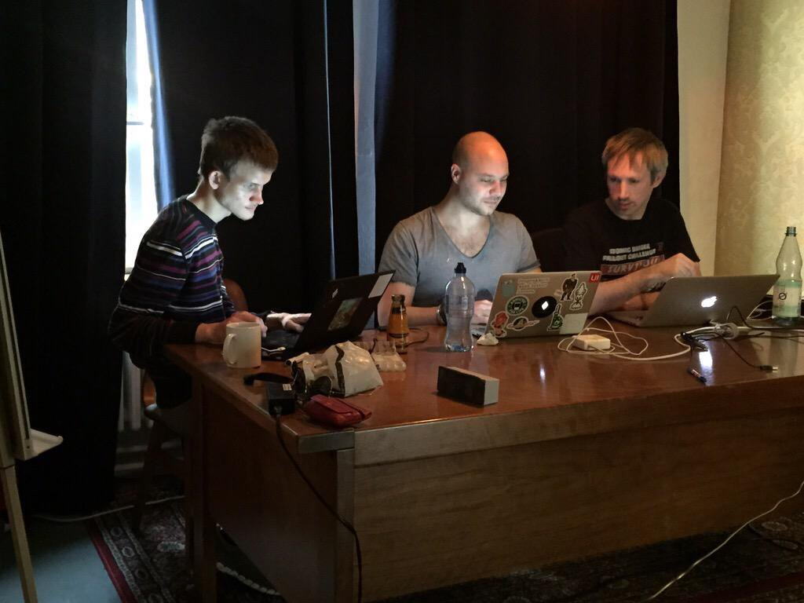
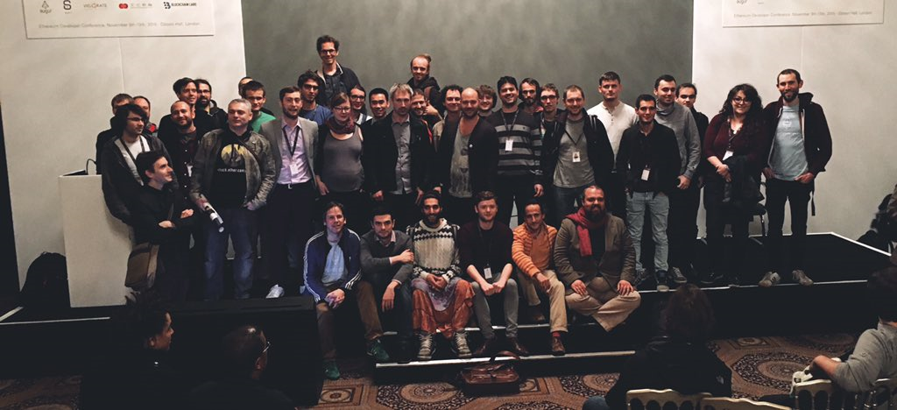

Development of Ethereum started in December 2013 when two developers and a college dropout researcher decided to put their heads together and develop this amazing piece of technology. We were later [joined](https://www.youtube.com/watch?v=GA8z7f7a2Pk) by many like-minded individuals. Our first Proof of Concept (PoC) came on February 1, 2014. By the time we started our crowdsale on July 23, we were up to PoC 5 with a protocol that was almost finished, and had achieved compatibility between multiple clients. The team was psyched when we got our first million and our second and our third and so on. It was crazy! Believing that we could deliver the Ethereum platform was one thing, but seeing others believe and want to participate it was incredibly inspiring.

Somewhat later in October of 2014, Gav and I were sitting on the train to the Zurich airport when we figured that an Ethereum conference would be absolutely awesome, and settled on doing it in November that same year. It was a bit hectic for those who organised it (thanks Aeron, Christian & Jason!), but we managed to pull it off as we were determined to host our first internal developers conference, [DEVcon0](https://www.youtube.com/playlist?list=PLJqWcTqh_zKEjpSej3ddtDOKPRGl_7MhS).

When January 2015 came around, we all knew this would be the year we’d have to launch our beta version of Ethereum. Our PoC series was closed off with the PoC 9 hackathon on March 5th and on July 30, 2015 we successfully launched Frontier. Miners from all over the globe booted up their mining rigs, users fired up their nodes and the network came to life. It worked; no hiccups, no issues and from a developer’s perspective the release couldn’t have gone smoother. In the following months, our team and community demonstrated its potential and true awesomeness in dealing with issues on the network and together solving two consensus bugs.

We felt it was extremely important to clearly communicate to our users how we felt about the security of the network. Today, we’re incredibly proud to announce that we are finally ready to remove the scratched out word “safe” from our website as move into a new phase: Homestead. The Homestead block will be **1.150.000** for the main network which means the Homestead transition will be roughly around midday on Pi day and the Homestead block for the Morden network will be **494.000**.

## What is Homestead?

Homestead is the second major version release of the Ethereum platform, which includes several protocol changes and a networking change that gives us the ability to do further network upgrades:

* [EIP-2](https://github.com/ethereum/EIPs/blob/master/EIPS/eip-2.mediawiki) Main homestead hardfork changes
* [EIP-7](https://github.com/ethereum/EIPs/blob/master/EIPS/eip-7.md) Hardfork EVM update: DELEGATECALL
* [EIP-8](https://github.com/ethereum/EIPs/pull/49) devp2p forward compatibility

## Client releases

The Go version of Ethereum (geth) for Homestead will be release ~1.3.4~ [release 1.3.5](https://github.com/ethereum/go-ethereum/releases/tag/v1.3.5) and includes the above mentioned changes to the protocol and network. Following the release of Homestead the Go team will also shortly come with the [1.4 release](https://github.com/ethereum/go-ethereum/milestones/1.4.0), which is our big feature release and includes months of work. The reason for keeping Homestead and our feature release separate is to keep the Homestead release changes to an absolute minimum, making debugging easier when required.

The **C++** version of Ethereum (eth) for Homestead will be [version 1.2.0](https://github.com/ethereum/webthree-umbrella/releases/tag/v1.2.0). Apart from the protocol and network changes, it also tries to be as compatible to geth as possible. You can already use Mist and “geth attach” with an eth node running in the background. In the next weeks, we will align key management with geth. The new DELEGATECALL feature of the EVM will be usable in Solidity for library calls (this is not yet released). For further details, please see the [release notes](https://github.com/ethereum/webthree-umbrella/releases/tag/v1.2.0).

## What’s next

Over the next couple of weeks, the teams will come together to pave the road for future development on both the Ethereum protocol as well as a roadmap for the clients and sub-protocols such as Swarm and Whisper. Once we have a clear picture of the work ahead we’ll provide details in another blog post.

For more information about Ethereum, Homestead and how to operate one of the Ethereum clients, please head over to the [Homestead Documentation](http://ethereum-homestead.readthedocs.org/) project and let us together prepare for the next phase of Ethereum.

