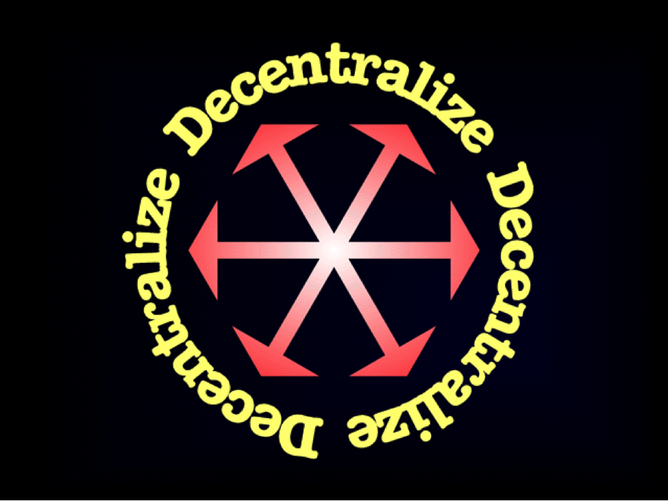

crwdns128713:0crwdne128713:0 crwdns128715:0crwdne128715:0

crwdns128717:0crwdne128717:0 crwdns128719:0crwdne128719:0 crwdns128721:0crwdne128721:0

crwdns128723:0crwdne128723:0 crwdns128725:0crwdne128725:0

crwdns128727:0crwdne128727:0 crwdns128729:0crwdne128729:0 crwdns128731:0crwdne128731:0 crwdns128733:0crwdne128733:0 crwdns128735:0crwdne128735:0 crwdns128737:0crwdne128737:0 crwdns128739:0crwdne128739:0 crwdns128741:0crwdne128741:0

crwdns128743:0crwdne128743:0 crwdns128745:0crwdne128745:0 crwdns128747:0crwdne128747:0 crwdns128749:0crwdne128749:0 crwdns128751:0crwdne128751:0 crwdns128753:0crwdne128753:0 crwdns128755:0crwdne128755:0 crwdns128757:0crwdne128757:0 crwdns128759:0crwdne128759:0 crwdns128761:0crwdne128761:0

crwdns128763:0crwdne128763:0 crwdns128765:0crwdne128765:0 crwdns128767:0crwdne128767:0 crwdns128769:0crwdne128769:0 crwdns128771:0crwdne128771:0

crwdns128773:0crwdne128773:0 crwdns128775:0crwdne128775:0 crwdns128777:0crwdne128777:0 crwdns128779:0crwdne128779:0

crwdns128781:0crwdne128781:0 crwdns128783:0crwdne128783:0 crwdns128785:0crwdne128785:0 crwdns128787:0crwdne128787:0 crwdns128789:0crwdne128789:0 crwdns128791:0crwdne128791:0

crwdns128793:0crwdne128793:0 crwdns128795:0crwdne128795:0 crwdns128797:0crwdne128797:0

crwdns128799:0crwdne128799:0 crwdns128801:0crwdne128801:0 crwdns128803:0crwdne128803:0 crwdns128805:0crwdne128805:0 crwdns128807:0crwdne128807:0 crwdns128809:0crwdne128809:0 crwdns128811:0crwdne128811:0 crwdns128813:0crwdne128813:0

**crwdns128815:0crwdne128815:0**

---

crwdns128817:0crwdne128817:0

---

**crwdns128819:0crwdne128819:0**

- [crwdns128823:0crwdne128823:0](https://ethereumclassic.org/A_Crypto-Decentralist_Manifesto.pdf)
- [crwdns128827:0crwdne128827:0](https://ethereumclassic.org/A_Crypto-Decentralist_Manifesto_vietnamese.pdf)
- [crwdns128831:0crwdne128831:0](https://ethereumclassic.org/A_Crypto-Decentralist_Manifesto_russian.pdf)
- [crwdns128835:0crwdne128835:0](https://ethereumclassic.org/A_Crypto-Decentralist_Manifesto_german.pdf)
- [crwdns128839:0crwdne128839:0](https://ethereumclassic.org/A_Crypto-Decentralist_Manifesto_italian.pdf)
