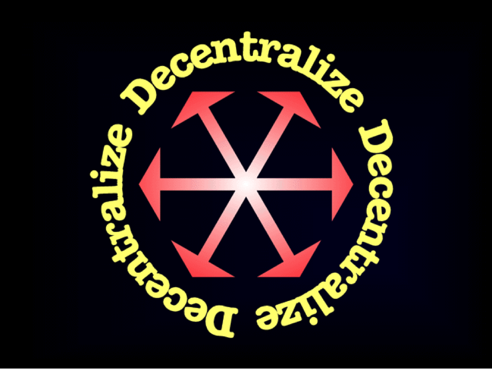

Les chaînes de blocs vont régner sur le monde, fournissant un mécanisme pour porter la coopération sociale et économique à un niveau sans précédent - une échelle véritablement mondiale. Cette coopération impliquera non seulement des êtres humains, des groupes et des associations, mais aussi une multitude croissante d'agents artificiels de plus en plus indépendants.

Chaque blockchain crée un réseau social autour de ses applications, la valeur du réseau augmentant de manière exponentielle avec le nombre de participants conformément à la loi de Reed. Cette valeur n'est pas extraite par des intermédiaires ou des contrôleurs, comme avec les modèles centralisés précédents. Au lieu de cela, il est partagé entre les participants, offrant des incitations économiques à la coopération sans coercition.

Toutes les blockchains ne sont pas créées égales. Il existe trois caractéristiques clés qui rendent possible une coopération évolutive basée sur la blockchain : l'ouverture, la neutralité et l'immuabilité.

**L' ouverture est nécessaire**. Il va sans dire que les règles du jeu doivent être ouvertes à tous pour qu'ils puissent les voir et les comprendre. N'importe qui devrait pouvoir participer à n'importe quelle couche du système sans demander la moindre permission. N'importe qui devrait pouvoir utiliser le réseau conformément à ses règles. N'importe qui devrait pouvoir créer son propre client implémentant le protocole ouvert. Tout le monde devrait pouvoir contribuer à la sécurité du réseau, etc. Aucune inscription, identification ou autre condition préalable ne doit limiter la participation. Toutes ces limitations empêchent le réseau d'évoluer et leur application crée des risques de centralisation.

**La neutralité est nécessaire**. Il est important que toute personne participant à une coopération basée sur la blockchain soit sur un pied d'égalité avec tout le monde. Peu importe si vous détenez un énorme pouvoir économique ou seulement un tout petit peu. Peu importe que vous soyez une sainte Mère Teresa ou un trafiquant de drogue vicieux. Peu importe que vous soyez un humain ou un réfrigérateur. Peu importe en quoi vous croyez, à quelle théorie politique vous souscrivez ou si vous êtes une personne morale ou immorale. L'origine ethnique, l'âge, le sexe, la profession, le statut social, les amis ou les affiliations, la marque ou le modèle, les objectifs, les buts ou les intentions d'un participant - rien de tout cela n'a d'importance pour la blockchain. Les règles du jeu sont exactement les mêmes pour tout le monde, point final. Sans neutralité, le système est biaisé en faveur d'un ensemble de participants au détriment des autres. Dans ce cas, il est moins susceptible d'être accepté par tous et de maximiser la valeur du réseau pour tout le monde.

**L'immuabilité est nécessaire**. La blockchain est une machine à vérité préservant une version universellement acceptée de l'histoire, une séquence immuable d'événements. Ce qui est vrai une fois est toujours vrai, quels que soient les intérêts politiques ou commerciaux, et aucun lobbying ne peut changer cela. S'il n'est tout simplement pas possible de modifier l'historique, aucune ressource n'est gaspillée. S'il existe des failles, des groupes d'intérêt suffisamment motivés et déterminés les exploiteront aux dépens des autres, ce qui réduira la valeur du réseau pour tout le monde.

Les règles régissant le réseau blockchain sont connues à l'avance. Ils sont exactement les mêmes pour tout le monde et ne peuvent être modifiés qu'avec un consensus à 100 %. Oui, il doit être à 100 %. Parce que toute modification des règles du système que tous les participants n'acceptent pas librement crée une division du réseau, ce qui diminue la valeur du réseau pour tout le monde.

Il est impossible d'atteindre ces caractéristiques de blockchain sans que le système soit **véritablement décentralisé**. Si un aspect du système blockchain devient soumis à un contrôle centralisé, cela introduit un vecteur d'attaque permettant la violation d'une ou plusieurs des caractéristiques clés de la blockchain. Il peut être possible de limiter la participation (par exemple en appliquant les règles AML/KYC), violant ainsi la transparence. Il peut être possible d'appliquer des politiques discriminatoires (par exemple en filtrant les transactions « illégales »), violant ainsi la neutralité. Il peut être possible de réécrire l'histoire des événements (par exemple en confisquant ou en « redistribuant » des fonds), violant ainsi l'immuabilité. L'introduction de points d'étranglement centralisés crée une condition préalable à l'introduction d '«intermédiaires ou contrôleurs de la blockchain» qui peuvent siphonner la valeur du système aux dépens des autres participants.

La décentralisation est donc la caractéristique la plus importante des systèmes de blockchain, celle dont tout le reste dépend. Avec la décentralisation, les blockchains vont dominer le monde. Sans cela, ils seront « confinés » et intégrés dans des applications de niche.

**Nous, décentralisateurs** , nous engageons à maintenir les blockchains ouvertes, neutres et immuables. Nous nous engageons à maintenir la décentralisation des systèmes de blockchain. Cela informe toutes nos actions et positions vis-à-vis de tout développement dans le monde de la cryptographie et au-delà. Toutes les tentatives de violation de l'une des caractéristiques clés de la blockchain doivent être combattues. Toutes les modifications des règles d'une blockchain qui introduisent de nouveaux risques de centralisation ou renforcent les risques existants doivent être combattues. Seuls les développements qui sont clairement bénéfiques à la décentralisation ou renforcent les trois caractéristiques clés de la blockchain doivent être soutenus et encouragés. La révolution blockchain ne sera pas centralisée. Assurons-nous-en.

**En avant.**

---

Source : https://medium.com/@bit_novosti/a-crypto-decentralist-manifesto-6ba1fa0b9ede#.2m5ro5rr9

---

**Version PDF :**

- [Anglais](https://ethereumclassic.org/A_Crypto-Decentralist_Manifesto.pdf)
- [Tiếng Việt](https://ethereumclassic.org/A_Crypto-Decentralist_Manifesto_vietnamese.pdf)
- [русский](https://ethereumclassic.org/A_Crypto-Decentralist_Manifesto_russian.pdf)
- [Deutsche](https://ethereumclassic.org/A_Crypto-Decentralist_Manifesto_german.pdf)
- [italien](https://ethereumclassic.org/A_Crypto-Decentralist_Manifesto_italian.pdf)
