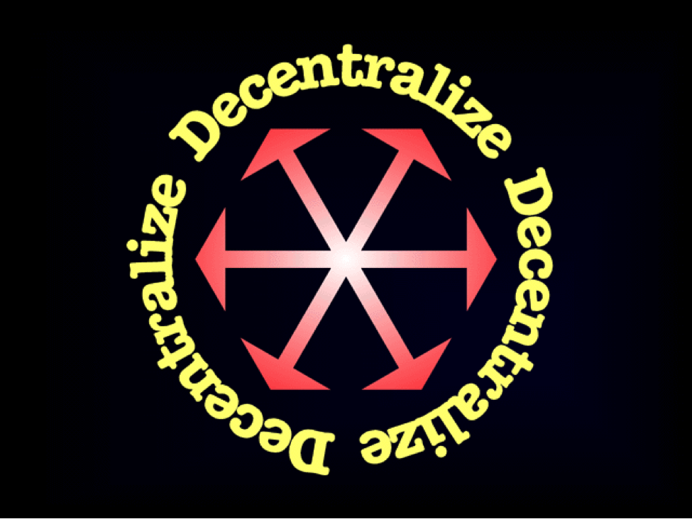

<b>PDF Version:</b>
 <a href="/A_Crypto-Decentralist_Manifesto.pdf">English</a>
 <a href="/A_Crypto-Decentralist_Manifesto_vietnamese.pdf">Tiếng Việt</a>
 <a href="/A_Crypto-Decentralist_Manifesto_russian.pdf">русский</a>
 <a href="/A_Crypto-Decentralist_Manifesto_german.pdf">Deutsche</a>
 <a href="/A_Crypto-Decentralist_Manifesto_italian.pdf">Italiano</a>

---

Blockchains are going to rule the world, providing a mechanism for scaling
social and economic cooperation to an unprecedented level — a truly global
scale. Such cooperation will involve not only human beings, groups and
associations but also a growing multitude of increasingly independent
artificial agents.

Every blockchain creates a social network around its applications, with network value growing exponentially with the number of participants in accordance with Reed’s Law. This value isn’t extracted by intermediaries or controllers, as with previous centralized models. Instead, it’s shared among participants, providing economic incentives for cooperation without coercion.

Not all blockchains are created equal. There are three key characteristics that make scalable blockchain-enabled cooperation possible: openness, neutrality and immutability.

**Openness is necessary**. It goes without saying that the rules of the game should be open for anyone to see and understand. Anyone should be able to participate in any layer of the system without asking for any permission whatsoever. Anyone should be able to use the network in accordance with its rules. Anyone should be able to create their own client implementing the open protocol. Anyone should be able to contribute to network security, and so on. No registration, identification or other preconditions should limit participation. All such limitations prevent the network from scaling and their enforcement creates centralization risks.

**Neutrality is necessary**. It’s important for anyone participating in
blockchain-enabled cooperation to be on an equal footing with everyone else. It doesn’t matter if you wield huge economic power or only a tiny amount. It doesn’t matter whether you’re a saintly Mother Theresa or a vicious drug dealer. It doesn’t matter whether you’re a human or a refrigerator. It doesn’t matter what you believe in, what political theory you subscribe to, or whether you’re a moral or immoral person. A participant’s ethnicity, age, sex, profession, social standing, friends or affiliations, make or model, goals, purposes or intentions — none of this matters to the blockchain even a bit. The rules of the game are exactly the same for everyone, period. Without neutrality, the system is skewed towards one set of participants at the expense of others. In that case, it’s less likely to gain universal acceptance and maximize network value for everyone.

**Immutability is necessary**. The blockchain is a truth machine preserving one universally accepted version of history, one immutable sequence of events. What’s true once is always true, regardless of political or business interests, and no amount of lobbying can change that. If it’s simply not possible to change history, then no resources are wasted on the effort. If there are any loopholes at all, then sufficiently motivated and determined interest groups will exploit them at the expense of others, diminishing network value for everyone.

The rules governing the blockchain network are known in advance. They’re exactly the same for everyone and not subject to change other than with 100% consensus. Yes, it must be 100%. Because any change to the system’s rules that not all participants freely agree to creates a network split, diminishing network value for everyone.

It’s impossible to achieve these blockchain characteristics without the system
being **truly decentralized**. If any aspect of the blockchain system becomes
subject to centralized control, this introduces an attack vector enabling the
violation of one or more of the key blockchain characteristics. It may be
possible to limit participation (such as by enforcing AML/KYC rules), thus
violating openness. It may be possible to enforce discriminatory policies (such as by filtering “illegal” transactions), thus violating neutrality. It may be possible to rewrite the history of events (such as by confiscating or
“redistributing” funds), thus violating immutability. Introducing centralized
chokepoints creates a precondition for the introduction of “blockchain
intermediaries or controllers” who can siphon value out of the system at other participants’ expense.

So decentralization is the most important feature of blockchain systems, the one everything else depends on. With decentralization, blockchains will come to rule the world. Without it, they’ll be “contained” and railroaded into niche applications.

**We decentralists** are committed to keeping blockchains open, neutral and
immutable. We’re committed to keeping blockchain systems decentralized. This informs all our actions and positions towards any developments in the crypto world and beyond. All attempts to violate any of the key blockchain
characteristics should be fought. All changes to a blockchain’s rules that
introduce new centralization risks or strengthen existing ones should be fought. Only developments that are clearly beneficial to decentralization or strengthen the three key blockchain characteristics should be supported and encouraged.
The blockchain revolution won’t be centralized. Let’s make sure of it.

**Onward.**
