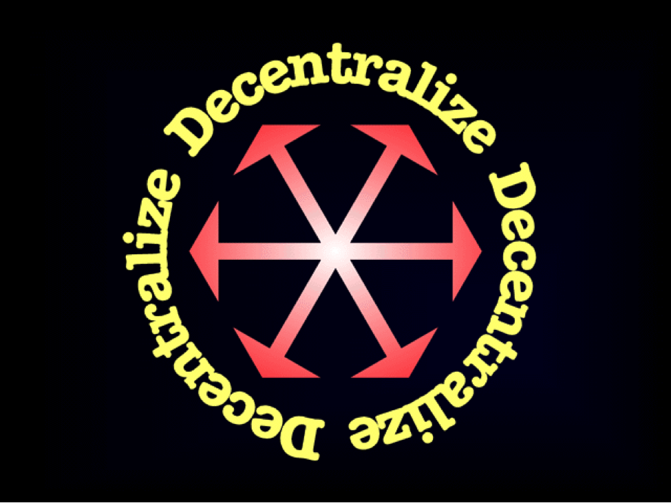

<b>PDF 버전 :</b>
<a href="/A_Crypto-Decentralist_Manifesto.pdf">영어</a>
<a href="/A_Crypto-Decentralist_Manifesto_vietnamese.pdf">Tiếng Việt</a>
<a href="/A_Crypto-Decentralist_Manifesto_russian.pdf">русский</a>
<a href="/A_Crypto-Decentralist_Manifesto_german.pdf">도이치</a>
<a href="/A_Crypto-Decentralist_Manifesto_italian.pdf">이탈리아어</a>

---

블록 체인은 세계를 지배 할 것이며 스케일링을위한 메커니즘을 제공합니다
전례없는 수준의 사회적, 경제적 협력-진정한 글로벌
규모. 이러한 협력에는 인간, 단체 및
협회뿐만 아니라 점점 더 많은 독립
인공 작용제.

모든 블록 체인은 응용 프로그램을 중심으로 소셜 네트워크를 만들고 리드의 법칙에 따라 참가자 수에 따라 네트워크 값이 기하 급수적으로 증가합니다. 이 값은 이전의 중앙 집중식 모델과 마찬가지로 중개자 나 컨트롤러가 추출하지 않습니다. 대신, 참가자들간에 공유되어 강요없이 협력을위한 경제적 인센티브를 제공합니다.

모든 블록 체인이 동일한 것은 아닙니다. 확장 가능한 블록 체인 지원 협력을 가능하게하는 세 가지 주요 특성이 있습니다 : 개방성, 중립성 및 불변성.

** 개방이 필요합니다 **. 모든 사람이보고 이해할 수 있도록 게임 규칙을 공개해야한다는 것은 말할 필요도 없습니다. 누구나 권한을 요청하지 않고 시스템의 모든 계층에 참여할 수 있어야합니다. 누구나 규칙에 따라 네트워크를 사용할 수 있어야합니다. 누구나 개방형 프로토콜을 구현하는 자체 클라이언트를 만들 수 있어야합니다. 누구나 네트워크 보안 등에 기여할 수 있어야합니다. 등록, 식별 또는 기타 전제 조건이 참여를 제한해서는 안됩니다. 이러한 모든 제한으로 인해 네트워크가 확장되지 않으며 해당 시행으로 인해 중앙 집중화 위험이 발생합니다.

** 중립성이 필요합니다 **. 참여하는 사람에게 중요합니다
블록 체인 기반의 협력은 다른 모든 사람들과 동등한 입장에 있습니다. 당신이 거대한 경제력을 행사하든 소량 만 사용하든 상관 없습니다. 성모 마리아 테레사이든 악의적 인 마약상이든 상관 없습니다. 인간이든 냉장고 든 상관 없습니다. 당신이 무엇을 믿는지, 어떤 정치 이론을 구독하는지, 또는 당신이 도덕적이거나 부도덕 한 사람인지는 중요하지 않습니다. 참가자의 민족성, 연령, 성별, 직업, 사회적 지위, 친구 또는 소속, 제작 또는 모델, 목표, 목적 또는 의도-이 중 어느 것도 블록 체인에 중요하지 않습니다. 게임의 규칙은 모든 사람에게 동일합니다. 중립이 없다면, 시스템은 다른 사람들을 희생시키면서 한 세트의 참가자들에게 기울어진다. 이 경우 모든 사람이 보편적으로 수용하고 네트워크 가치를 극대화 할 가능성이 줄어 듭니다.

** 불변성이 필요합니다 **. 블록 체인은 보편적으로 수용되는 하나의 역사 버전, 하나의 불변의 사건 시퀀스를 보존하는 진실 기계입니다. 한 번만 사실은 정치적 또는 사업 적 이해 관계에 관계없이 항상 사실이며 로비의 양은 그것을 바꿀 수 없습니다. 단순히 역사를 바꿀 수 없다면 노력에 자원이 낭비되지 않습니다. 허점이 있다면, 충분히 동기를 부여하고 결정된 관심 그룹은 다른 사람들을 희생하여 그들을 활용하여 모든 사람의 네트워크 가치를 떨어 뜨릴 것입니다.

블록 체인 네트워크에 적용되는 규칙은 미리 알려져 있습니다. 그것들은 모두에게 동일하며 100 % 합의가 아닌 다른 변경을받지 않습니다. 예, 100 % 여야합니다. 모든 참가자가 자유롭게 네트워크 분할을 생성하는 데 동의하지 않는 시스템 규칙을 변경하면 모든 사람의 네트워크 가치가 떨어집니다.

시스템없이 이러한 블록 체인 특성을 달성하는 것은 불가능합니다
** 정말로 분산 된 **. 블록 체인 시스템의 어떤 측면이
중앙 집중식 제어에 따라이 기능은
하나 이상의 주요 블록 체인 특성 위반 아마도
(AML/KYC 규칙 시행과 같은) 참여를 제한 할 수 있으므로
개방성 위반. 차별 정책 (예 : "불법"거래를 필터링하는 등)을 시행하여 중립을 위반하는 것이 가능할 수 있습니다. 사건의 이력을 다시 쓸 수도 있습니다 (예 : 압수 또는
"재분배"자금), 따라서 불변성을 위반. 중앙 집중식 소개
chokepoints는“blockchain의 도입을위한 전제 조건을 만듭니다
다른 참가자의 비용으로 시스템에서 가치를 떨어 뜨릴 수있는 중개자 또는 관리자”

따라서 분산화는 다른 모든 것이 의존하는 블록 체인 시스템의 가장 중요한 기능입니다. 분산화로 블록 체인이 세상을 지배하게 될 것입니다. 그것없이, 그들은 "포함"되고 틈새 응용 프로그램에 철도 될 것입니다.

** 우리의 탈 중앙 주의자 **는 블록 체인을 개방적이고 중립적이며
불변. 우리는 블록 체인 시스템을 분산 상태로 유지하기 위해 노력하고 있습니다. 이것은 암호화 세계와 그 밖의 모든 발전에 대한 우리의 모든 행동과 입장을 알려줍니다. 모든 주요 블록 체인을 위반하려는 모든 시도
특성을 싸워야합니다. 블록 체인 규칙에 대한 모든 변경 사항
새로운 중앙 집중화 위험을 도입하거나 기존 위험을 강화해야합니다. 분산화 또는 3 가지 주요 블록 체인 특성 강화에 분명히 도움이되는 개발 만이 지원되고 장려되어야합니다.
블록 체인 혁명은 중앙 집중화되지 않습니다. 확인합시다.

** 앞으로 **