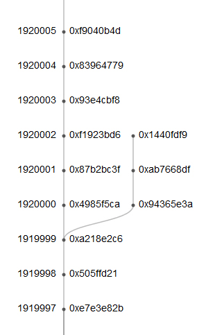

Attribution: [https://blog.ethereum.org/2016/07/20/hard-fork-completed/](https://blog.ethereum.org/2016/07/20/hard-fork-completed/)

We would like to congratulate the Ethereum community on a successfully completed hard fork. [Block 1920000](http://etherscan.io/block/1920000) contained the execution of an irregular state change which transferred ~12 million ETH from the “Dark DAO” and “Whitehat DAO” contracts into the [WithdrawDAO recovery contract](https://etherscan.io/address/0xbf4ed7b27f1d666546e30d74d50d173d20bca754). The fork itself took place smoothly, with roughly 85% of miners mining on the fork:

You can see ongoing fork progress [here](http://fork.ethstats.net/). [EthStats](https://ethstats.net/) shows Go, Java and Parity (Rust) nodes successfully synchronized to the fork chain.

The recovery contract is already returning DAO token holders’ ether; about 4.5 million ETH has been sent to DAO token holders, and about 463000 ETH is in the control of [the curator](https://etherscan.io/address/0xda4a4626d3e16e094de3225a751aab7128e96526); a contract to facilitate extrabalance payments is currently undergoing security review.

Users who are interested only in participating in the fork chain should upgrade their clients to a fork-compatible version if they have not already done so; the upgraded Go client (version 1.4.10) is available [here](https://github.com/ethereum/go-ethereum/releases/tag/v1.4.10). If any users continue to be interested in following the non-fork chain, they should still update, but run with the `--oppose-dao-fork` flag enabled, though they should beware of [transaction replay attacks](https://medium.com/@timonrapp/how-to-deal-with-the-ethereum-replay-attack-3fd44074a6d8#.ocsfgea7l) and take appropriate steps to guard against them; users with no interest in the non-fork chain do not need to worry about transaction replay attack concerns.

We thank our developers and the community for working together to make the transition as smooth as it has been, and look forward to working together to continue to make the Ethereum ecosystem and protocol a success.
