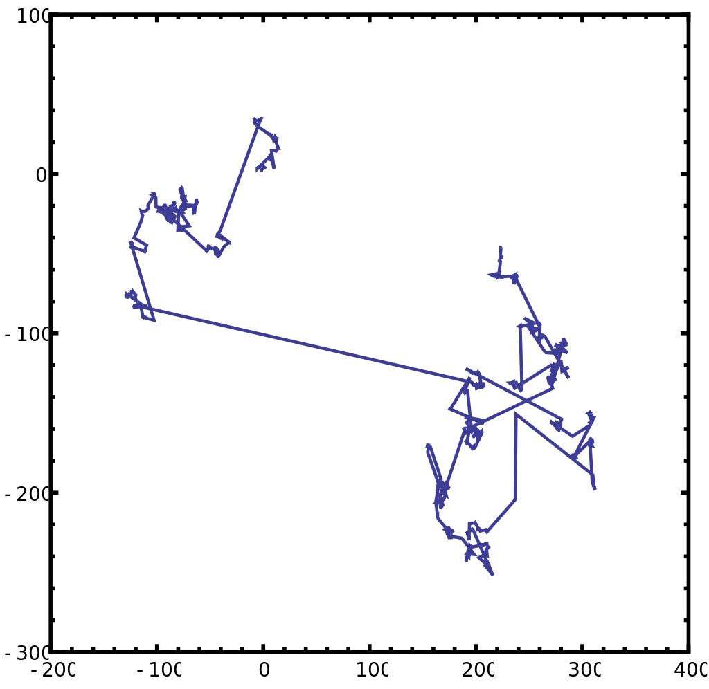

Figure 1. Ethereum Classic pulsing community. Source Ethereum Classic Slack [#website-design channel](https://ethereumclassic.slack.com/archives/website-design)

-----
## Nature Inspired Dynamics

For every opportunity presented to Ethereum Classic community I think it should not disencourage going to several random different approaches as a mutant evolving community. If an individual can grab some fruits in one direction awesome. If it starts to starve in another, that direction might be cancelled like in a [Lévy flight foraging hypothesis](https://en.wikipedia.org/wiki/L%C3%A9vy_flight_foraging_hypothesis) performed by a bee looking for pollen for example.

Figure 2. Hive and bees. Source [Geyser of Awesome](http://geyserofawesome.com/post/112481764846/bees-are-awesome-they-pollinate-the-crops-we-rely)

Figure 3. An example of 1000 steps of a Lévy flight in two dimensions. The origin of the motion is at \[0,0\], the angular direction is uniformly distributed and the step size is distributed according to a Lévy (i.e. stable) distribution with α = 1 and β = 0 which is a Cauchy distribution. Source [wikipedia](https://en.wikipedia.org/wiki/L%C3%A9vy_flight).

 The analogy helps to understand a proposed dynamics for the community:
 
- Each hive has limited resources depending upon the ecossytem where that hive is located among other factors.
- The species (analogous to the community) can be considered as a population of hives.
- Each bee's purpose is to make its hive and species grow stronger. A bee is a high valued asset for the hive. As each hive is a valued asset for the species.
- A regular bee can develop leadership skills becoming a leading bee.
- A leading bee can form a new hive and should be encouraged to do so.

According to the resources requirement, the selection of the best looking path by a single bee has to somehow be performed. Going into one direction has a cost function related to the bee fatigue. If it doesn't find pollen after a long run, best to abort mission and return to the hive to rest and recover energy. When that happens the hive is encouraged to welcome that bee with proud, happiness and warming comfort. 

-----
## Ethereum Classic community development

Figure 4. ETC Declaration of Independence. Source [EthNews](http://www.ethnews.com/)

 The community behing Ethereum Classic is growing as time goes by in a healthy and pulsating way preserving its outstanding [values](http://www.ethnews.com/ethereum-classic-declares-their-independence-from-the-foundation) with determination.

Good ideas that boost motivation and drive inspiration are key factors to reward the community with advances in the crypto space. The idea presented here (nature inspired community dynamics) is philosophical and brings people a good understanding of the sense of a true community. In the other hand, diverging development efforts is to be avoided.