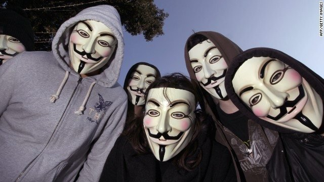
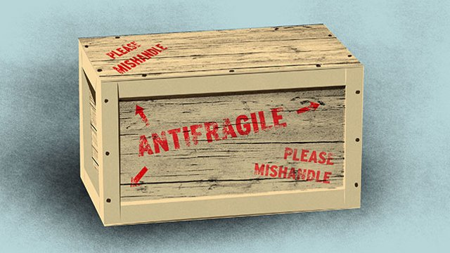

I will discuss denial of service (DOS) attacks in general and give details regarding the
Ethereum and Ethereum Classic attacks.

# Estonian Cyberwar

Estonia is known as "the most wired country in Europe". Over 90% of banking transactions are done online, and, it was the first country to have worldwide electronic voting. In 2007 Estonia also experienced the first cyberwar. Over the course of three weeks, over a *million* computers from fifty countries attacked its information infrastructure.  Hundreds of government, banking, university and news sites were crippled or shut down by DOS attacks.  There had been cyber attacks before, but, never had an entire country been targeted and its national security so threatened.

# Denial Of Service Attacks

DOS attacks attempt to make computer resources unavailable. If attacks originate from several computers, they are often referred to as distributed denial of service (DDOS) attacks. These are commonly executed by sending large amounts of traffic to computing targets. DOS attacks may be *unintentional*. When Michael Jackson died, news sites slowed or crashed in response to the increased traffic.  DOS attacks may even arguably sometimes be *legitimate*.  In 2011 the group of hackers known as Anonymous executed DOS attacks against PayPal, MasterCard and Visa to protest their refusal to process WikiLeaks donations.  They claimed this was rightful protest and no different in principle than Occupy Wall Street.  DOS attacks may even be *governmental*.  Edward Snowden revealed that the Government Communication Headquarters (GCHQ) in the United Kingdom has developed DOS attack tools. Lastly, DOS attack vulnerabilities, without great effort, may be *undetectable*.  An address blacklist was proposed to deal with the Ethereum DAO attack.  Shortly thereafter, an overlooked DOS attack vulnerability was discovered with this scheme and the proposal was dropped.

# Ethereum & Ethereum Classic Denial Of Service Attacks

The recent DOS attacks against the Ethereum system started in September around the time of the developer conference in Shanghai. Vulnerabilities were exploited.  Vulnerabilities were later patched.  Then, new vulnerabilities would repeat the cycle over and over again. The attacker, or attackers, spent thousands of dollars to keep this going for several weeks. Eventually the Ethereum Classic system was also attacked in a similar manner.

Anyone can send large numbers of transactions to several Ethereum and Ethereum Classic nodes. Therefore, *anyone* can degrade these systems for the other participants *anytime*.  This is typically not done because it would be horrendously expensive to keep it up for very long. The current attacks were possible because some Ethereum and Ethereum Classic instructions were *underpriced* relative to the amount of resources they tied up. Examples include EXTCODESIZE, EXTCODECOPY, BALANCE, SLOAD, CALL, CALLDELEGATE, CALLCODE and SUICIDE. Some attack transactions cheaply invoked EXTCODESIZE tens of thousands of times!  Price adjustments to remove these vulnerabilities have necessitated changes to the systems (hard forks).

# Antifragility

In the long term, these attacks might actually be *beneficial*.  The Ethereum and Ethereum Classic networks are antifragile. Antifragility is the property of improving in response to stressors. Immune systems, bones, muscles, economies, theories and the mythological Hydra are antifragile. Every time a new attack is exposed, the developers eventually remove the vulnerability. Therefore, every attack makes the Ethereum and Ethereum Classic systems stronger!

# Feedback

Feel free to leave any comments or questions below.  You can also contact me by clicking any of these icons:

  

# Acknowledgements

I would like to thank IOHK (Input Output Hong Kong) for funding this effort.

# License

This work is licensed under the Creative Commons Attribution ShareAlike 4.0 International License.
