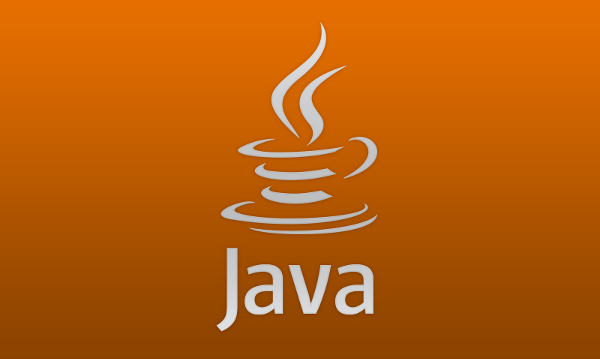
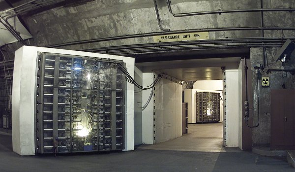

## Introduction

Hard forks are incompatible changes to systems. Hard forks have caused more grief than probably anything else in the history of blockchains.  Additional hard forks are being discussed now by the Ethereum and Ethereum Classic communities to deal with issues caused by the recent denial of service attack spam. Fortunately, there is nothing problematic about the proposed hard forks.  I will describe an analogous technology and details of the Ethereum and Ethereum Classic systems to show why all is well.

## Java Virtual Machine

People own various computing devices.  People also run various versions and types of operating systems.  The Java Virtual Machine (JVM) allows disparate systems to all run programs and get the *exact* same results.  People have implemented the JVM in hardware, but, most just simulate it in software.  Some use compilers with no optimizations.  Some use "just in time" compilers.  Some use "ahead of time" compilers. Few care about the differences in JVM realizations as long as program results are *always* identical.  If a complex Java based weather simulation predicts the temperature in one week will be 78.91775159 °F, and all JVM instances also compute 78.91775159 °F, then everyone is happy.

## Ethereum & Ethereum Classic Virtual Machines

The Ethereum and Ethereum Classic systems are also "virtual" machines.  They are imaginary machines that are *simulated*.  There is no Ethereum or Ethereum Classic world computer  located in a bunker somewhere.  The JVM allows everyone to effectively run programs on identical *clones* of a computer.  Astonishingly, Ethereum and Ethereum Classic allow everyone to effectively run programs on the same *instance* of a computer.  In other words, it is as if everyone is using the same single machine! As with the JVM, few care how this is done as long as the results are the same.  The recent denial of service attacks took advantage of the way the systems are currently simulated. The proposed hard forks will just improve the *efficiency*. All results will remain the same.

## More Details On The Proposed Hard Forks

#### ***Ethereum attack contract account 0x7c20218efc2e07c8fe2532ff860d4a5d8287cb31 as of 2016-10-26 15:00:00 UTC that created over 2.4 million empty accounts:***

| FIELD | VALUE |
| ------------- |-------------|
| Ether Balance | 0 |
| Contract Code | 0x7f6004600c60003960046000f3600035ff00000000000000000000000... |
| Storage Dictionary | (None) |
| Counter (Nonce) | 34148 |

The state of the Ethereum and Ethereum Classic systems at all times depends on all the previous activity.  Computations affect *accounts*.  There are *external* accounts and *contract* accounts. All accounts have four components: an ether balance, contract code, storage dictonary (associative array), and, a counter (nonce).  For external accounts, the counter tracks the submitted transactions.  For contract accounts, the counter tracks the created contracts. There is no reason for network nodes to store anything for accounts that either do not exist or are empty.  The attacks created millions of empty accounts that are using massive amounts of storage.  The proposed hard forks will just stop wasting space for these accounts.¹ As this storage is not in the blockchain, **no changes to the blockchain are involved**.

--------------------

1. Technically the proposed hard forks will also likely lead to slight gas costs to recreate these accounts.

## Feedback

You can contact me by clicking any of these icons:

  

## Acknowledgements

I would like to thank Elaine Ou, Nick Johnson and  Smokyish for their help.  I would also like to thank IOHK (Input Output Hong Kong) for funding this effort.

## License

This work is licensed under the Creative Commons Attribution ShareAlike 4.0 International License.
