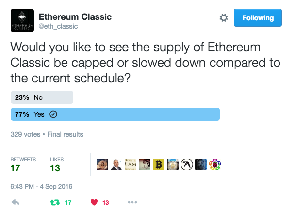

Since the beginning of the formation of the Ethereum Classic community, users, developers, miners, and traders have been pondering about a change in monetary policy for ETC. Though many users in ETC look forward to a future of decentralized applications and smart contracts running on the blockchain but are dissatisfied with the current supply schedule of 5 ETC awarded per block which is created on average every 14 seconds.

As of the time of this writing, the available supply of ETC stands at 85.4 Million coins in circulation and users can’t help but compare that to Bitcoin’s 15.96 Million. For every 1 BTC there are 5 ETC and Bitcoin is 7 years older! Ethereum started with a Pre-Mine of 72 Million and by 2055, if nothing is changed, there will be about 500 Million ETC.

## A Network Upgrade

The current supply schedule for ETC is a bug, not a feature. A tightening of supply similar to Bitcoin’s would constitute as a network upgrade. The upward pressure on price due to the increased scarcity would encourage more mining, savings, and investment into ETC dApps and smart contracts.

The want and need for change in the money supply even had 77% support in one poll conducted by the Ethereum Classic Twitter Account.

Granted, it was not a scientific poll, but it seems to be an indicator of where the general ETC community stands on wanting to change policy.

## The Tithing Event

Below are two [proposals by user “Snaproll”](https://www.reddit.com/r/EthereumClassic/comments/5a8f5l/monetary_policy_analysis_help_doc_spreadsheet/) for changing the block reward of ETC. They are similar in nature to the supply schedule of Bitcoin which has proven to be a successful model were created with the goal of a CAP close to 210 million ETC. So that for every 1 BTC, there are roughly 10 ETC.

### Option A: “Tithing” at 10% Block Reward
* 10% Decrease in block reward every 3 million blocks.
* 3 million blocks is roughly 1.4 Years
* Theoretical Max CAP at 222 million, CAP in reality closer to 210 million.
* 99% of ETC mined by 2071, CAP hit after 2164

### Option B: “Tithing” at 20% Block Reward.
* 20% Decrease in block reward every 6 million blocks.
* 6 million blocks is roughly 2.8 Years
* Theoretical Max CAP at 222 million, CAP in reality closer to 210 million.
* 99% of ETC mined by 2066, CAP hit after 2157

Out of the two proposals, I prefer “Option A.” The tithing at 10%, for the reason that a change in supply schedule is done on the same day as the “Freeze of the Difficulty Bomb” network upgrade at block 3 million. It sends a clear signal to the market that ETC has taken steps towards it’s long term future and place in the crypto-currency market.

Follow Ethereum Classic Twitter and Reddit for more updates on monetary policy:

* https://twitter.com/eth_classic
* https://www.reddit.com/r/EthereumClassic
