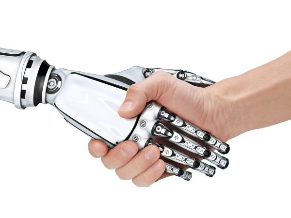
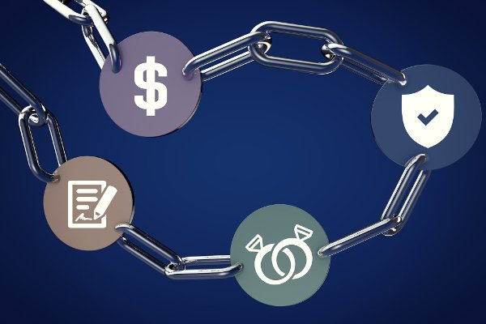

## Introduction

Smart contracts, as defined by Nick Szabo, are computer systems that manage assets. Assets include money, votes, passports and reputation. Examples of smart contracts include supermarket checkout systems and automated teller machines.

## Actions & Agents

Smart contracts can perform *actions*.  Automobile insurance plans might adjust rates hourly based on the weather or location.   Washing machines might order replacement parts when needed.

Because smart contracts often operate autonomously, it might sometimes be more appropriate to refer to them as *agents* (autonomous software components).  On the other hand, the original term emphasizes that they can manage many legal and financial *agreements*.  An example of a smart contract that managed a financial agreement would be a television that stopped working when the loan payments were in arrears.

## Blockchains

Blockchain systems, such as Ethereum and Ethereum Classic, are ideal platforms for smart contracts (agents) because of their security, reliability and censorship resistance.

## Improved Communication

A major benefit of smart contracts is the improved *communication*.  Uncertainties in legal and financial agreements such as confusing legalese and unintended loopholes incur huge costs.  In contrast, smart contracts are *deterministic* and formal verification methods can help avoid mistakes.

Smart contracts can have the flexibility of legal contracts¹.  For example, they can be designed to allow modifications when there are certain unforeseen events.

## Conclusion

Smart contracts can effectively manage assets removing a lot of the confusion of previous methods.  Furthermore, when implemented on blockchain systems, they can have unprecedented levels of security, reliability and censorship resistance.

--------------------

1. Some have misinterpreted the saying, "Code is law!", as implying smart contracts somehow supercede legal systems.  The intended meaning is that blockchain based smart contracts should be immutable and unstoppable like  laws of *nature*.

## Feedback

You can contact me by clicking any of these icons:

  

## Acknowledgements

I would like to thank Gavin Wood for his informative papers and talks that have greatly helped clarify many of these ideas.  I would also like to thank IOHK (Input Output Hong Kong) for funding this effort.

## License

This work is licensed under the Creative Commons Attribution ShareAlike 4.0 International License.
