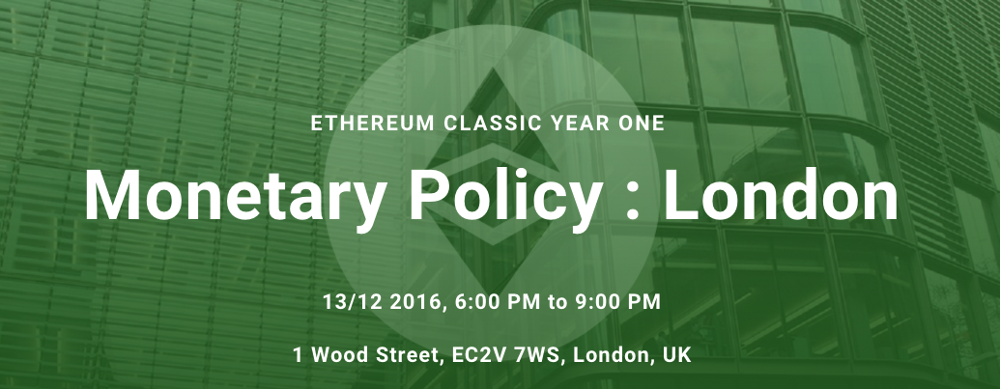

## Please join us!

ETC End of Year and Monetary Policy Event The Event is hosted by one of the leading financial services law firms, Eversheds LLP, at their [London St. Pauls Head Quarters](https://maps.google.com/maps?f=q&hl=en&q=1+Wood+Street%2C+EC2V+7WS+%2C+London%2C+gb). Attendance is free, but you need to [**register for the event**](https://www.meetup.com/EthereumClassic/quick_join/?eventId=235470622&joinFrom=event&response=3). More information at the [Event web site](http://mp2016.ethereumclassic.org).

## Key Event Focus Points

1. Update on what has happened so far in the ETC Ecosystem and future roadmap   
2. Overview of the planned ETC monetary policy Hard Fork and why it matters
3. Panel Discussion on Monetary Policy, Economics and the Future of Cryptocurrencies

## Panel: "Monetary Policy in Cryptocurrencies"

**Jon Matonis**:

Founding Director of the Bitcoin Foundation and his career has included senior influential posts at VISA International, VeriSign, Sumitomo Bank, and Hushmail. An economist and e-Money researcher focused on expanding the circulation of nonpolitical digital currencies, Jon also serves as an independent board director to companies in the Bitcoin, the Blockchain, mobile payments, and gaming sectors. A prominent fintech columnist with Forbes Magazine, American Banker, and CoinDesk, he recently joined the editorial board for the cryptocurrency journal Ledger. His early work on digital cash systems and financial cryptography has been published by Dow Jones and the London School of Economics.

**Alistair Milne**:

Founded and sold several companies over the past 15 years, including one IPO. Most of Alistair’s work has been in technology and web businesses. Over the last five years he has focused his efforts on the world of cryptocurrencies as both an Angel investor as well as manager of one of the few actively traded cryptocurrency funds. He is also an evangelist, writing and speaking about the new wave of innovation emerging from the convergence of digital technologies, cryptography and finance.

**Edan Yago**:

Experienced entrepreneur and seasoned veteran of the digital currency world. He is currently CEO & Founder of Epiphyte, a Bitcoin/Fiat Currency remittance company; which is one of the leading companies helping banks integrate with distributed ledgers for next generation payment services. Yago has led digital currency initiatives at Zynga and is a founding member of DATA, the leading digital asset industry regulatory body. Yago is an angel investor and advisor to several Bitcoin companies and is a thought leader in the space.

**Matt Herbert**:

Director at the British Bankers Association, where he is heading up the BBA’s digital policy and blockchain programme. Matthew works closely with member banks and other financial sector organisations to engage on key policy reforms, in order to support the sustainable digital transformation of the banking industry. His core focus is on the development and advocacy of industry policy, legislative, and regulatory reforms required in the UK, pan-EU, and Globally, to enable digital innovation in banking and FinTech. He is also an advocate of the core premise of immutable blockchains that have a native digital store of value. His other areas of focus are cognitive computing, big data analytics, homomorphic encryption and security. He is a former lawyer, with deep experience in the capital markets.

## Event Agenda

* Opening by Eversheds (**5 min**)

* ETC Event Introduction and Overview of Developing a Sustainable Open Ecosystem: **Dr. Avtar Sehra** (**15 min**)

* ETC Twitter Sentiment: **Carlos Graterol**, Manager of @eth_classic (**5 min**)

* Technology Progress to Date and Next Steps: **Igor Artamonov**, CTO Classic Development Labs (**15 min**)

* Overview of ETC Monetary Policy Proposal: **Matthew Mazur**, Architect of ECIP1017 (**15 min**)

* Panel Discussion: Monetary Policy in Cryptocurrencies (**60 min**)

## Please join us!

Attendance is free, but you need to [**register for the event**](https://www.meetup.com/EthereumClassic/quick_join/?eventId=235470622&joinFrom=event&response=3). More information at the [Event web site](http://mp2016.ethereumclassic.org).

