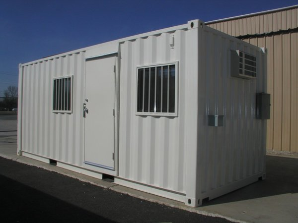

## Basic Definition

Zero knowledge proofs are proofs that do not reveal *any* information *except* the statement being proved.

## Ben & Jerry

Ben wants to prove to Jerry that he knows the passcode associated with an automated teller machine (ATM) card.  Therefore, he performs an ATM deposit and withdrawal *without* divulging the passcode entered.  Ben has made a zero knowledge proof!

A zero knowledge proof must not *leak* information.  Therefore, Ben must select an ATM in an enclosed area to prevent someone reading the passcode with a telescope.  For the same reason, all security cameras must be covered or disabled.  Temperature changes due to ATM key presses must be removed lest they create yet another way to determine the passcode.  Ben also cannot only deposit or only withdraw money because that would reveal information about the balance.  Preventing information leakage is not easy!

A zero knowledge proof method must not be able to prove *false* statements.  This is referred to as the *soundness* property.  If Ben does not know the passcode, he should not be able to fool Jerry by various tricks.  He should not be able to fake a deposit by stashing money somewhere.  He should also not be able to fake a withdrawal by using  money hidden on his person or near the ATM.  Therefore, the ATM and surrounding area must be searched before and after the deposit.  For the same reason, Ben must disrobe and undergo a full body cavity search before and after the deposit!

Only with *all* the necessary steps preventing Ben from leaking information, and Jerry from being fooled, is the zero knowledge proof valid.

## Current Methods

Many current zero knowledge proof methods are *interactive*.  They require the exchange of nonces, or some equivalent, to protect against replay attacks (replaying transmitted text).

Many current zero knowledge proof methods only establish a high *probability* of a statement being true.  Technically they are not providing proofs but rather only strong *evidence*.  However, this evidence often provides *absurdly* high probabilities of truthfulness.

## Some Applications

Zero knowledge proofs might improve authentication systems.  Imagine how secure password based systems will be if they *only* require zero knowledge proofs of password possession.  Adequate systems, for many applications, are *already* available  with public key encryption!

Zero knowledge proofs might eliminate the need for many escrow services.  Imagine people trying to get paid for performing  lengthy  computations.  They do not want to disclose their results before being compensated, and, customers do not want to pay up before confirming the work done.  Zero knowledge proofs might provide the necessary guarantees in a way that pleases everyone.

Zero knowledge proofs might lead to amazing blockchain applications that can *also* protect privacy.  zk-SNARKs are zero knowledge proof methods that are *currently* being used on the Zcash blockchain!

## Parting Thoughts

Zero knowledge proofs might improve authentication systems, eliminate escrow services, add privacy to blockchain applications, and, do much more.  Who would have guessed research in an abstract field of mathematics would have so many consequences!

## Feedback

You can contact me by clicking any of these icons:

  

## Acknowledgements

I would like to thank IOHK (Input Output Hong Kong) for funding this effort.

## License

This work is licensed under the Creative Commons Attribution ShareAlike 4.0 International License.
