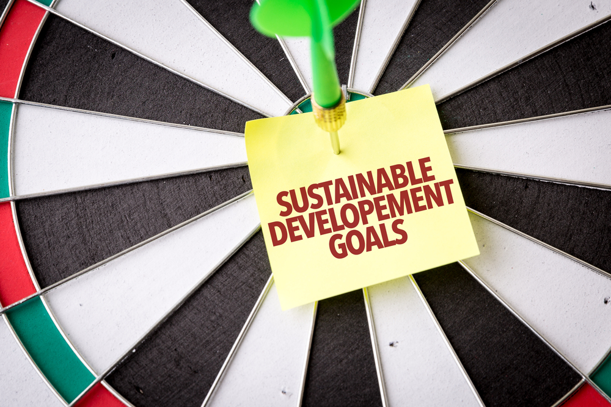
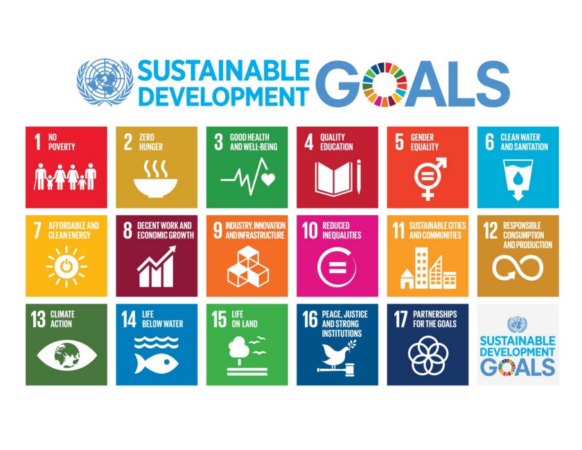

> Alas, our technology has marched ahead of our spiritual and social evolution, making us, frankly, a dangerous people. 

> [Steven M. Greer](http://www.goodreads.com/author/show/23515.Steven_M_Greer) 

## Inherent Sustainability

One of the core values of Ethereum Classic has always been sustainaility due to several reasons specially as a perpetuation strategy for not only ETC community but the human species itself.
We now have new opportunities ahead to broaden ETC presence in the blockchain space by collaborating to include wider measures of value and thus becoming instrumental in achieving the United Nation's Sustainable Development goals.
___

## World has changed

Recently the [COP21](http://www.un.org/sustainabledevelopment/cop21/) conference raised diplomatic bars and was regarded as a [monumental triumph](http://www.un.org/sustainabledevelopment/blog/2015/12/un-chief-hails-new-climate-change-agreement-as-monumental-triumph/#prettyPhoto) and a [victory for the planet](http://www.gouvernement.fr/en/universal-cop21-agreement-a-victory-for-the-planet).

> It sets the stage for progress in ending poverty, strengthening peace and ensuring a life of dignity and opportunity for all.

> [Ban Ki-moon](http://www.un.org/sg/) in a tweet, immediately following its adoption.

195 countries are signators of the COP21 conference and they are naturally pushed to deliver sustainable results over the next decades because of their already signed commitment.
In other words there's increased interest and funding available to initiatives able to bring closer to reality the UN target for a more sustainable world at 2030.

### Fintech Development Lab
Tomorrow, operating through the UN Innovation Centre, the [Blockchain Alliance for Good](http://www.bisgit.org/) launches its Fintech development lab to deliver the United Nations **S**ustainable, **D**evelopment **G**oals.
In a nutshell, the effort brings social innovation through the power of the blockchain to truly engage and empower communities to achieve structural and sustainable change.

> This is a very exciting collaboration of leading global institutions to accelerate the achievement of the Sustainable Development Goals

> Barbara Mellish, President of the [Blockchain Alliance for Good](http://www.bisgit.org/)

### ETC China Support

[ETC China](http://www.etc.tm/) is one of the powers behind ETC community and has already signaled its support to the initiative. 

> Blockchain would have huge impact on civil society in positive ways.
> United Nation's Sustainable Development Goals is the perfect case how technology can improve human being’s happiness.

> Roy Zou, Chairman of Ethereum Classic Consortium (ECC) in Chinese community, Founder & CEO of BITKIO, Co-founder of Fundonomy

### Centre for Citizenship Enterprise and Governance Support

The [CCEG](http://www.cceg.org.uk/) is a Think Tank focussing on the movement of non-financial and social value. It has also signaled it is supportive of the idea.

> We are honoured to harness the technology, influence and inspiration of ETC community and ETC China to support this programme. Together we will guarantee its success

> Olinga Ta'eed, Director of the [Centre for Citizenship Enterprise and Governance](http://www.cceg.org.uk/)

___

## Call for Action
In these terms I invite you fellows to become part of this technological revolution the world is recently experiencing with the advent of the blockchain in the social innovation space!
Let's participate identifying opportunities in this regard and taking action whenever positive outcome is most likely expected.

- Participate of the ETC Sustainable Growth [Slack channel](https://ethereumclassic.slack.com/messages/sustainable-growth/) 
- Register your support or offer your services at [bisgit.iov](http://www.bisgit.org/)

**Let's make sure our spiritual and social evolution will march together with technology!**

