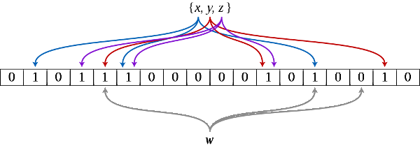
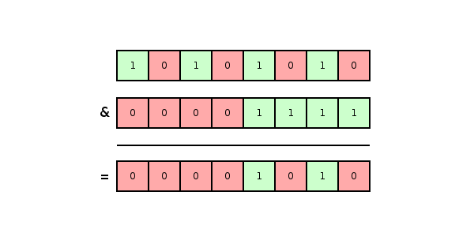

## The Problem

Millions of people search the Internet, government databases, private databases and blockchains everyday for medical advice, financial updates, weather reports, maps and more.  Likewise, millions of people want or need fast searches.

## A Solution

An effective method to speed up many searches is the use of *indexes*.  Indexes, like those at back of textbooks, provide the locations of all search terms.  A possible drawback is that they require large amounts of storage.

## Another Solution

An effective method to speed up many searches, with less storage requirements, is the use of *Bloom filters*.  These are important in many areas such as mobile and embedded  devices.

## Bloom Filters

Bloom filters are binary strings used to quickly determine set membership with nominal storage requirements.  Browsers use them to detect malicious websites.  Databases use them to avoid searching for nonexistent data.

Bloom filters require less memory than indexes, but, they sometimes give false positives.  In other words, they might claim an object is a member of a set when it is not.  It is noteworthy that Bloom filters never give false *negatives*.  They never claim an object is *not* in a set when it actually is.  Browser Bloom filters might incorrectly claim safe websites are malicious, but, they will never claim malicious websites are safe. Fortunately, extra checks can always be performed to eliminate any false positives.

## Construction

To build a Bloom filter for the set {X₁, X₂, X₃, ..., Xₙ}, with hash function H, calculate H(X₁) | H(X₂) | H(X₃) | ... | H(Xₙ).  | is the bitwise OR operator.  H is only valid if the number of set bits (ones) in all hashes is always less than or equal to some selected maximum.

Larger Bloom filters have less false positives.  Bloom filters of several megabytes are not uncommon.  As hash functions typically do not have large enough hashes, not to mention hashes with required number of set bits, adequate hashes are often constructed from *multiple* hash functions.  A common recipe is to have a group of hash functions each set a single bit in the construction of a valid hash.  For example, to set a bit in a hash with 2²³ bits, the first 23 bits of the Secure Hash Algorithm 1 (SHA1) hash can be used to select the *position* of a bit to set.

## Operation

To determine if an object X might be in a set with Bloom filter B, built with hash function H, determine if H(X) & B = H(X).  & is the bitwise AND operator.  Notice that the test only returns true if all the set bits in H(X) are also set in B.  Basically, groups of set bits in B correspond to elements.  X might be a member of the set if and only if its group of set bits corresponds to a group in B.  The reason B can only determine if X *might* be in the set is because B contains the bits of several elements.

## Blockchains

Bloom filters allow lightweight (small memory requirements) Bitcoin wallets to quickly and privately obtain account information without downloading the entire blockchain.  Bloom filters also allow lightweight Ethereum Classic clients to quickly and privately obtain account information without downloading the entire blockchain.

## Conclusion

Bloom filters are a powerful tool that allows additional innovation in blockchain applications and many other areas in the twenty first century.

## Feedback

You can contact me by clicking any of these icons:

  

## Acknowledgements

I would like to thank IOHK (Input Output Hong Kong) for funding this effort.

## License

This work is licensed under the Creative Commons Attribution ShareAlike 4.0 International License.
