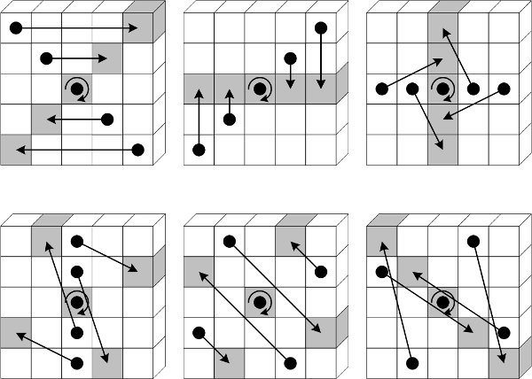
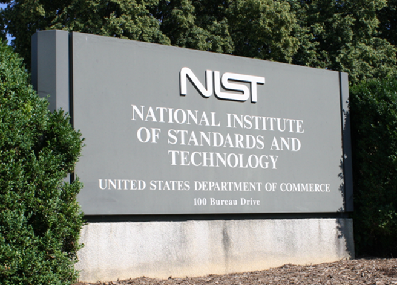

## SHA3 Description

The Secure Hash Algorithm 3 (SHA3) functions are referred to as SHA3-224, SHA3-256 and SHA3-512.  The hash sizes are the same as SHA2.  Therefore, SHA3 can easily replace SHA2 should that become necessary.  The SHA3 algorithms however are *substantially* different.  These differences will hopefully make any weaknesses ever found in SHA2 not also apply to SHA3.  There are no known vulnerabilities in either SHA2 or SHA3.

## SHA3 History

Several years ago improved attacks and increased computing power made MD5 and SHA1 insecure for some applications.  People became concerned that improved attacks might also make SHA2 insecure for some applications.  Therefore, the National Institute of Standards and Technology (NIST) began the process of finding an alternative in 2006.  Keccak became the official SHA3 standard in 2015.  Keccak functions have *multiple* adjustable parameters.  Different choices imply different levels of security and performance.

## SHA3 Controversy

NIST attempted to make changes to the selected Keccak functions *after* the peer review process to increase performance.  The new candidates were all legitimate Keccak functions and not necessarily a bad idea.  Unfortunately for NIST, these changes were proposed shortly after the Edward Snowden revelations.  Snowden was a National Security Agency (NSA) contractor who exposed top secret information about several questionable programs starting in 2013.  Documents suggest the NSA may have colluded with NIST to *intentionally* weaken the [Dual_EC_DRBG standard](https://en.wikipedia.org/wiki/Dual_EC_DRBG).  Therefore, the reaction to the proposed SHA3 changes was ferocious.  NIST eventually backpedaled and reverted to more secure albeit slower Keccak function choices.

## SHA3 & ETC

The Ethereum (ETH) system was developed in the midst of this drama.  The Ethereum Foundation decided not to follow every twist and turn that occured after the SHA3 peer review process.  Therefore, ETH uses a hash function that today is referred to as Keccak-256 instead of SHA3-256.  Because Ethereum Classic (ETC) inherited this design decision, it also uses Keccak-256. There is nothing wrong with that except that Keccak-256 is referred to in many places as SHA3.  This has led to lots of [confusion](http://ethereum.stackexchange.com/questions/559/why-arent-solidity-sha3-hashes-not-matching-what-other-sha3-libraries-produce).  There are multiple Ethereum Improvement Proposals (EIPs) to fix this.  Solidity has *already* implemented some corrections.  If you understand now, please support my [Ethereum Classic Improvement Proposal](https://github.com/ethereumproject/ECIPs/blob/master/ECIPs/ECIP-1018.md) (ECIP) to address this.

## Feedback

You can contact me by clicking any of these icons:

  

## Acknowledgements

I would like to thank IOHK (Input Output Hong Kong) for funding this effort.

## License

This work is licensed under the Creative Commons Attribution ShareAlike 4.0 International License.
