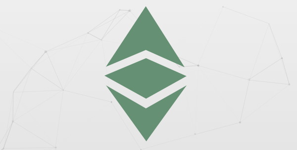
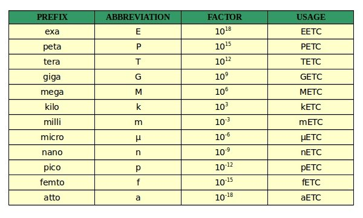

## Proposal

Here are some proposed Ethereum Classic (ETC) conventions to improve communication and avoid expensive mistakes:

* Refer to the currency as "ETC".  Avoid the term "ether" whenever possible.

* Use the International System (SI) or metric prefixes to denote divisions of currency as in kETC, nETC and aETC.  Avoid the terms "wei", "szabo" and "finney" whenever possible.

* Prefer the green clean minimalist logo on the ETC website over other choices.

## Motivation

The term "ether" is error prone for beginners as it can be confused with the Ethereum (ETH) currency.  This can lead to expensive mistakes on cryptocurrency exchanges.  Furthermore, the ETH currency terms "wei", "szabo" and "finney" are also confusing for beginners.  The inventors of blockchain technology deserve to be honored.  However, there are better ways to do that than to complicate currency transactions.  Also, using the same consistent logo will improve marketing efforts.  Finally, these conventions are another way to positively distinguish ETC from ETH and improve investor confidence.

## Implementation

The proposed conventions are based on the *current* standard currency code, "ETC", and the *de facto* standard logo on the ETC website.  It is only necessary to continue using them and avoid other choices whenever possible.  The SI or metric prefixes are already well known throughout the entire world and will be immediately recognized without any effort needed:

The choice that will likely get used the most, in addition to ETC, is aETC since many objects in software denote funds using this smallest possible division of currency.

## Feedback

You can contact me by clicking any of these icons:

  

## Acknowledgements

I would like to thank IOHK (Input Output Hong Kong) for funding this effort.

## License

This work is licensed under the Creative Commons Attribution ShareAlike 4.0 International License.
