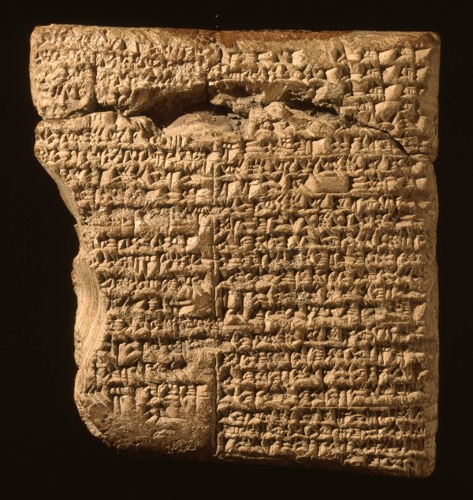

Eyan Ron in  [A New Era of Blockchain Immutability - Towards a New Understanding](http://cryptom.site/2017/03/06/a-new-era-of-blockchain-immutability-towards-a-new-understanding/) brilliantly describes two types of blockchain system immutability: *historical* and *procedural*.  I will show how these distinctions can improve Ethereum Classic (ETC) immutability discussions.

## Historical Immutability

*historical immutability : property of blockchain systems such that the content and positions of all blocks, older than some minimum age, do not change*

Historical immutability is not the same as blockchain immutability.  An immutable blockchain would not allow new blocks!  Historical immutability only applies to sufficiently aged blocks (or equivalently, blocks of sufficient depth in the blockchain).  It permits new blocks and avoids confusion regarding the latest blocks.  Furthermore, historical immutability does not allow new blocks to be added anywhere except after the latest blocks.

## Procedural Immutability

*procedural immutability : property of blockchain systems such that the protocol to determine valid blocks does not change*

Blockchain systems define block validation protocols.  These might specify mining rewards and valid proof of work information.  Procedural immutability typically is *not* desirable!  It would prohibit bug fixes and new features!  Although blockchain systems typically cannot guarantee procedural immutability, they should specify the only situations in which it may be violated.

## ETC Immutability

It is now possible to more precisely define ETC immutability:

*ETC guarantees historical immutability, and, to only violate procedural immutability in order to improve the system.*

## Managing Improvements

Unfortunately, this does not eliminate all ambiguity.  There might still be confusion and disagreements regarding what constitutes *improvements!*  Is the Ethereum DAO attack hard fork an "improvement" because it potentially increased the available investment capital? Clearly all blockchain systems, including ETC, must develop protocols to evaluate proposed improvements and avoid future problems.

## Historical Discussions

Below are some noteworthy historical ETC immutability related snippets and possible responses:

### Gavin Wood - 2016-10-27 - [I would suggest that EIP-150 was compliant from a "don't mess with the chain" immutability point of view.](https://www.reddit.com/r/ethereum/comments/59naa2/what_does_immutability_really_mean/)

Possible Response: *EIP-50 did not violate historical immutability since it only altered gas prices.  It was a violation of procedural immutability that improved the system.*

### Nick Johnson - 2016-10-27 - ["Immutability" is overused and under-specified. Strictly speaking, it should mean only that the blockchain - the set of past transactions - is not modified, which no Ethereum fork has ever done.](https://www.reddit.com/r/ethereum/comments/59naa2/what_does_immutability_really_mean/)

Possible Response: *The DAO attack hard fork did not technically violate historical immutability.  However, it was a violation of procedural immutability that many would argue did not improve the system.*

### Vitalik Buterin - 2016-11-15 - [ETC is mutable too; they mutated their transaction execution rules to fix the recent DoS issues,](https://www.reddit.com/r/btc/comments/5cxyv8/andrew_lee_purseio_ceo_on_twitter_multiple/da0qpdi/)

Possible Response: *Removing the denial of service vulerabilities violated procedural immutability.  However, this improved the system and did not violate historical immutability.*

### Emin Gün Sirer - 2017-01-14 - [Feel free to edit your coin any way you like. But be advised that the word immutable doesn't apply.](https://twitter.com/el33th4xor/status/820370931004542978)

Possible Response: *Procedural immutability does not apply but historical immutability does.*

## Conclusion

Eyan Ron has helped clarify the definition of ETC immutability.  This is useful to improve discussions.  Further work is required to specify a protocol to manage proposed ETC improvements.

## Feedback

You can contact me by clicking any of these icons:

  

## Acknowledgements

I would like to thank IOHK (Input Output Hong Kong) for funding this effort.

## License

This work is licensed under the Creative Commons Attribution ShareAlike 4.0 International License.
