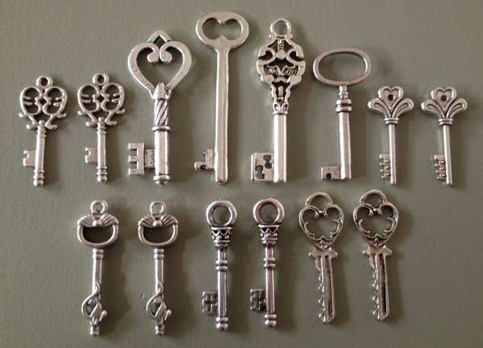

# Introduction



Interactions with the Ethereum Classic (ETC) system depend on special numbers referred to as *public keys* and *private keys*.  Private keys are used to transfer funds, install programs, and, run programs.  These numbers must be kept secret at all times.  Public keys are used to confirm knowledge of private keys *without* their disclosure.  Public keys also provide a means of identifying [accounts](https://steemit.com/etc/@cseberino/the-ethereum-classic-world-computer-accounts-and-states-explained).

# Details


Private keys are 32 byte numbers between 1 and

```
115792089237316195423570985008687907852837564279074904382605163141518161494336
```

inclusive.  People *randomly* select them.  Some may be concerned that two people might unintentionally select the same private key.  The odds of that happening are vanishingly small.  In fact, the number of possible private keys is approximately equal to the number of atoms in the entire *universe!*

Public keys are 64 byte numbers *derived* from private keys using an odd type of arithmetic with respect to *pairs* of numbers.  Here is a Python script that calculates public keys from private keys:

```
#!/usr/bin/env python3

"""
Calculates ETC public keys from ETC private keys.

Usage: etc_pub_key <private key>
"""

import random
import sys

A           = 0
N           = 0xfffffffffffffffffffffffffffffffebaaedce6af48a03bbfd25e8cd0364141
P           = 0xfffffffffffffffffffffffffffffffffffffffffffffffffffffffefffffc2f
GX          = 0x79be667ef9dcbbac55a06295ce870b07029bfcdb2dce28d959f2815b16f81798
GY          = 0x483ada7726a3c4655da4fbfc0e1108a8fd17b448a68554199c47d08ffb10d4b8
HEXADECIMAL = 16
NUM_FORMAT  = "{{:0{}x}}".format(len(hex(P)[2:]))

def inverse(number):
        """
        Inverts a number.
        """

        inverse = 1
        power   = number
        for e in bin(P - 2)[2:][::-1]:
                if int(e):
                        inverse = (inverse * power) % P
                power = (power ** 2) % P

        return inverse

def add(pair_1, pair_2):
        """
        Adds two pairs.
        """

        if   pair_1 == "identity":
                sum_ = pair_2
        elif pair_2 == "identity":
                sum_ = pair_1
        else:
                if pair_1 == pair_2:
                        numer   = 3 * pair_1[0] ** 2 + A
                        lambda_ = (numer * inverse(2 * pair_1[1])) % P
                else:
                        numer   = pair_2[1] - pair_1[1]
                        denom   = pair_2[0] - pair_1[0]
                        lambda_ = (numer * inverse(denom)) % P
                x    = (lambda_ ** 2 - pair_1[0] - pair_2[0])  % P
                y    = (lambda_ * (pair_1[0] - x) - pair_1[1]) % P
                sum_ = (x, y)

        return sum_

def multiply(number, pair):
        """
        Multiplies a pair by a number.
        """

        product = "identity"
        power   = pair[:]
        for e in bin(number)[2:][::-1]:
                if int(e):
                        product = add(power, product)
                power = add(power, power)

        return product

def convert(pair):
        """
        Converts pairs to numbers by concatenating the elements.
        """

        return int("".join([NUM_FORMAT.format(e) for e in pair]), HEXADECIMAL)

print(convert(multiply(int(sys.argv[1]), (GX, GY))))
```

The reason for this convoluted process is so that private keys *cannot* be derived from public keys.  If you want to learn more, investigate *elliptic curve cryptography*.  The reason for this name is that historically it followed from calculations of the arc lengths of ellipses.

# Miscellany


### Addresses

The first 20 bytes of [Keccak 256](https://steemit.com/etc/@cseberino/why-ethereum-classic-uses-an-incorrect-sha3-implementation) hashes of public keys are referred to as account *addresses*.  These are most often used to identify accounts rather than public keys.  Interestingly, public keys cannot be determined solely from addresses.

Here is a Python script that calculates addresses from public keys.  It requires the PySHA3 package.  Addresses are typically expressed in hexadecimal notation and that convention is followed in this script:

```
#!/usr/bin/env python3

"""
Calculates ETC addresses from ETC public keys.

Usage: etc_address <public key>
"""

import sha3
import binascii
import sys

N_ADDRESS_BYTES = 20
N_PUB_KEY_BYTES = 64

public_key = (int(sys.argv[1])).to_bytes(N_PUB_KEY_BYTES, byteorder = "big")
print(sha3.keccak_256(public_key).hexdigest()[-2 * N_ADDRESS_BYTES:])
```

### Signatures

Private keys provide a way to effectively sign transactions.  For this, ETC uses the Elliptic Curve Digital Signature Algorithm (ECDSA). The basic idea is to create sets of numbers, corresponding to transactions, that can *only* be generated by the sending account private keys.  This is analogous to handwritten signatures that can only be generated by the corresponding hands.

### Programs

Programs, or [smart contracts](https://steemit.com/etc/@cseberino/the-skinny-on-smart-contracts-an-introduction-and-why-you-should-care), do not have their own public and private keys.  Therefore, programs cannot digitally sign transactions.  Furthermore, program account addresses must be selected by some other means.

# Example


Here is a slightly edited session, on a Linux computer, that calculates a public key and address with regards to a random private key.  It uses the aforementioned scripts saved in files called etc_pub_key and etc_address respectively:

```
% PRIVATE_KEY="92788259381212812445638172234843282167646237087212249687358593145563035518424"

% PUBLIC_KEY=`etc_pub_key $PRIVATE_KEY`

% ADDRESS=`etc_address $PUBLIC_KEY`

% echo $PRIVATE_KEY
92788259381212812445638172234843282167646237087212249687358593145563035518424

% echo $PUBLIC_KEY
9808854183897174607002157792089896992612613490844656534725423301978228163634425857099752732031947328803605451685330420628756154476771607661633738743568351

% echo $ADDRESS
89b44e4d3c81ede05d0f5de8d1a68f754d73d997
```

# Conclusion


Public and private keys are widely used in ETC and in other technologies.  Therefore, I hope this has been enlightening.

# Feedback

You can contact me by clicking any of these icons:

[](https://twitter.com/chris_seberino) [](https://www.facebook.com/cseberino) [](https://www.linkedin.com/in/christian-seberino-776897110)

# Acknowledgements

I would like to thank IOHK (Input Output Hong Kong) for funding this effort.

# License


This work is licensed under the Creative Commons Attribution ShareAlike 4.0 International License.
