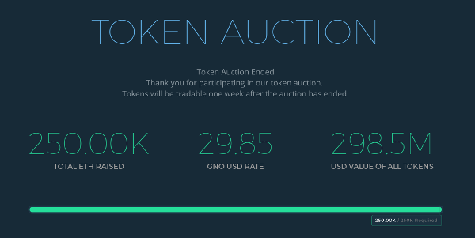

Many initiatives are raising capital with initial coin offerings (ICOs).  The Ethereum (ETH) project raised 18 million dollars and the DAO project raised 150 million dollars!  Furthermore, the entire blockchain space is worth 90 *billion* dollars!  I will describe ICOs and their custom cryptocurrencies on Ethereum Classic (ETC).

## ICO Basics



An ICO is a method of raising funds with the sale of a new cryptocurrency.  These cryptocurrencies are often required to purchase goods and services from the issuing organizations.  For example, the ETH cryptocurrency (ether) is used to rent ETH system resources.  Upcoming ICOs are typically announced on [Bitcointalk.org](https://bitcointalk.org/index.php?board=159.0) forums and heavily marketed beforehand.  Buyers often purchase the new cryptocurrencies by sending bitcoins or ether to escrow accounts.  The initial prices are set, then supply and demand determines the future prices.  If the organizations are well managed, and their cryptocurrencies prove useful, they should both increase in value.  If prices skyrocket, minuscule cryptocurrency subdivisions can typically be used.  For example, ETC cryptocurrency tokens can be subdivided into as many as 10<sup>18</sup> pieces.

Caution is required with ICOs as they are effectively *unregulated*.  Participants do not purchase ownership in companies, nor, many privileges protected by established case law.  There is great potential for innovation as well as scams.  [Smith & Crown]( https://www.smithandcrown.com) and [ICOrating](http://icorating.com/) are two resources that can assist with ICO research.

## ICO Cryptocurrencies


Cryptocurrencies are implemented with [smart contracts](https://steemit.com/etc/@cseberino/the-skinny-on-smart-contracts-an-introduction-and-why-you-should-care). ETC provides an excellent smart contract platform.  It has all of the functionality of ETH at a fraction of the cost.

Many exchanges and other users prefer crytocurrencies to adhere to the [Ethereum Token Standard](https://github.com/ethereum/EIPs/issues/20).  This standard specifies the following interfaces for cryptocurrency smart contracts:

| INTERFACE                                            | DESCRIPTION                       |
|------------------------------------------------------|-----------------------------------|
| transfer(receiving_address, transfer_amount)         | Transfers funds between accounts. |
| balanceOf(account_address)                           | Returns account balances.      |
| totalSupply()                                        | Returns the total supply.         |

The standard also specifies the following interfaces for when a user wants *another* account to also manage their funds:

| INTERFACE	                                                        | DESCRIPTION                               |
|-------------------------------------------------------------------|-------------------------------------------|
| approve(approved_address, approved_amount)                       	| Allows other accounts to also transfer funds. |
| transferFrom(sending_address, receiving_address, transfer_amount)	| Transfers funds between accounts.         |
| allowance(shared_address, approved_address) 	                     | Returns approved amounts.    |

It is also common to include the following named constants:

| NAMED CONSTANT | DESCRIPTION                                                 |
|----------------|-------------------------------------------------------------|
| name           | cryptocurrency name                                         |
| symbol         | cryptocurrency exchange ticker symbol                                |
| decimals       | cryptocurrency maximum number of subdivision decimal places |

For example, the ETC cryptocurrency exchange ticker symbol is ETC.  Since ETC cryptocurrency tokens can be divided into as many as 10<sup>18</sup> pieces, the maximum number of subdivision decimal places is 18.

### Sample Code

There are many [Ethereum Token Standard compliant Solidity smart contract examples](https://theethereum.wiki/w/index.php/ERC20_Token_Standard) available.  Here is an example of an Ethereum Token Standard compliant [Serpent](https://steemit.com/etc/@cseberino/serpent-introduction-to-the-best-ethereum-classic-smart-contract-language) smart contract:

```
#
## Implements a cryptocurrency that adheres to the Ethereum Token Standard.
#

data NAME
data SYMBOL
data DECIMALS
data TOTAL_SUPPLY
data balance[]
data approved[][]

event Approve(managed_add:address:indexed, manager_add:address:indexed, approv_amt:uint256)
event Transfer(send_add:address:indexed, receiv_add:address:indexed, trans_amt:uint256)

def init():
        #
        # Sets the named constants and the initial balance(s).
        #

        self.NAME                = "Example"
        self.SYMBOL              = "EXPL"
        self.DECIMALS            = 4
        self.TOTAL_SUPPLY        = 100 * 10 ** self.DECIMALS
        self.balance[msg.sender] = self.TOTAL_SUPPLY

def name():
        #
        # Returns the cryptocurrency name.
        #

        return self.NAME

def symbol():
        #
        # Returns the exchange ticker symbol.
        #

        return self.SYMBOL

def decimals():
        #
        # Returns the maximum number of subdivision decimal places.
        #

        return self.DECIMALS

def totalSupply():
        #
        # Returns the total supply.
        #

        return self.TOTAL_SUPPLY

def balanceOf(account_add:address):
        #
        # Returns account balances.
        #

        return self.balance[account_add]

def allowance(managed_add:address, manager_add:address):
        #
        # Returns approved amounts.
        #

        return self.approved[managed_add][manager_add]

def approve(manager_add:address, approv_amt:uint256):
        #
        # Allows managers (other accounts) to also transfer funds.
        #

        self.approved[msg.sender][manager_add] = approv_amt
        log(type = Approve, msg.sender, manager_add, approv_amt)

        return 1

def valid(send_add:address, receiv_add:address, trans_amt:uint256):
        #
        # Determines the validity of transfers.
        #

        valid_trans_amt  = 0 <= trans_amt <= self.TOTAL_SUPPLY
        suff_send_bal    = self.balance[send_add] >= trans_amt
        receiv_bal       = self.balance[receiv_add] + trans_amt
        valid_receiv_bal = receiv_bal <= self.TOTAL_SUPPLY

        return valid_trans_amt and suff_send_bal and valid_receiv_bal

macro update_balance($send_add, $receiv_add, $trans_amt):
        #
        # Updates balance with regards to transfers.
        #

        self.balance[$send_add]   -= $trans_amt
        self.balance[$receiv_add] += $trans_amt

macro update_approved($send_add, $trans_amt):
        #
        # Updates approved with regards to transfers.
        #

        self.approved[$send_add][msg.sender] -= $trans_amt

def transfer(receiv_add:address, trans_amt:uint256):
        #
        # Transfers funds between accounts.
        #

        result = 0
        if self.valid(msg.sender, receiv_add, trans_amt):
                update_balance(msg.sender, receiv_add, trans_amt)
                log(type = Transfer, msg.sender, receiv_add, trans_amt)
                result   = 1

        return result

def transferFrom(send_add:address, receiv_add:address, trans_amt:uint256):
        #
        # Transfers funds between accounts.
        #

        result     = 0
        approv_amt = trans_amt <= self.approved[send_add][msg.sender]
        if self.valid(send_add, receiv_add, trans_amt) and approv_amt:
                update_balance(send_add, receiv_add, trans_amt)
                update_approved(send_add, trans_amt)
                log(type = Transfer, send_add, receiv_add, trans_amt)
                result   = 1

        return result
```

## Conclusion


ICOs are a new way to raise funds and the ETC platform is an excellent choice for the required cryptocurrency smart contracts.  Vigilance due to the lack of regulations remains important. Hopefully, mechanisms to protect against abuse will allow an ever growing number of people to reap the benefits.

## Feedback

You can contact me by clicking any of these icons:

[](https://twitter.com/chris_seberino) [](https://www.facebook.com/cseberino) [](https://www.linkedin.com/in/christian-seberino-776897110)

## Acknowledgements

I would like to thank IOHK (Input Output Hong Kong) for funding this effort.

## License


This work is licensed under the Creative Commons Attribution ShareAlike 4.0 International License.
