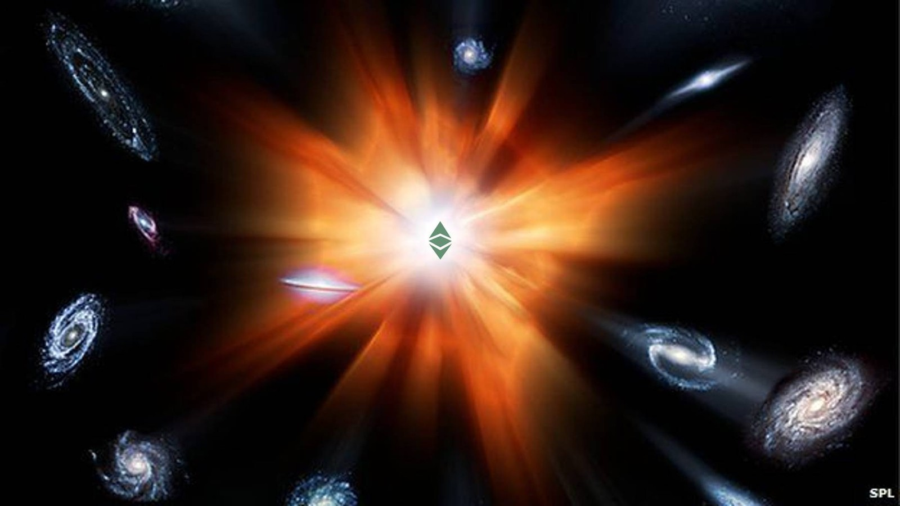

## Ethereum Classic welcomes Ethereum Commonwealth

> "If by my life or death I can protect you, I will. You have my sword..."
> Aragorn - J.R.R Tolkien

We are very happy to welcome Dexaran's soon to be development team called [Ethereum Commonwealth](https://dexaran.github.io/ICO/) as one of the development powers behind Ethereum Classic. As you know your team is joining us at an exciting time in history, as Ethereum Classic is shifting from the incredible burst of expansion (inflation) to the cooling down phase where matter starts to be formed.

Source [BBC](http://www.bbc.com/news/science-environment-26605974)

We are hopeful that with your fresh ideas and enthusiasm, this will be one of our best years ever! The community is projecting unprecedented growth this year, and we are counting on you to help us get there.

When you have already established your team, let's coordinate efforts to expand the community in several different and complimentary dimensions. We are all looking forward to working with your team and are certain that you guys are going to be yet a great power to Ethereum Classic as Grothendiek and ETC Dev teams are. Welcome aboard!

## Pledge for support
Contribute to the many development teams powering Ethereum Classic technology, help teams to be born by supporting them as you can. We as a community thank all the brave work already done by developers. But still there is a lot to do.

Source [Little Time Machine](littletimemachine.com)

There is a beautiful horizon ahead, so let us shape with joy and enthusiasm the future together for good!
