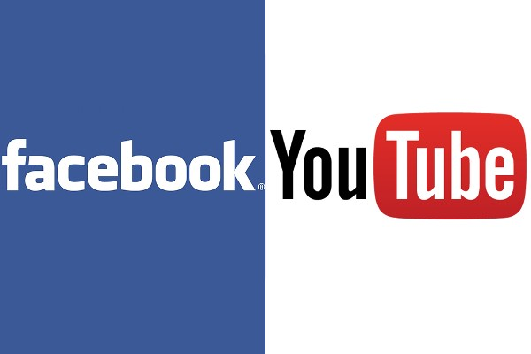

The most ambitious goal for Ethereum Classic (ETC) is to *replace* the World
Wide Web (Web). Blockchain based replacements for the Web are often referred to
as Web 3.0.

## Web 2.0

The Web was developed by Tim Berners-Lee and first made publicly available in
1991. It is a user friendly general purpose system based on the Internet.
Initially the Web mainly contained simple static content such as primitive
personal home pages. As the Web evolved, greater dynamism and interactivity was
possible such as with social media. This improved Web is often referred to as
Web 2.0. The term was popularized by Tim O’Reilly.

## Web 3.0

Neither the Internet nor the Web were initially designed to be *trustless*
systems. Components have been steadily introduced to improve security such as
Transport Layer Security (TLS), certificate authorities, and, Domain Name System
Security Extensions (DNSSEC). Unfortunately, many such improvements are only
partially adopted.

Gavin Wood popularized the term Web 3.0 for blockchain based trustless
alternatives to the Web. Confusingly, Web 3.0 also sometimes refers to the
Semantic Web. Furthermore, Web3 also refers to a standard set of ETC application
programming interfaces.

### Peer To Peer

Web 3.0 is a *peer to peer* replacement for the Web. A peer to peer architecture
is required to build trustless systems.

### Pseudonymous

Web 3.0 users are pseudonymous. They are *only* identified by their accounts,
unlike the Web, where addresses can be associated with identities.

### Extensible

ETC requires access to additional short and long term storage systems to replace
the Web. The InterPlanetary File System (IPFS) is an example of a compelling
peer to peer storage system that can integrate with ETC.

### Evolving

The Web currently coexists with blockchain systems. Websites access these
systems to provide additional functionality. As ETC and related systems mature,
browsers will increasingly just point to these Web alternatives thus ushering in
the era of Web 3.0.

## Conclusion

A public, censorship resistant, pseudonymous, auditable, reliable, secure and
trustless replacement for the Web is a compelling vision. ETC, IPFS and related
tools can deliver Web 3.0. It is therefore understandable why so many are
enamored with ETC and its potential.

## Feedback

You can contact me by clicking any of these icons:

## Acknowledgements

I would like to thank IOHK (Input Output Hong Kong) for funding this effort.

## License

This work is licensed under the Creative Commons Attribution ShareAlike 4.0
International License.
