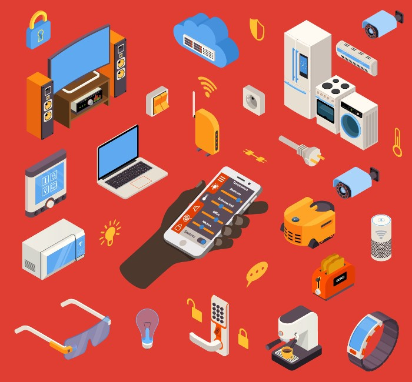
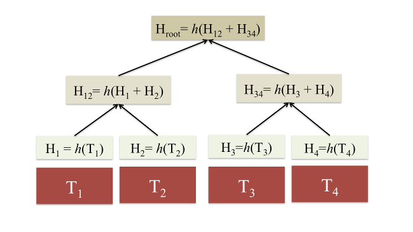

Ethereum Classic (ETC) light clients are clients that do not maintain a copy of
the entire ETC blockchain. I will explain how they can nevertheless *securely*
operate.

### Honest Nodes

Light clients obtain blockchain information by communicating with network nodes.
It is possible that malicious network nodes may censor blocks on the longest
chain. Light clients can still operate securely as long as they connect to at
least one honest and *up to date* node. It is not sufficient to connect to an
honest node. The honest node must itself be connected to another honest node,
and so on. Otherwise, honest nodes may not have all the blocks on the longest
chain.

Here is a list of honest ETC network node TCP sockets that light clients can
connect to. (This list can also be found
[here](https://github.com/paritytech/parity/blob/master/ethcore/res/ethereum/classic.json).):

    174.112.32.157:30303

    52.206.67.235:30303

    162.243.55.45:30303

    104.155.176.151:30303

    104.154.136.117:30303

    104.198.71.200:30303

    144.76.238.49:30303

    144.76.238.49:30306

### Block Headers

Hashes are fixed length strings that can *guarantee* the integrity of all
information. Merkle trees are trees of hashes that can minimize the necessary
communication between network nodes and light clients. The tops of Merkle trees
are referred to as root hashes. Block headers contain the root hashes for light
clients to securely and efficiently obtain state and transaction information
from network nodes. Because block headers are *much* smaller than entire blocks,
light clients with limited storage can still operate securely by storing just
the block headers of the blockchain.

### Hash Checks

To be sure a light client is connected to the ETC network, confirm the first
block (genesis block) of the blockchain is associated with the following hash:

    0xd4e56740f876aef8c010b86a40d5f56745a118d0906a34e69aec8c0db1cb8fa3

Also, confirm block 1,920,000 is associated with the following hash:

    0x94365e3a8c0b35089c1d1195081fe7489b528a84b22199c916180db8b28ade7f

This block is where the ETC blockchain diverges from the Ethereum (ETH)
blockchain.

### Node Incentives

Some think the need for light clients to request state and transaction
information from network nodes might be a vulnerability. The concern is that
network nodes may not always have sufficient incentives to assist light clients.
Some have suggested compensating network nodes for assisting light clients. At
the very least, supporters of ETC are motivated to support light clients to grow
the number of users. Also, smart contract application providers are motivated to
support light clients to increase the number of potential customers.

### Conclusion

It is amazing that a protocol exists for even tiny embedded devices to securely
utilize the ETC system. By connecting to honest nodes, only storing block
headers, and, utilizing the properties of hashes, even toasters can benefit from
the ETC world computer.

## Feedback

You can contact me by clicking any of these icons:

## Acknowledgements

I would like to thank IOHK (Input Output Hong Kong) for funding this effort.

## License

This work is licensed under the Creative Commons Attribution ShareAlike 4.0
International License.
