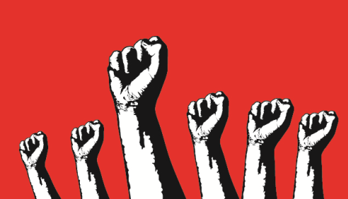

*In a parallel universe near you…*

“IT’S JUST NOT FAIR!” shouted Gully Bull into his microphone so loud his voice
thundered over the audience. Bull is the car delivery business owner and
activist who put together the Save Toll Equality March On Washington. Toll
equality is the principle that every vehicle should pay the same toll road fees.
Small cars pay an average of &dollar;5 at most toll roads. Big 18 wheelers pay
&dollar;30 or
more depending on their weight. Intertoll Service Providers (ISPs) that manage
the national toll road network (Intertoll) argue that heavier vehicles should
pay greater fees since they cause more road wear. Former President O. Bammer
required the Federal Cargo Commision (FCC) to begin a policy enforcing toll
equality: “This is the great moral issue of our time. Nothing less than the very
survival of the Intertoll is at stake.” Unfortunately for President Bammer, his
chosen successor lost in a stunning upset to now President Trunk. Gully Bull and
others were terrified that now ISPs would continue charging different vehicles
different toll fees.

Trunk’s new FCC could have weathered Gully Bull’s trouble making. However, there
were thousands of other like minded “Gully Bulls” all over the country.
Furthermore, all the major trucking companies had poured millions into the Save
Toll Equality campaign. Facetruck CEO Mark Tuckerberg donated &dollar;50
million.
YouTruck CEO Eric Smith donated another &dollar;40 million. Major media outlets
blared
constant headlines about the Save Toll Equality movement. Every American was
talking about it.

Just two hours before Gully Bull’s current speech, the massive campaign had
finally forced Trunk’s FCC to reverse its position. “Today I stand before you,
not as a small business man, but as an American. An American that wants an
Intertoll that is not just affordable for us, but, also for our childrens’
children.”

### 18 MONTHS LATER…

“IT’S JUST NOT FAIR!” screamed Gully Bull into his smartphone to the CEO of
Verizone, the largest ISP in the nation. Since toll equality, many ISPs went out
of business. Verizone survived thanks to a massive rate hike. It was easy since
much of their competition disappeared. Although everyone now paid the same, the
new &dollar;10 rate was double the previous &dollar;5 for small cars. Truckers
fared better as
&dollar;10 was *one third* of their previous &dollar;30.

“Mr. Bull, we believe in treating everyone fairly and strictly honor toll
equality on all our toll roads. We raised our rates on small cars to cover the
extra wear from heavier trucks. We also had to make up the lost revenue from the
new lower truck rate.”

“Yes but &dollar;10 is killing my car delivery business! And, you’re giving the
truckers a handout!”

“I’m sorry you feel that way. Please take up any further concerns with the FCC.
Good day.”

The next week, Gully Bull’s company went bankrupt and the country slid into a
recession. Facetruck and YouTruck reported record quarterly earnings.

On a completely unrelated note. Since I have your attention dear reader, allow
me to comment on something completely unrelated, net neutrality: DON’T BELIEVE
THE HYPE!

## Feedback

You can contact me by clicking any of these icons:

## Acknowledgements

I would like to thank IOHK (Input Output Hong Kong) for funding this effort.

## License

This work is licensed under the Creative Commons Attribution ShareAlike 4.0
International License. 
