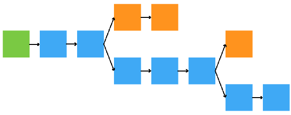

The Ethereum Classic (ETC) mining difficulty parameter may seem mysterious to
some. I will show it has a beautiful easy to understand interpretation.

### Background

Some ETC network computers receive rewards for creating, distributing and
validating the blocks of the ETC blockchain. This work is referred to as
*mining* and the computers as *miners*. To create valid blocks, miners keep
adjusting random numbers in those blocks until corresponding 256 bit hashes meet
a certain requirement. The random numbers are referred to as *nonces*. The hash
requirements involve a number referred to as the *difficulty*. For a hash value
*H* and difficulty *d*, this is the requirement:

*H* ≤ 2²⁵⁶ / *d*

### Interpretation

The probability of an arbitrary hash meeting the requirement is equal to the
number of acceptable hashes divided by the number of possible hashes. In other
words, for a difficulty *d*, this probability is equal to the following:

(2²⁵⁶ / *d*) / 2²⁵⁶ = 1 / *d*

I will now show that *d* equals the average required number of hashes to find an
acceptable nonce. I will do this first using software and second using calculus:

*Software Based Derivation* - The following Python program finds the average
required counts of random numbers, between zero and one, to obtain values less
than 1 / *d* for various values of *d*:

    #!/usr/bin/env python3

    import random

    ONE_MILLION = 1e6

    def get_count(maximum):
            """
            Calculates the number of random values, between 0 and 1,
            generated before arriving at a value less than or equal to
            some maximum.
            """

            value = random.random()
            count = 1
            while value > maximum:
                    value  = random.random()
                    count += 1

            return count

    def get_average(maximum):
            """
            Calculates the average output of one million get_count
            invocations for a given maximum.
            """

            average = 0
            for i in range(int(ONE_MILLION)):
                    average += get_count(maximum) / ONE_MILLION

            return average

    print("difficulty        average")
    print("=========================")
    for d in [10, 500, 1000, 50000, 100000]:
            average = get_average(1 / d)
            print("   {:7d}     {:10.2f}".format(d, average))

Here is the output:

    difficulty        average
    =========================
            10          10.01
           500         500.26
          1000        1000.29
         50000       49916.62
        100000       99963.98

The errors can always be made smaller by averaging over a larger quantity of
numbers. Clearly the average count is the difficulty.

*Calculus Based Derivation* - The probablity of a hash count of one is 1 /
*d*. The probability of a hash count of two is (1 / *d*)(1 - 1 / *d*). The
probability of a hash count of three is (1 / *d*)(1 - 1 / *d*)², etc. The
average hash count is the sum of the products of these probabilities and their
corresponding hash counts:

(1 / *d*)(1) + (1 / *d*)(1 - 1 / *d*)(2) + (1 / *d*)(1 - 1 / *d*)² (3) + …

Let *A*(*x*) be a function based on this expression such that the average hash
count is *A*(1):

*A*(*x*) = (1 / *d*) + (2 / *d*)(1 - 1 / *d*)*x* + (3 / *d*)(1 - 1 / *d*)² *x*² + …

Here is the antiderivative of *A*(x):

(1 / *d*)*x* + (1 / *d*)(1 - 1 / *d*)*x*² + (1 / *d*)(1 - 1 / *d*)² *x*³ + …

This is equal the following geometric series divided by *d* - 1:

(1 - 1 / *d*) *x* + (1 - 1 / *d*)² *x*² +(1 - 1 / *d*)³ *x*³ + (1 - 1 / *d*)⁴
*x*⁴ + …

Using the formula for an infinite geometric series, this can be shown to equal:

*d* / (*d* + *x* - *dx*) - 1

Since *A*(*x*) is equal to the derivative of its antiderivative, *A*(*x*) is equal
to the derivative of the above expression divided by *d* - 1:

*A*(*x*) = *d* / (*d* + *x* - *dx*)²

Clearly the average hash count *A*(1) = *d*.

### Conclusion

The mining difficulty can be understood as the average number of hashes required
to find a valid nonce. If it was mysterious before, hopefully now it is less so.

### Feedback

You can contact me by clicking any of these icons:

### Acknowledgements

I would like to thank IOHK (Input Output Hong Kong) for funding this effort.

### License

This work is licensed under the Creative Commons Attribution ShareAlike 4.0 
International License.
