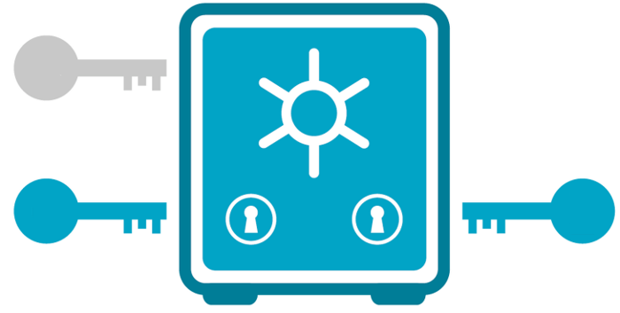
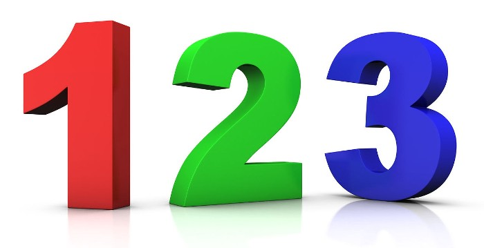

Multisig smart contracts will likely be the dominant smart contract type in the
future. The security and other benefits are that compelling. I will describe
these smart contract types and scenarios where they are useful.

### Introduction

Malware, keyboard loggers and “man in the middle attacks” are just some of the
ways passwords can be stolen. Therefore, many use multifactor authentication to
increase security. For example, accessing a website from a laptop may require a
password *and* approval from a smartphone.

Ethereum Classic (ETC) and other smart contract systems can also benefit from
multifactor authentication. ETC users are associated with accounts. ETC account
authentication involves digital signatures. Therefore, ETC smart contracts
requiring multifactor authentication are referred to as *multisig* smart
contracts.

### 2 Of 3 Applications

One of the most common types of multisig smart contracts requires digital
signatures from any two of three accounts. Here are some applications where this
is useful:

**Single Individuals** - Imagine always requiring a digital signature from a
laptop based account and a smartphone based account. To protect against the loss
of either device, store the information for the third account in a secured paper
wallet.

**Online Shopping (Trusted Escrow)** - When purchasing products and services
online, imagine buyers placing funds in multisig smart contracts. Have buyers
and sellers each control an associated account. Allow an arbiter to control the
third associated account. Notice buyers and sellers can together release funds
without the arbiter. In the event of disagreements notice the arbiters can,
together with buyers or sellers, release funds to the desired choices. This is
referred to as *trusted escrow* because the arbiter does not control of any
funds.

**Small Businesses** - Imagine a small business controlling one associated
account, and, a separate inspection service company controlling the second
associated account. All transactions must be approved by the inspection service.
To protect against issues with either account, store the information for the
third associated account in a secured paper wallet.

### Additional Applications

Here are two more multisig smart contract types and applications:

**Majority Rule** - Imagine all members of a group controlling separate
associated accounts. Always require digital signatures from any *majority* of
the accounts. This would implement a majority rule arrangement.

**Unanimity Rule** - Imagine all members of a group controlling separate
associated accounts. Always require digital signatures from *all* of the
accounts. This would implement a unanimity rule arrangement.

### Standardization

There are currently no ETC multisig smart contract standards. However, open
source templates are available such as from the
[OpenZeppelin](https://openzeppelin.org/) project.

### Conclusion

There are several common scenarios where multisig smart contracts are useful and
significantly increase security. Therefore, it is likely they will take over ETC
and the world.

### Feedback

You can contact me by clicking any of these icons:

### Acknowledgements

I would like to thank IOHK (Input Output Hong Kong) for funding this effort.

### License

This work is licensed under the Creative Commons Attribution ShareAlike 4.0 
International License.
