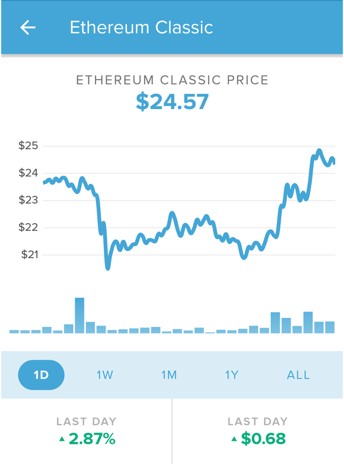

[Read this article on Medium (looks nicer)](https://medium.com/@pyskell/etc-roundup-whats-new-this-week-3-12-18-5eabdf954a49)

## Circle Invest will carry ETC

Goldman Sach’s answer to Coinbase will allow for the trading of ETC/USD as
[first reported by
CCN](https://www.ccn.com/circles-coinbase-like-cryptocurrency-investing-app-enters-closed-beta/)
(not CNN).

A USD onramp will be huge for ETC, it’s already a preferred method of moving
funds. Many traders I’ve spoken to like ETC because of its speed and low
transaction fee (half-cent to 1-cent transactions).

With ETC sidechains coming out later this year I think we’ll see ETC keep up
with the increased usage Circle Pay will bring.

Seems Circle chose ETC over XRP.

#### Website Redesign

Very long overdue improvements are coming to
[ethereumclassic.org](http://ethereumclassic.org/), we’ll be bringing the site
up to modern standards and making it far more informative for new users and
developers alike.

I could write an entire article about it but want to keep this short so if you
want to learn more about the redesign and provide some input then please
[respond to the forum
post](https://forum.ethereumclassic.org/t/ethereumclassic-org-redesign-and-improvement/).

We’ll have mockups in a couple of weeks for a more visual preview so stay tuned
for further announcements.

#### Community Fund

The contract is live and [located here](http://0x48dbda9443746a99ef1b26ab01dd94ac50d7014b/), just awaiting two of
the signers to approve their test transactions.

We’ll be using it to fund various bounties and other proposals which will be
posted in the [Ecosystem Proposals
category](https://forum.ethereumclassic.org/c/ecosystem-proposals) on the
forums.

If you want to submit a proposal feel free to make a new post, just remember to
[follow the
template](https://forum.ethereumclassic.org/t/forum-proposal-template-use-this-for-any-proposals-that-need-funding/1467/2)
if you’re submitting a funding request.

#### Disabling the Difficulty Bomb

We’ll be turning off the difficulty bomb at block 5,900,000; expected to occur
around May 8th. [ETCDEV](https://www.etcdevteam.com/) has contributed the code
for this fork and no, there are no new coins, this is a network improvement, not
a cash grab, please stop asking.

This bomb was originally put in place by the Ethereum Foundation in order to
push the network towards PoS. However it has become apparent that PoS is both
far more complicated and risky than originally thought. So rather than further
delay the difficulty bomb we’re simply going to remove it and stay PoW since it
works.

There’s also a mailing list for hard forks and security alerts now, it’s run by
[The ETC Cooperative](http://etccooperative.org/), if you’re an exchange, miner,
node operator, wallet creator, or just plain interested then signup to it here:
[http://eepurl.com/dmc_AX](http://eepurl.com/dmc_AX)