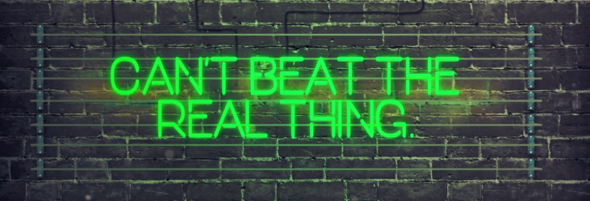

[Read this article on Medium (looks nicer)](https://medium.com/@pyskell/etc-roundup-what-happened-last-week-3-19-18-d49b6ef1add0)

[via
Reddit](https://www.reddit.com/r/EthereumClassic/comments/85avyn/metallic_butts_presents_its_showtime_you_love/)

#### SputnikVM to Manage Satellite Data

The news is very new, so we’re waiting for more information but the reality for
satellite data right now is that it’s very segmented, each station has its own
data and they don’t really talk to each other. [SAT-1 aims to use SputnikVM to
solve
that](https://medium.com/@S1ini/post-03-sat-1-blockchain-presenting-at-the-february-sofia-crypto-meetup-d84dab3aef7b).
They have a lot planned so [check out their roadmap](http://sat-1.com/roadmap/).

ETCDEV’s goal of bringing IoT to the ETC blockchain is quickly becoming a
reality and they all deserve our thanks. So go ahead and [tweet them something
nice](https://twitter.com/intent/tweet?text=Thanks for all your hard work on
SputnikVM @etcdev).

#### ETC Cooperative’s New Members

[Myself ](https://twitter.com/pyskell)and [Christian
Xu](https://twitter.com/CRSXu) are joining the ETC Cooperative. We’re going to
be working to gain ETC the larger exposure and recognition that it deserves.
We’ll be improving our resources, messaging, and international community
support.

**ETC’s Resources:** [such as the
website](https://forum.ethereumclassic.org/t/ethereumclassic-org-redesign-and-improvement-in-progress-preview-images-on-3-23/1621/),
documentation, and all the odds-and-ends that have gone a bit neglected.

**ETC’s Message: **Like everyone else we’re tired of hearing “ETC is just about
The DAO”, “ETC is just about immutability”. We want everyone to see how great it
is to use, and the potential we have for IoT.

**Our Asian Communities:** Christian will be focusing on China, South Korea,
Japan, and Taiwan. He’ll be running meetups and starting some more chat channels
(WeChat, Telegram, etc.).

Oh, and we’ll also be hosting ETC’s 2018 Summit! More information to come on
this one.

#### Forums Reached 1,000 Users

In just 3 short months since launch we’ve now reached 1,000 users on the [ETC
forums](https://forum.ethereumclassic.org/) and we’re growing every day.
Congratulations [Yaz Khoury](https://medium.com/@yazanator), and excellent work
running the forums!

If you haven’t joined yet you’ll be able to find [guides on common ETC
uses](https://forum.ethereumclassic.org/c/help-me/guides), [ecosystem
improvement proposals](https://forum.ethereumclassic.org/c/ecosystem-proposals),
and ask a question in the [help me
section](https://forum.ethereumclassic.org/c/help-me). Plus all the usual
suspects of news, introductions, mining, and tech talk. So come join the party!

#### ETC on the Stock Market

Later this year the Ethereum Classic Investment Trust will be publicly tradeable
on OTCQX market. This means that soon you will be able to invest in ETC through
your 401k, IRA, and regular brokerage accounts. [Michael
Sonnenshein](https://twitter.com/Sonnenshein) spilled the news on CNBC’s Fast
Money (skip to 2:20).

#### More Fiat Pairs

Both [Abra ](https://www.abra.com/blog/20-new-cryptocurrencies/)and
[BitIt](https://twitter.com/Bitit_Gift/status/974300647523790854) have added the
ability to purchase ETC using USD, EUR, KRW, CNY, JPY, and many others.
