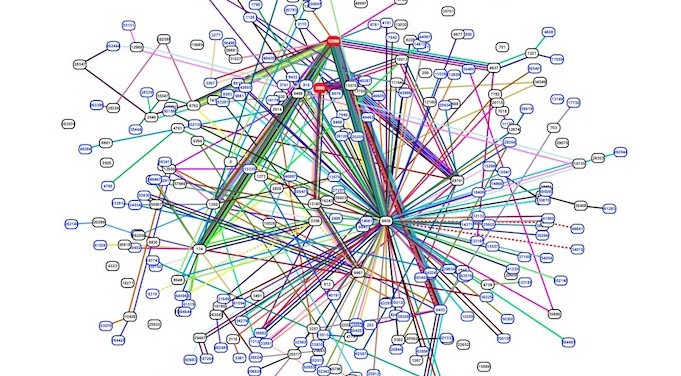

Ich werde Versuche beschreiben und erklären, warum sie so wichtig sind.

## Die Einführung

Versuche werden häufig in Blockchain-Systemen und anderswo verwendet. Dies sind Baumstrukturen, die Sätze von Schlüsselwertpaaren in Software darstellen. Stattdessen können Schlüsselwertpaare auch nur zusammenhängend dargestellt werden. Dann wäre es jedoch schwieriger, Änderungen vorzunehmen und Suchvorgänge durchzuführen als mit Versuchen. Versuche bestehen aus verbundenen Knoten, die Werte speichern. Unterschiedliche Knoten implizieren unterschiedliche Schlüssel basierend auf ihren Positionen. Eine häufige Anwendung, die Versuche verwendet, ist das Internet-Routing.

## Die Beispiele

In dem obigen Versuchsdiagramm repräsentieren die Punkte Knoten und Liniensegmente Verbindungen. Beachten Sie, dass jeder Punkt ein linkes und ein rechtes Liniensegment darunter hat. Der Schlüssel für jeden Knoten lautet wie folgt:

1.	Suche den Pfad vom obersten Knoten zum Knoten.
2.	Füge für jedes linke Liniensegment entlang des Pfads der Taste eine "0" hinzu.
3.	Füge für jedes rechte Liniensegment entlang des Pfads der Taste eine "1" hinzu.

Daher entspricht der gelbe Punkt zum Schlüssel "010". Der blaue Punkt entspricht zum Schlüssel "11". Ein ähnliches Verfahren wird für alle Versuche verwendet, Schlüssel zu bestimmen.

Das obige Diagramm stellt einen Versuch dar, bei dem jeder Knoten mit 16 darunter liegenden Knoten verbunden ist. Beachten Sie, dass jedes Liniensegment einen von 16 möglichen Werten (nibbles) zu den Schlüsseln hinzufügt. Der gelbe Punkt entspricht daher dem Schlüssel mit der hexadezimalen Darstellung "0x0f2". Das vorige Versuchsdiagramm zeigte 15 Knoten. Dieser repräsentiert 4369 Knoten!

## Die Kompression

Bei der Darstellung von Gruppen von Schlüsselwertpaaren mit Versuchen gibt es oft Tausende nicht verwendeter Knoten. Komprimierungstechniken werden häufig verwendet, um Versuche mit vielen nicht verwendeten Knoten effizienter zu speichern.

## Die Nomenklatur

Die Begriffe "Wurzelbäume" und "Patricia-Bäume" beziehen sich auch auf Versuche. Manchmal, aber nicht immer, implizieren diese Begriffe "komprimierte" Versuche, um nicht verwendete Knoten effizienter zu verwalten.

## Das Fazit

Versuche sind Baumstrukturen, in denen Schlüsselwertpaare in einem Format gespeichert werden, das Änderungen und Suchen erleichtert. Sie werden in vielen Anwendungen ausgiebig eingesetzt. Hoffentlich haben Sie jetzt die Grundlagen erlangt, um sich eingehender mit diesen Konzepten zu befassen.

## Die Feedback

Sie können mich kontaktieren, indem Sie auf eines der folgenden Symbole klicken:

## Die Danksagung

Ich möchte IOHK (Input Output Hong Kong) für die Finanzierung dieser Bemühungen danken.

## Die Lizenz

Diese Arbeit unterliegt der Creative Commons Attribution ShareAlike 4.0 International-Lizenz.