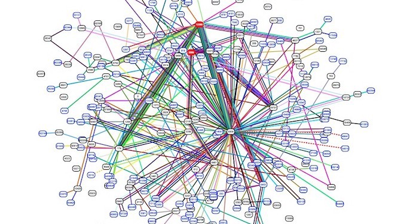
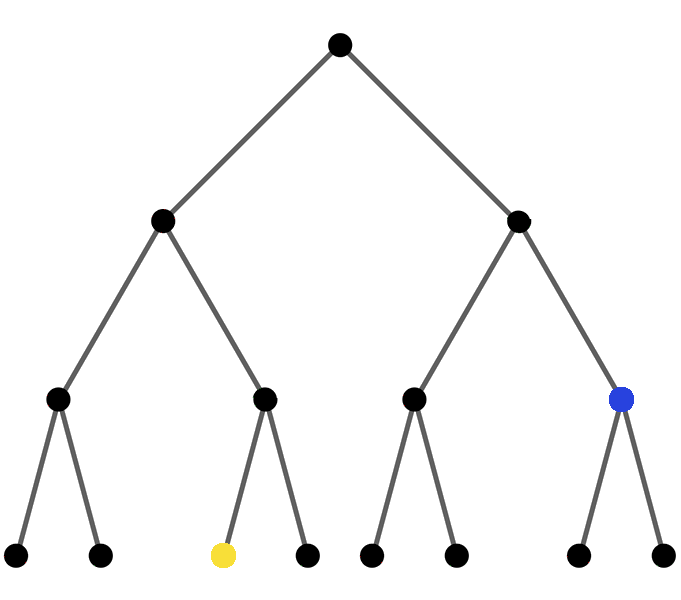

I will describe tries and explain why they are so important.

## Introduction

Tries are used extensively in blockchain systems and elsewhere. They are tree
structures that represent sets of key value pairs in software. It is possible to
instead just represent key value pairs contiguously. However, then it would be
more difficult to make changes and perform searches than with tries. Tries are
composed of connected *nodes* that store values. Different nodes imply different
keys based on their *positions*. A common application that uses tries is
internet routing.

## Examples

In the trie diagram above, the dots represent nodes and line segments represent
connections. Note that each dot has a left and right line segment below it. The
key corresponding to each node is found as follows:

1.  Find the path from the top node to the node.
1.  For each left line segment along the path, add a "0" to the key.
1.  For each right line segment along the path, add a "1" to the key.

Therefore, the yellow dot corresponds to the key "010". The blue dot corresponds
to the key "11". A similar procedure is used for all tries to determine keys.

The diagram above represents a trie where each node connects to 16 nodes below
it. Note that each line segment will add one of 16 possible values (nibbles) to
the keys. Therefore, the yellow dot corresponds to the key with the hexadecimal
representation "0x0f2". The previous trie diagram represented 15 nodes. This one
represents 4369 nodes!

## Compression

When representing sets of key value pairs with tries, there is often thousands
of unused nodes. Compression techniques are often used to more efficiently store
tries with lots of unused nodes.

## Nomenclature

The terms radix trees and Patricia trees also refer to tries. Sometimes, but not
always, these terms imply "compressed" tries that more efficiently manage unused
nodes.

## Conclusion

Tries are tree structures that store key value pairs in a format that
facilitates changes and searches. They are used extensively in many
applications. Hopefully now you have gained the fundamentals to be able to take
a deeper dive into these concepts.

## Feedback

You can contact me by clicking any of these icons:

## Acknowledgements

I would like to thank IOHK (Input Output Hong Kong) for funding this effort.

## License

This work is licensed under the Creative Commons Attribution ShareAlike 4.0
International License.
