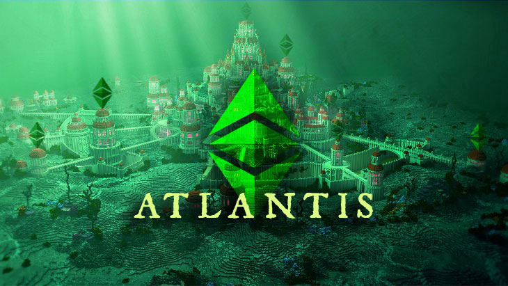

[https://ecips.ethereumclassic.org/ECIPs/ecip-1054](https://ecips.ethereumclassic.org/ECIPs/ecip-1054)

## ETC Core Devs Call - Atlantis Finalization

* When: Thursday, May 30, 2019, 3pm UTC, 60 minutes max.
* Where: Ethereum Classic [Discord](https://discord.gg/dwxb6nf) #ecips channel. Will use/create a voice channel ad hoc.

## Agenda

### Quick client teams check-in

* Geth / Multi-Geth
* Parity Ethereum
* IOHK Mantis

### Atlantis (ECIP-1054) is in "last call" state

### ECIP-1054 needs to be either accepted or updated (or rejected)

* discuss whether EIP-161 should be included or not @meowsbits @sorpaas
* discuss any other EIP that might cause uncertainty
* discuss timeline for the protocol upgrade
    * Morden Classic and Kotti Classic testnet (August?)
    * Ethereum Classic mainnet (September?)

### Anything else related to Atlantis

### Outlook: Agharta (ECIP-1056) if time permits

### Outlook: Astor SHA3 testnet if time permits

### Please comment to add items to the agenda

[https://github.com/ethereumclassic/ECIPs/issues/78](https://github.com/ethereumclassic/ECIPs/issues/78)

