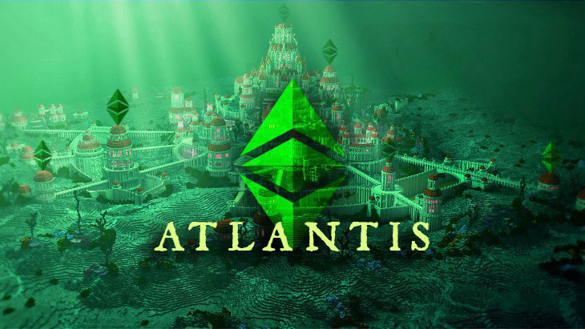

[https://ecips.ethereumclassic.org/ECIPs/ecip-1054](https://ecips.ethereumclassic.org/ECIPs/ecip-1054)

## ETC Core Devs Call - Finalization of the Atlantis Finalization

* When: Thursday, June 20, 2019, 3pm UTC.
* Where: Ethereum Classic [Discord](https://discord.gg/hQs894U) `#ecips` channel.

## Agenda

### Quick client teams check-in

* Multi-Geth
* Parity Ethereum
* IOHK Mantis
* Classic Geth

### Testnet status

* Kensington
* Kotti Hardfork
* Morden Outlook

### Discussion about the hard fork block

### Please comment to add items to the agenda

[https://github.com/ethereumclassic/ECIPs/issues/83](https://github.com/ethereumclassic/ECIPs/issues/83)

