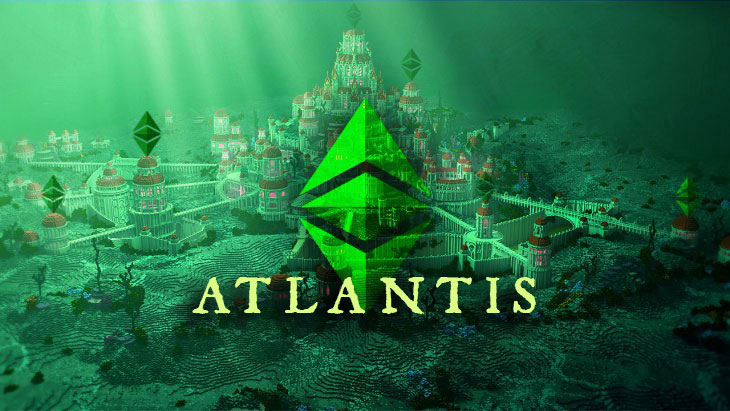

# ECIP 1054: Atlantis EVM and Protocol Upgrades

[https://ecips.ethereumclassic.org/ECIPs/ecip-1054](https://ecips.ethereumclassic.org/ECIPs/ecip-1054)

## Simple Summary

Enable the outstanding Ethereum Foundation *Spurious Dragon* and *Byzantium* network protocol upgrades on the Ethereum Classic network in a hard-fork code-named *Atlantis* to enable maximum compatibility across these networks.

## Abstract

Add support for a subset of protocol-impacting changes introduced in the Ethereum Foundation (ETH) network via the *Spurious Dragon* and *Byzantium* hardforks. The proposed changes for Ethereum Classic’s *Atlantis* upgrade include:

* Spurious Dragon state-trie clearing.
* Spurious Dragon contract-code size limit.
* Byzantium EVM opcodes, namely `REVERT`, `RETURNDATASIZE`, `RETURNDATACOPY`, and `STATICCALL`.
* Byzantium EVM precompiled contracts, namely addition and scalar multiplication on the elliptic curve `alt_bn128`, optimal ate pairing check on the elliptic curve `alt_bn128`, and BIGINT modular exponentiation.
* Replacing the intermediate state root field in transaction receipts with the contract return status.
* Change difficulty adjustment to target mean block time including uncle.

This document proposes the following blocks at which to implement these changes in the Classic networks:

* `100` on Kensington Classic PoW-testnet (early June 2019)
* `716_617` on Kotti Classic PoA-testnet (mid June 2019)
* `4_729_274` on Morden Classic PoW-testnet (early July 2019)
* `8_772_000` on Ethereum Classic PoW-mainnet (mid September 2019)

For more information on the opcodes and their respective EIPs and implementations, please see the *Specification* section of this document.

## Motivation

To enhance the Ethereum Virtual Machine’s (EVM) capabilities, various opcodes and precompiled contracts shall be added to the Ethereum Classic networks, all of which have been in use on the Ethereum Foundation networks since late 2017. Adoption of the *receipt status* feature provides a helpful method for decentralized-application developers to access the successful or failed state of a contract. This would establish a higher level of interoperability between Foundation and Classic EVMs, and make a more extensive array of tooling available for the ETC network (e.g., Solidity version, contract debugging tools). The proposed change to the difficulty formula ensures that the difficulty adjustment algorithm targets a constant average rate of blocks produced including uncles, and so ensures a highly predictable issuance rate that cannot be manipulated upward by manipulating the uncle rate.

## Specification

Technical specifications for each EIP can be found at those documents respectively:

* [EIP 100](https://eips.ethereum.org/EIPS/eip-100) (Change difficulty adjustment to target mean block time including uncles)
* [EIP 140](https://eips.ethereum.org/EIPS/eip-140) (`REVERT` instruction in the Ethereum Virtual Machine)
* [EIP 161](https://eips.ethereum.org/EIPS/eip-161) (State-trie clearing)
* [EIP 170](https://eips.ethereum.org/EIPS/eip-170) (Contract-code size limit)
* [EIP 196](https://eips.ethereum.org/EIPS/eip-196) (Precompiled contracts for addition and scalar multiplication on the elliptic curve `alt_bn128`)
* [EIP 197](https://eips.ethereum.org/EIPS/eip-197) (Precompiled contracts for optimal ate pairing check on the elliptic curve `alt_bn128`)
* [EIP 198](https://eips.ethereum.org/EIPS/eip-198) (Precompiled contract for BIGINT modular exponentiation)
* [EIP 211](https://eips.ethereum.org/EIPS/eip-211) (New opcodes `RETURNDATASIZE` and `RETURNDATACOPY`)
* [EIP 214](https://eips.ethereum.org/EIPS/eip-214) (New opcode `STATICCALL`)
* [EIP 658](https://eips.ethereum.org/EIPS/eip-658) (Embedding transaction status code in receipts)

In case any of the before mentioned proposals define a variable similar to the pattern `*_FORK_BLKNUM` named after *Spurious Dragon* or *Byzantium*, it shall be replaced by a `ATLANTIS_FORK_BLKNUM`.

## Rationale

**Atomicity**: This protocol specification notably omits the scheduled features of the anticipated Constantinople protocol upgrade, which would be expected to include various further EVM upgrades. This allows for dedicated testing of the proposed changes in light of multiple delays of the Constantinople fork ([a postmortem of the latest delay](https://medium.com/ethereum-cat-herders/a-post-mortem-report-the-constantinople-ethereum-hard-fork-postponement-dd780d7ae63d)).

**Interoperability**: establishing and maintaining interoperable behavior between Ethereum clients is essential for developers and end-user adoption, yielding benefits for all participating chains (e.g., ETH and ETC, Ropsten and Morden, Görli and Kotti).

**Immutability**: None of the introduced new opcodes in the EVM has the potential to change the behavior of existing contracts; in the case where previously an arbitrary invalid bytecode would have been deployed to the network, none of them would be able to modify the state of the Ethereum Classic networks retrospectively. Adding opcodes and precompiled contracts to the EVM increases its functionality and should be considered a feature upgrade rather than a modification.

## Implementation

Adoption of the content of this ECIP requires a hard fork as it introduces changes that are not backward compatible.

The following clients with Ethereum Classic support implement the Spurious Dragon and Byzantium features currently:

* Geth Classic: partial support for EIP-658 receipt status code change
* Parity Ethereum: all features due to Ethereum Foundation compatibility
* Multi Geth: all features due to Ethereum Foundation compatibility
* Mantis: all features due to Ethereum Foundation compatibility

### Copyright

Copyright and related rights waived via [CC0](https://creativecommons.org/publicdomain/zero/1.0/).
