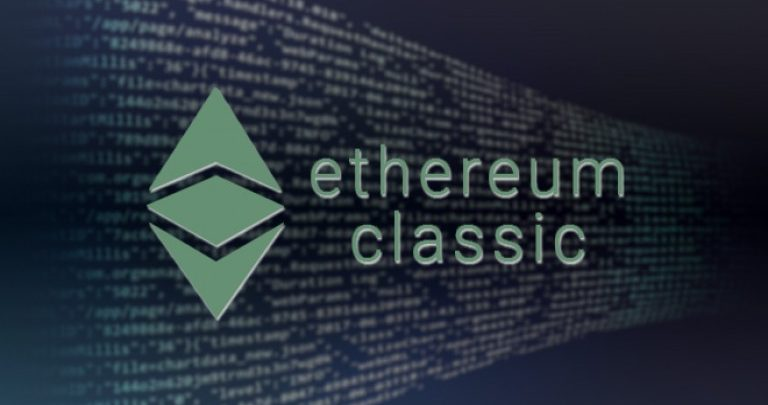
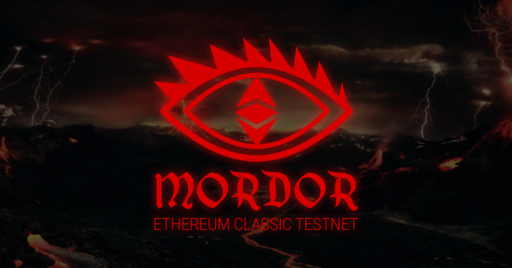

# Mordor Testnet Launch

[https://youtu.be/sURnZEeIqBU](https://youtu.be/sURnZEeIqBU)

## State of the Ethereum Classic Testnets Summary

There are a massive number of Ethereum Classic testnets.

* --morden
    * 2015 Genesis with Ethereum
    * Ethash Proof-of-Work
    * 2016 issues with Starting Nonce `2**20`
    * 2017 Ethereum Foundation abandoned it
    * 2017 Morden Classic
    * not supported by Multi-Geth
* --kotti
    * 2018 Genesis
    * Clique Proof-of-Authority
    * Görli Testnet Initiative
    * The first Cross Client PoA network with EVM capability
    * [https://stats.kotti.goerli.net/](https://stats.kotti.goerli.net/)
    * not supported by Geth Classic
* --astor
    * 2019 Genesis
    * SHA3 Proof-of-Work
    * No client support
    * Experimental testnet
* --kensington
    * 2019 Genesis
    * Ethash Proof-of-Work
    * Görli Testnet Initiative & ChainSafe
    * Ad-Hoc testing of `Atlantis`
    * Morden - Starting Nonce = Kensington
    * All-clients support
* --nazgul
    * 2019 Genesis
    * Ethash Proof-of-Work
    * Görli Testnet Initiative & Whiteblock
    * Stress-testing of `Atlantis`
    * Temporary testnet

## Remove ETC Testnet Redundancies

### --mordor

    * 2019 Genesis
    * Ethash Proof-of-Work
    * Replaces Morden, Kensington, Nazgul
    * Supported by all clients
    * No Premine, No Presale, Fair launch!

[Mordor Testnet Launch Video](https://youtu.be/sURnZEeIqBU)

