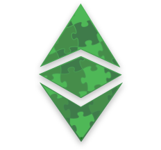
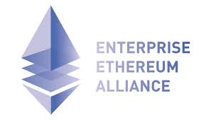
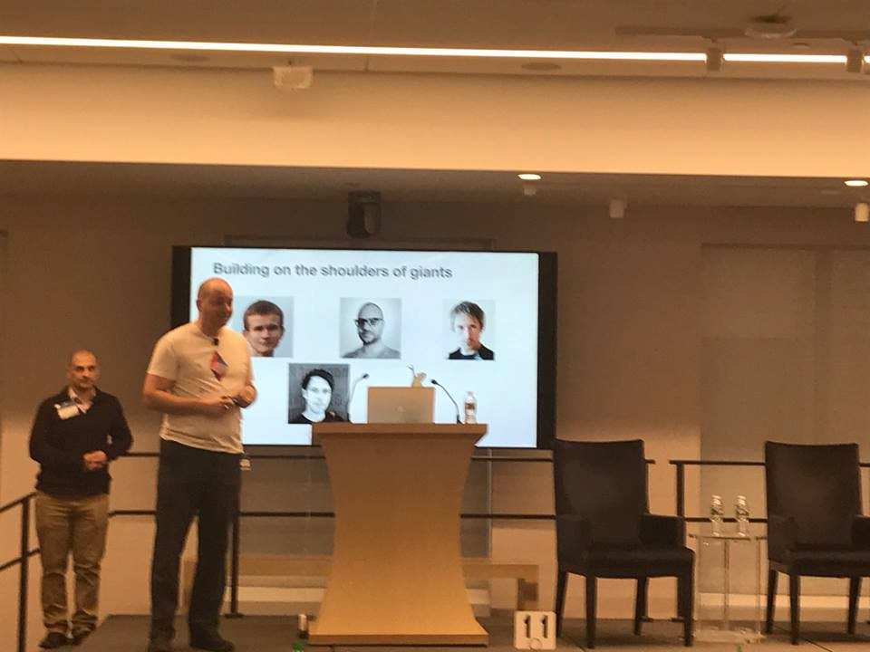

**18th October 2019 – Vancouver, Canada** – The [ETC Cooperative](https://etccooperative.org) today announced that it has joined the [Enterprise Ethereum Alliance (EEA)](https://entethalliance.org), the defacto standards organization for enterprise blockchain – one that is backed by the largest developer community in the world and a worldwide member-base.

As a member of the EEA, the ETC Cooperative will collaborate with industry leaders in pursuit of Ethereum-based enterprise technology best practices, open standards, and open-source reference architectures.

The ETC Cooperative is a Delaware-incorporated 501(c)(3) public charity, which seeks to accelerate the growth of Ethereum Classic.   The Cooperative is working with the Ethereum community and the Ethereum Foundation on shared challenges between Ethereum and Ethereum Classic.

The Executive Director of ETC Cooperative, [Bob Summerwill](https://bobsummerwill.com/about), was co-Lead Architect during the launch period of the EEA and then served as the first Secretary of the Technical Working Group and then as Vice-Chair of the Technical Steering Committee.

Bob Summerwill says: “I am absolutely delighted to return to the EEA – an organization which is very close to my heart.  We at the ETC Cooperative plan to engage deeply in the EEA Mainnet Initiative and to work to help standardize the “Ethereum Stack” which is emerging as the defacto standard for smart contracts.  That tech stack is common to Ethereum, Ethereum Classic, Enterprise Ethereum, EVM-in-Fabric and to other emerging related smart contract platforms.  Ethereum is unique in its span of both public and private use-cases, and the EEA is the best place on the planet to find collaborators to mature that technology in the world-changing way which I know is possible.”

The EEA membership base represents hundreds of companies from every region of the world across a wide variety of business sectors, including technology, banking, legal, government, healthcare, energy, pharmaceuticals, marketing, and insurance. The EEA’s industry-focused, member-driven Special Interest and Technical Working Groups define market requirements needed to contribute to future versions of the EEA specification, helping to scale the number of market categories the specification supports. The EEA specifications and related materials are available for public download on the EEA website at entethalliance.org.

## About the EEA

The EEA is a member-driven, standards organization whose charter is to develop open, blockchain specifications that drive harmonization and interoperability for businesses and consumers worldwide. Our global community of members is made up of leaders, adopters, innovators, developers, and businesses who collaborate to create an open, decentralized web for the benefit of everyone. For additional information about joining the EEA, please reach out to membership@entethalliance.org.
For additional information about joining EEA, please reach out to membership@entethalliance.org or visit www.entethalliance.org.

## About ETC Cooperative

The ETC Cooperative is a Delaware-incorporated 501(c)(3) public charity, which seeks to accelerate the growth of Ethereum Classic.