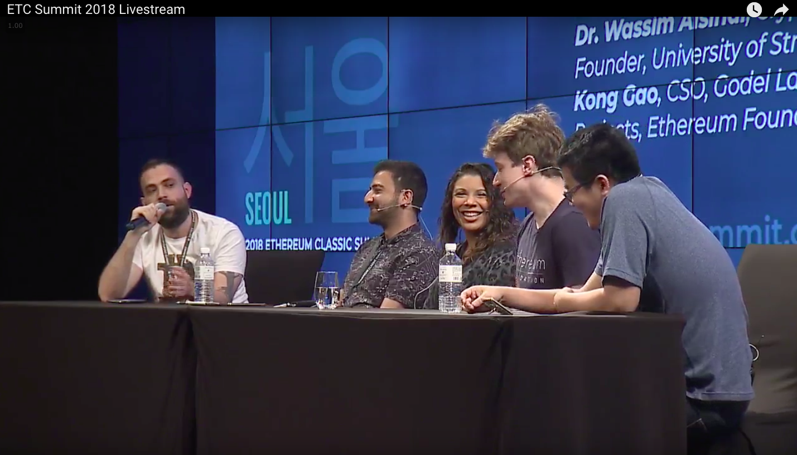
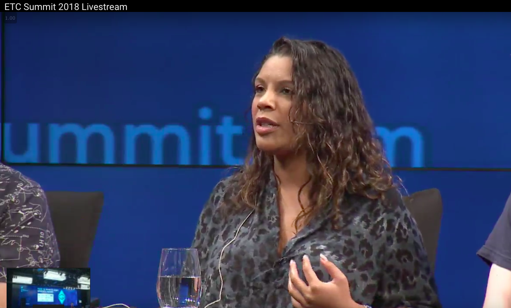

** 19 Oktober 2019 - Vancouver, Kanada ** - Die [ETC Cooperative](https://etccooperative.org) gab heute bekannt, dass [Alison Alexis CPA](https://www.linkedin.com/in/alison-alexis-ca/) der ETC-Cooperative als Wirtschaftsprüferin im Rahmen eines einjährigen Teilzeitvertrages beigetreten ist.

Alison ist eine kanadische Wirtschaftsprüferin (Chartered Professional Accountant = CPA) mit [13 Jahren Berufserfahrung](https://www.linkedin.com/in/alison-alexis-ca/).

Alison sprach auf dem [ETC Summit 2018](https://etcsummit.com/2018-etc-summit/#speakers) auf dem Unveränderlichkeits-Panel:

Sie ist [Alison Emily (@ aalexis1234)](https://twitter.com/aalexis1234) auf CryptoTwitter.

Bob Summerwill sagte: *„Ich freue mich sehr, dass Alison als Wirtschaftsprüferin in die ETC-Cooperative aufgenommen wird. Die Cooperative setzt sich für finanzielle Transparenz ein und Alison bringt umfassende Buchhaltungserfahrung mit. Sie wird mich auch bei der Festlegung der Führung der ETC-Cooperative ab 2020 unterstützen, da wir völlig unabhängig von Grayscale werden.“*

## Öffentliche Offenlegung

Bob Summerwill, der Geschäftsführer der ETC Cooperative und Alison Alexis CPA, die neu ernannte Wirtschaftsprüferin, sind Geschäftspartner bei [Varro Technologies](https://varro.tech). Sie wollen heiraten und haben gemeinsam ein Kind.

## Über ETC Cooperative

Die ETC Cooperative ist eine in Delaware eingetragene gemeinnützige Organisation nach 501(c)(3), die das Wachstum von Ethereum Classic beschleunigen will.