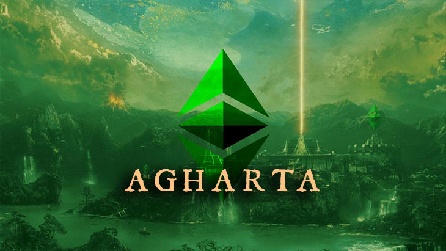

[https://ecips.ethereumclassic.org/ECIPs/ecip-1056](https://ecips.ethereumclassic.org/ECIPs/ecip-1056)

Ref [#131](https://github.com/ethereumclassic/ECIPs/issues/131) [ECIP-1056](https://github.com/ethereumclassic/ECIPs/blob/master/_specs/ecip-1056.md)

## ETC Core Devs Call - Agharta Finalization

* When: Thursday, October 24, 2019, 1pm UTC, 60 minutes max.
* Where: Ethereum Classic [Discord](https://discord.gg/dwxb6nf) `#ecips` channel. Will use/create a voice channel *ad hoc*.

## Agenda

### Quick client teams check-in

* Geth Classic / ChainSafe, ETC Labs Core
* Multi-Geth / Multi-Geth, ETCLabs Core
* Parity Ethereum / Parity Tech
* Mantis / IOHK
* Hyperledger Besu / ChainSafe, PegaSys

### Agharta (ECIP-1056) is in "draft" state

* ECIP-1056 needs to be either accepted or updated (or rejected)
    * discuss [EIP 145](https://eips.ethereum.org/EIPS/eip-145) (Bitwise shifting instructions)
    * discuss [EIP 1014](https://eips.ethereum.org/EIPS/eip-1014) (Skinny `CREATE2` opcode)
    * discuss [EIP 1052](https://eips.ethereum.org/EIPS/eip-1052) (`EXTCODEHASH` opcode)
    * discuss account versioning ref [#86](https://github.com/ethereumclassic/ECIPs/pull/86) (EIP-1702)
* discuss a timeline for the protocol upgrade
    * Morden Classic and Kotti Classic testnet (January?)
    * Ethereum Classic mainnet (March?)
* anything else related to Agharta

### Bonus

* Sha3 / ECIP-1049
* DAG Size / ECIP-1043

### Please comment to add items to the agenda

[https://github.com/ethereumclassic/ECIPs/issues/135](https://github.com/ethereumclassic/ECIPs/issues/135)

