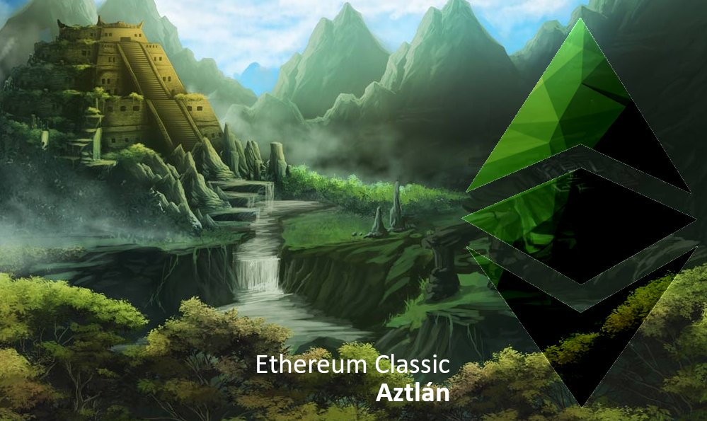

[https://ecips.ethereumclassic.org/ECIPs/ecip-1061](https://ecips.ethereumclassic.org/ECIPs/ecip-1061)

Ref [ECIP-1061](https://github.com/ethereumclassic/ECIPs/blob/master/_specs/ecip-1061.md) [#81](https://github.com/ethereumclassic/ECIPs/pull/81) [#157](https://github.com/ethereumclassic/ECIPs/pull/157) [#176](https://github.com/ethereumclassic/ECIPs/pull/176)

## ETC Core Devs Call - ECIP-1061 Aztlán Finalization

* When: Wednesday, November 27, 2019, 1pm UTC, 60 minutes max.
* Where: Ethereum Classic [Discord](https://discord.gg/dwxb6nf) `#ecips` channel. Will use/create a voice channel *ad hoc*.

## Agenda

### Quick client teams check-in

* Parity Ethereum / Parity Tech
* Geth Classic / ChainSafe, ETCLabs Core
* Multi-Geth / Multi-Geth, ETCLabs Core
* Hyperledger Besu / ChainSafe, PegaSys

### Aztlán (ECIP-1061) needs to be either accepted or updated (or rejected)

* discuss included EIPs
* discuss a timeline for the protocol upgrade
    * Mordor Classic and Kotti Classic testnet (February?)
    * Ethereum Classic mainnet (March?)

### Anything else related to Aztlán

### Please comment to add items to the agenda

[https://github.com/ethereumclassic/ECIPs/issues/177](https://github.com/ethereumclassic/ECIPs/issues/177)

