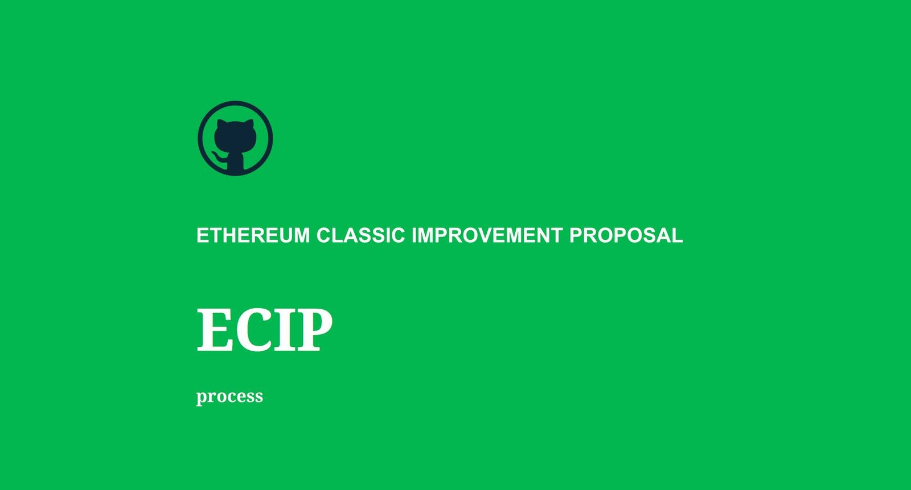
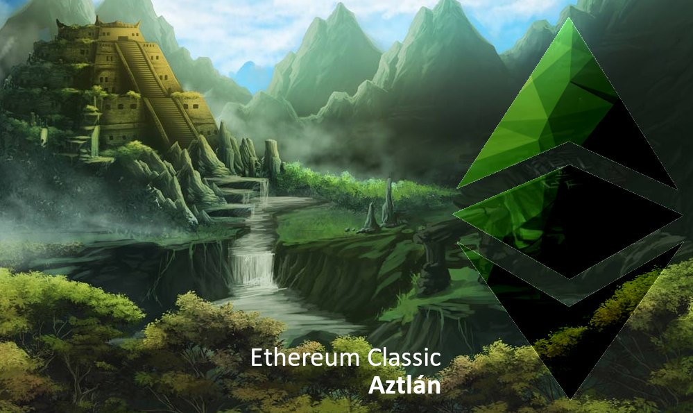

[https://ecips.ethereumclassic.org/ECIPs/ecip-1061](https://ecips.ethereumclassic.org/ECIPs/ecip-1061)

## ETC Core Devs Call - Confirm consensus for Aztlán Upgrade (Yingchun Edition)

* When: Thursday, December 5, 2019, 1pm UTC, 60 minutes max.
* Where: Ethereum Classic [Discord](https://discord.gg/hQs894U) `#ecips` channel. Will use/create a voice channel *ad hoc*.

Meeting Coordinator: @developerkevin.

## Agenda

### Aztlán Upgrade (Yingchun Edition) ([ECIP-1061](https://ecips.ethereumclassic.org/ECIPs/ecip-1061)) is in *"Last Call"* status with review ending on 19th Dec 2019.

* Establish that we have new consensus on ECIP-1061, after several days of crisis.
* No finger-pointing, blame or post-mortem in this specific meeting. It would make a lot of sense to do a post-mortem on the last few days, and anybody is welcome to create an issue to start that process, or to publish their own post-mortem, etc. Just out of scope HERE.
* No discussion of [#221](https://github.com/ethereumclassic/ECIPs/pull/221) and [#224](https://github.com/ethereumclassic/ECIPs/pull/224) or other process clarifications. Similar to post-mortem, these have value and when we have fully-formed ECIPs we should certainly discuss those. Just out of scope HERE.

This is the full scope of the agenda. We won't add any items to this call. Laser focus.

The aim of the meeting is to calm everybody's nerves and to get back on track. We should record the audio. Multiple people should take minutes. The outcome should be reported on.

[https://github.com/ethereumclassic/ECIPs/issues/215](https://github.com/ethereumclassic/ECIPs/issues/215)

