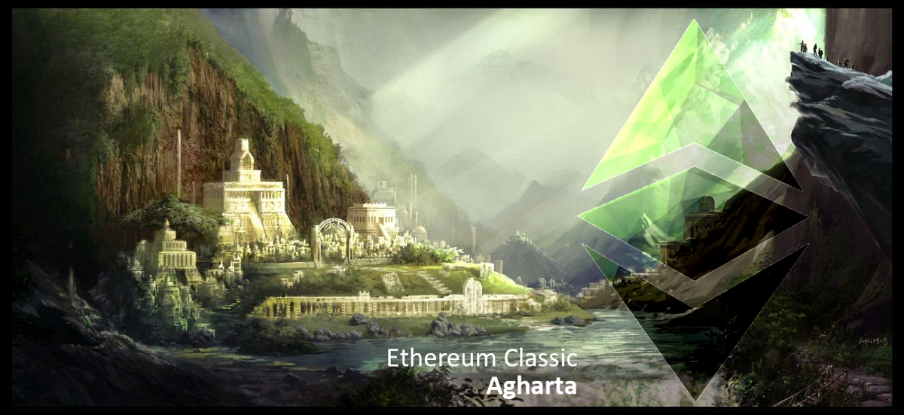

[https://ecips.ethereumclassic.org/ECIPs/ecip-1056](https://ecips.ethereumclassic.org/ECIPs/ecip-1056)

Ref [#131](https://github.com/ethereumclassic/ECIPs/issues/131) [ECIP-1056](https://github.com/ethereumclassic/ECIPs/blob/master/_specs/ecip-1056.md)

Ref [ECIP-1056](https://ecips.ethereumclassic.org/ECIPs/ecip-1056) [#75](https://github.com/ethereumclassic/ECIPs/pull/75) [#131](https://github.com/ethereumclassic/ECIPs/issues/131) [#135](https://github.com/ethereumclassic/ECIPs/issues/135)

## ETC Core Devs Call - Agharta Final Finalization

* When: Thursday, December 12, 2019, 1pm UTC, 60 minutes max.
* Where: Ethereum Classic [Discord](https://discord.gg/dwxb6nf) `#ecips` channel. Will use/create a voice channel *ad hoc*.

## Agenda

### Quick client teams check-in

* Parity Ethereum / Parity Tech
* Geth Classic / ChainSafe, ETCLabs Core
* Multi-Geth / Multi-Geth, ETCLabs Core
* Hyperledger Besu / ChainSafe, PegaSys

### Agharta (ECIP-1056) is in "last call" state

* ECIP-1056 needs to be accepted
    * evaluate testing on morden testnet
    * evaluate testing on mordor testnet
    * evaluate testing on kotti testnet
* discuss a timeline for the protocol upgrade
    * agree on a block number for mainnet

### Please comment to add items to the agenda

[https://github.com/ethereumclassic/ECIPs/issues/175](https://github.com/ethereumclassic/ECIPs/issues/175)

### Recording of Core Devs Call

[Core Devs Call:  Agharta hard fork finalization](https://youtu.be/vipvH21tXgc)

