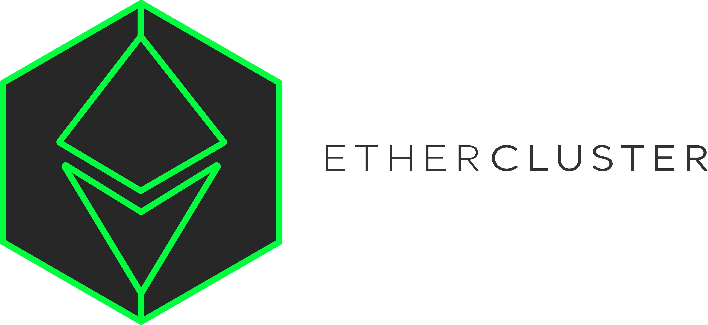

**23rd Devember 2019 – Vancouver, Canada** – The [ETC Cooperative](https://etccooperative.org) today announced that the
[Ethercluster](https://www.ethercluster.com/) project has been contributed to [Hyperledger Labs](https://hyperledger-labs.github.io/) to bring this
key Ethereum infrastructure project to a broader audience.

Ethercluster uses [Kubernetes](https://kubernetes.io/),
[Terraform](https://www.terraform.io/) and [Docker](https://www.docker.com/)
to host a cluster of Ethereum client nodes serving JSON-RPC endpoints. These
clusters can be dynamically scaled.

The [ETC Cooperative](https://etccooperative.org) hosts instances
of Ethercluster as a public service for developer onboarding for the following chains:

- ETC Mainnet
- ETC Mordor POW testnet
- ETC Kotti POA testnet
- ETH Gorli POA testnet

Ethercluster is
equally useful for public permissionless chains like ETH and ETC
or for permissioned chains such as those following the "Enterprise Ethereum"
specifications developed by the
[Enterprise Ethereum Alliance (EEA)](https://entethalliance.org/).  Instructions on how to set up further instances of Ethercluster are
available in the [developer documentation](https://docs.ethercluster.com/).

Ethercluster is the crown jewel of ETC Cooperative's development efforts.  All credit for its creation lies with [Yaz Khoury](https://twitter.com/Yazanator), our Director of Developer Relations.

This is the second contribution to Hyperledger from ETC Cooperative, following ETC support for Hyperledger Besu, which was upstreamed
earlier this month.

ETC support for Hyperledger Besu is an ongoing commitment, with a second
batch of changes pending to add support for the forthcoming
ETC [Aztlán hardfork](https://ecips.ethereumclassic.org/ECIPs/ecip-1061).
[Edward Mack](https://github.com/edwardmack) of
[ChainSafe](https://chainsafe.io/), who implemented the ETC support in Hyperledger Besu on behalf of the ETC Cooperative was added as a
Maintainer in recognition of his work.

## About ETC Cooperative

The ETC Cooperative is a Delaware-incorporated 501(c)(3) public charity, which seeks to accelerate the growth of Ethereum Classic.