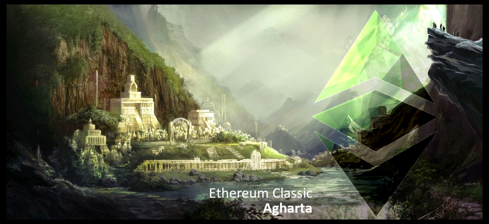

# ECIP 1056: Agharta EVM and Protocol Upgrades

[https://ecips.ethereumclassic.org/ECIPs/ecip-1056](https://ecips.ethereumclassic.org/ECIPs/ecip-1056)

## Simple Summary

Enable the outstanding Ethereum Foundation *Constaninople* and *Petersburg* network protocol upgrades on the Ethereum Classic network in a hard-fork code-named *Agharta* to enable maximum compatibility across these networks.

## Abstract

Add support for a subset of protocol-impacting changes introduced in the Ethereum Foundation (ETH) network via the *Constaninople* and *Petersburg* hardforks. The proposed changes for Ethereum Classic’s *Agharta* upgrade include:

* Constantinople bitwise shifting instructions
* Constantinople skinny `CREATE2` opcode
* Constantinople `EXTCODEHASH` opcode

This document proposes the following blocks at which to implement these changes in the Classic networks:

* `5_000_381` on Morden Classic Testnet (November 13, 2019)
* `301_243` on Mordor Classic Testnet (November 20, 2019)
* `1_705_549` on Kotti Classic Testnet (December 11, 2019)
* `9_573_000` on Ethereum Classic Mainnet (January 15, 2020)

For more information on the opcodes and their respective EIPs and implementations, please see the *Specification* section of this document.

## Motivation

To enhance the Ethereum Virtual Machine’s (EVM) capabilities, various opcodes shall be added to the Ethereum Classic networks, all of which have been in use on the Ethereum Foundation networks since early 2019.

## Specification

Enable the following three hard fork features:

* [EIP 145](https://eips.ethereum.org/EIPS/eip-145) (Bitwise shifting instructions)
* [EIP 1014](https://eips.ethereum.org/EIPS/eip-1014) (Skinny `CREATE2` opcode)
* [EIP 1052](https://eips.ethereum.org/EIPS/eip-1052) (`EXTCODEHASH` opcode)

## Rationale

**Atomicity**: This protocol specification notably merges the scheduled features of the anticipated *Petersburg* protocol upgrade, which would removes the buggy proposal `SSTORE` net-gas metering.

**Interoperability**: Establishing and maintaining interoperable behavior between Ethereum clients is essential for developers and end-user adoption, yielding benefits for all participating chains (e.g., ETH and ETC, Ropsten and Morden, Görli and Kotti).

**Immutability**: None of the introduced new opcodes in the EVM has the potential to change the behavior of existing contracts; in the case where previously an arbitrary invalid bytecode would have been deployed to the network, none of them would be able to modify the state of the Ethereum Classic networks retrospectively. Adding opcodes to the EVM increases its functionality and should be considered a feature upgrade rather than a modification.

## Implementation

Adoption of the content of this ECIP requires a hard fork as it introduces changes that are not backward compatible.

The following clients with Ethereum Classic support implement the *Constaninople* and *Petersburg* features currently:

* Geth Classic: full support in `v6.1.0` and later
* Parity Ethereum: all features due to Ethereum Foundation compatibility
* Multi Geth: all features due to Ethereum Foundation compatibility
* IOHK Mantis: *no support*
* Hyperledger Besu: all features due to Ethereum Foundation compatibility

### Copyright

Copyright and related rights waived via [CC0](https://creativecommons.org/publicdomain/zero/1.0/).
