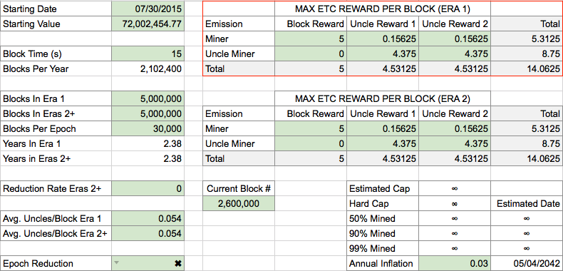
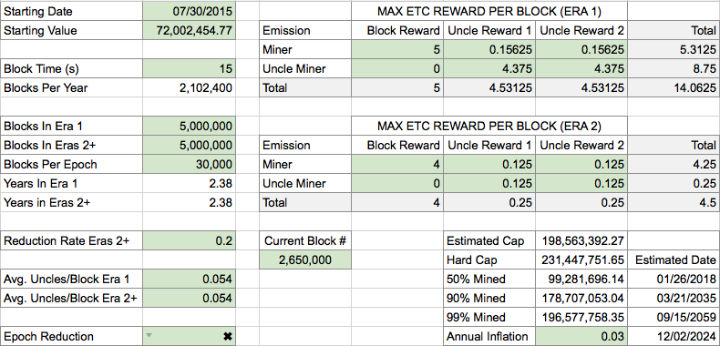

# ECIP 1017: Monetary Policy and Final Modification to the Ethereum Classic Emission Schedule

[https://ecips.ethereumclassic.org/ECIPs/ecip-1017](https://ecips.ethereumclassic.org/ECIPs/ecip-1017)

## Abstract

This ECIP proposes a solution to the Ethereum Classic Monetary Policy to adjust, with finality, the current emission schedule implementation of 14.0625ETC per block in perpetuity. The solution proposed introduces a theoretical upper bound on the maximum absolute number of ETC and introduces a method of degraded emission over time.

## Motivation

At its core, the purpose of adjusting the current monetary policy of the ETC network, to a policy which places an upper bound on the number of tokens issued and decreases the rate at which ETC is introduced into the system over time, is to “bootstrap” the network’s security. By increasing the security of the network, a proper monetary policy indirectly nurtures the network, providing a secure platform for which smart contract development will be more likely to occur.

If we accept that speculation, a demand function, is the main economic driver of any new system, that the Ethereum Classic Network is a new system, and that speculation will drive the value of the Ethereum Classic token until the utility value of the Ethereum Classic token exceeds its speculative value, it is reasonable to assume that rewarding speculation will help to secure and nurture the network:

Large scale, high risk, and/or high profile applications will be less likely to be developed on a blockchain with weak security ie. a low hashrate. Increasing demand for the Ethereum Classic token will, all else being equal, increase the price of the Ethereum Classic token. An increase in the price of the token incentivizes mining operations to direct their efforts on the Ethereum Classic Network or to begin operations on the Ethereum Classic Network. The additional mining power that is directed towards the network, because of this incentive, further secures the network. An increase in the security of the network assists in building trust between the network and both current and potential users and developers of the network. This increase of trust in the network provides an incentive for large scale, high risk, and/or high profile applications to be developed on the network. Thus, rewarding speculation helps to secure and nurture the Ethereum Classic network.

Especially important to early stage cryptocurrencies, assuming all other variables are equal, a network with a decreasing rate of production and an upper bound on the number of tokens that will be issued will provide more incentive for high risk speculation to occur than one without a known rate of production or an upper bound.

Above all, it is important to recognize that a monetary policy does not directly create value for the network. A stable platform with useful applications and a vibrant community are the variables that drive value. The purpose of a properly structured monetary policy is to create an incentive for people to take a risk on a system that has not yet reached its full potential, providing an additional reason for those who may not otherwise be interested, who cannot or have not developed anything on the platform (yet), or who remain skeptical, to involve themselves in an otherwise nascent platform.

## Specification

Current Ethereum Classic Monetary Policy

The current mining rewards on the Ethereum Classic Network are as follows:

* A “static” block reward for the winning block of 5 ETC
* An extra reward to the winning miner for including uncles as part of the block, in the form of an extra 1/32 (0.15625ETC) per uncle included, up to a maximum of two (2) uncles.
* A reward of up to 7/8 (4.375ETC) of the winning block reward for a miner who has mined an uncled block and has that uncle included in the winning block by the winning miner, up to a maximum of two (2) uncles included in a winning block.
* This reward structure is set to continue in perpetuity.

Proposed Ethereum Classic Monetary Policy

*An “Era” is defined as the number of blocks containing a given production rate.*

The proposed mining rewards on the Ethereum Classic Network are as follows:

* Era 1 (blocks 1 - 5,000,000)

    * A “static” block reward for the winning block of 5 ETC
    * An extra reward to the winning miner for including uncles as part of the block, in the form of an extra 1/32 (0.15625ETC) per uncle included, up to a maximum of two (2) uncles.
    * A reward of up to 7/8 of the winning block reward (4.375ETC) for a miner who has mined an uncled block and has that uncle included in the winning block by the winning miner, up to a maximum of two (2) uncles included in a winning block.

* Era 2 (blocks 5,000,001 - 10,000,000)

    * A “static” block reward for the winning block of 4 ETC
    * An extra reward to the winning miner for including uncles as part of the block, in the form of an extra 1/32 (0.125ETC) per uncle included, up to a maximum of two (2) uncles.
    * A reward of 1/32 (0.125ETC) of the winning block reward for a miner who has mined an uncled block and has that uncle included in the winning block by the winning miner, up to a maximum of two (2) uncles included in a winning block.
    * Era 2 represents a reduction of 20% of Era 1 values, while also reducing uncle rewards to uncle miners to be the same value as the reward to the winning miner for including the uncle(s).

* Era 3+

    * All rewards will be reduced at a constant rate of 20% upon entering a new Era.
    * Every Era will last for 5,000,000 blocks.

## Rationale

Why this 5M20 model:

* Minimizes making the first adjustment too “exceptional.” Other than equalizing all uncle rewards at block 5M, the changes/reductions to supply over time are equal.
* The model is easy to understand. Every 5M blocks, total reward is reduced by 20%.
* Uncle inclusion rates through block 5M will likely remain at around the 5%. Because of this, once block 5M is reached, in the worst case scenario (supply wise, which assumes two uncles included every block in perpetuity) the total supply will not exceed 210.7M ETC. Should the network remain as efficient in its ability to propagate found blocks as it has in Era 1 (5.4% uncle rate), the total supply will not be less than 198.5M ETC. This provides for an incentive to miners and client developers to maintain high standards and maintenance of their hardware and software they introduce into the network.
* The 5M model provides a balance between providing an acceptable depreciating distribution rate for rewarding high risk investment into the system and maintaining an active supply production over time. Maintaining this future supply rate keeps the potential price of the ethereum token suppressed enough to ensure transaction prices can remain lower than if the supply were to reduce to zero at an earlier date. This serves as a “blow off valve” for price increases in the case that a dynamic gas model cannot be implemented for the foreseeable future.
* Having the monetary policy begin at 5M provides a balance between delaying the implementation to provide enough time for code development and testing, and accelerating the implementation to provide an incentive to potential early adopters and high risk investors. Based on community discussion, beginning before block 4M is too soon for development, testing, and implementation of the policy, and later than block 6M is too long to interest many potential early adopters/investors.
* Not changing the monetary policy of ETC provides no benefit to risk taking early on in the life of the system, speculation wise. It will be difficult for the network to bootstrap its security. While bitcoin has what is considered to be the generally accepted ideal monetary policy, with its 50% reduction every four years, this model is not likely to yield optimal investment for ETC. If ETC were to adopt the bitcoin halving model, it is arguable that too much of the supply would be produced too soon: 50% of the estimated total ETC supply would be mined 75% sooner than traditional bitcoin because of the pre-mine of 72M ETC that was initially created in the genesis block. While the 5M model does not completely eliminate the effects of the premine, since 50% of total estimated production occurs sooner than would the bitcoin model, it makes up for this, to an extent, with its lengthening of the time until 90%, 99% and 100% of bitcoin are mined. The tail end of ETC production is longer and wider than bitcoin.
* In the current ETC reward schedule, the total reward for uncles is higher than the reward received by the miner who also includes uncles. In this state, a miner is significantly diluting the value of his reward by including these uncled blocks. By equalizing the rewards to uncle block miners with the rewards to miners who include an uncle block, the reward structure is more fairly distributed. In addition, equalizing the uncle rewards reduces the incentive for miners to set up an ETC “uncle farm,” and instead drives them to better secure the network by competing for the latest “real block.”
* Because the rate at which uncled blocks can vary with extreme, reducing the reward for uncle blocks assists considerably with being able to forecast the true upper bound of the total ETC that will ultimately exist in the system.
* The model is the best attempt at balancing the needs to incentivize high risk investment into the system in order to bootstrap security and create a potential user base, be easy to understand, include a reduction to the rate of production of ETC over time, include an upper bound on supply, provide for a long term production of the ETC token, and allow enough time for development, adoption, and awareness.
