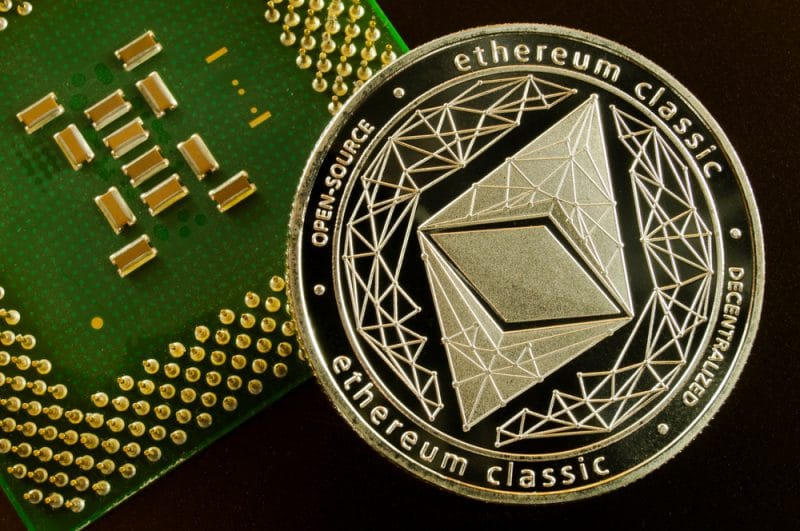

PDF: [A Proposal for An Ethereum Classic Treasury System](./A-proposal-for-an-Ethereum-Classic-treasury-system.pdf)

Topic discussion references:

* 2017: [A Proposal for An Ethereum Classic Treasury System](https://iohk.io/en/research/library/papers/a-proposal-for-an-ethereum-classic-treasury-system/) - IOHK Proposal
* 2017: [Let's Talk ETC! (Ethereum Classic) #10 - Charles Hoskinson & Roman Oliynykov - Treasury Proposal](https://www.youtube.com/watch?v=zxZoSjnHN84) - IOHK Proposal
* 2017: [ETC Community Fund](https://medium.com/@pyskell/some-changes-to-ethereum-classic-7a97c993a06c)
* 2018: [ECIP 1051: Ethereum Classic Treasury system](https://ecips.ethereumclassic.org/ECIPs/ecip-1051) - Dexaran Proposal
* 2018: [ECIP 1051 Dicussion: Ethereum Classic Treasury system](https://github.com/ethereumclassic/ECIPs/issues/4) - Dexaran Proposal
* 2019: [ECIP-1051: Reject Ethereum Classic Treasury system](https://github.com/ethereumclassic/ECIPs/pull/229) - Dexaran Proposal
* 2020: [ETC at Crossroads](https://youtu.be/oHUQuXOwYeU) - IOHK Renewed Proposal
* Example: [A brief history of GnuPG: vital to online security but free and underfunded](https://theconversation.com/a-brief-history-of-gnupg-vital-to-online-security-but-free-and-underfunded-80800) - Tragedy of the Commons example
* 2020: [Bailout?](https://youtu.be/Cspqt-nZqsc) - IOHK Follow up
* 2020: [Ethereum Classic Treasury Roadmap Call: Initial Discussions](https://github.com/ethereumclassic/ECIPs/issues/332)

## ETC Core Devs Call - Treasury Roadmap Initial Discussions

* When: Thursday, August 13, 2020, 3pm UTC, 60 minutes max.
* Where: Ethereum Classic [Discord](https://discord.gg/dwxb6nf) `#ecips` channel. Will use/create a voice channel *ad hoc*.

## Agenda

### Quick client teams check-in

* Core-Geth - ETC Labs
* Hyperledger Besu - ETC Coop/ChainSafe
* Mantis - IOHK

### IOHK Proposal for an Ethereum Classic Treasury:

* [A Proposal for An Ethereum Classic Treasury System](https://iohk.io/en/research/library/papers/a-proposal-for-an-ethereum-classic-treasury-system/)
* [ETC at Crossroads](https://youtu.be/oHUQuXOwYeU)
* [A brief history of GnuPG: vital to online security but free and underfunded](https://theconversation.com/a-brief-history-of-gnupg-vital-to-online-security-but-free-and-underfunded-80800)
* [Bailout?](https://youtu.be/Cspqt-nZqsc)

### Gather Community feedback on Proposal via Q&A

### Measure Rough Consensus to Determine if IOHK will move forward with making an ECIP for the ETC Treasury.

### Anything else related to an Ethereum Classic Treasury System

### Please comment to add items to the agenda.

[https://github.com/ethereumclassic/ECIPs/issues/332](https://github.com/ethereumclassic/ECIPs/issues/332)

### Recording of Core Devs Call

* Link to be added after call.

