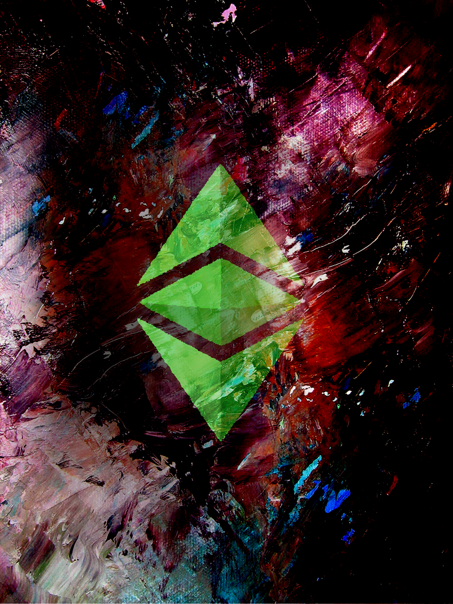
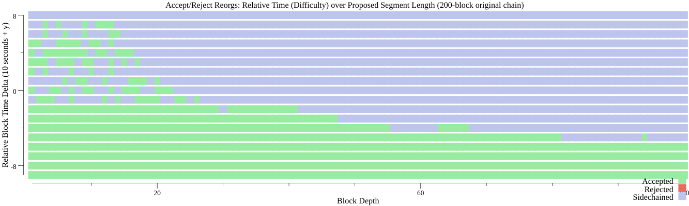

# ECIP 1100: MESS (Modified Exponential Subjective Scoring)

[https://ecips.ethereumclassic.org/ECIPs/ecip-1100](https://ecips.ethereumclassic.org/ECIPs/ecip-1088)

## Abstract

Define a function arbitrating chain acceptance using relative total difficulty and common ancestor time to raise finality confidence.

## Motivation

A low hashrate has caused Ethereum Classic’s consensus algorithms to yield inconvenient and undesirable finality rates.

This proposal offers a way to increase the finality rate without tampering with existing “hard” chain consensus functions or characteristics, and to do so with minimal negative side effects.

## Specification

General

This proposal is built on a proposed core principle to Ethereum Classic neatly summed as:

> Small reorgs are normal and healthy; large reorgs are suspicious. Given a reorg of unusual length, nodes should value their local (first-available) segment with preference over the later proposed segment, despite that it may have greater difficulty. [Source](https://github.com/ethereumclassic/ECIPs/issues/374#issuecomment-691662459)

What follows is an algorithm and implementation details toward a way to realize this opinion programmatically as convention for network clients.

[More Specifics](https://ecips.ethereumclassic.org/ECIPs/ecip-1088)

## Rationale

This is a modified (M) version of Buterin’s Exponential Subjective Scoring (ESS) by

* using a capped polynomial function instead of an unbounded exponential function
* using the difference of local head time(stamp) from common ancestor time(stamp), rather than the previously described block lengths or times of block reception used by Buterin.

See [References](https://ecips.ethereumclassic.org/ECIPs/ecip-1100#References) for what I’ve found on the topic.

The Case and Place of Subjectivity

This specification maintains the (modified) GHOST protocol as an invariant; existing consensus rules are not modified nor sidestepped. Modified only is the schedule (ie “pace”, “timeline”) at which clients choose to implement these established procedures. The heaviest (most difficult) chain will – still – always, eventually, win. Proposed only is to make clients somewhat stubborn in their opinion and processing of chains; it makes them sluggish and resistant to big changes. It gives them a (temporary) opinion.

Opinions are allowed under GHOST and the rest of Ethereum’s Yellow Paper (and Satoshi’s email chains). Nowhere is it specified that blocks must be imported or included immediately, nor that a miner must mine on the heaviest chain available to them, nor that submitted transactions must be processed, nor that blocks must be propagated regularly.

The normal functioning of the chain is explained (as in rationalized) by some game theory and economics, but it is not subject to it. Miners are not forced (as in caused by the protocol) to mine on the heaviest chain available to them; they normally do so because they bet that that will turn out to be profitable for them. But sometimes mining on the heaviest chain may not be profitable for them; like if the heaviest chain was apparently made by a criminal, and perpetuating that association may lower the exchange rate of their reward. Miners can mine on whatever chain they want, can include whatever transactions they want, and can process, propagate, postpone, or ignore blocks however they want; all without offending Satoshi or his idolators.

In consideration here is a proposal of CONVENTION for network participants that is designed to keep the network as unified as possible while describing an opinion (implemented as algorithm) that prevents big ugly late-coming chain segments from being immediately and automatically accepted.

This is functionally no different than a thought experiment where the human miners are watching their nodes day-in and day-out, every minute, arbitrating with their own personal opinions about whether or not to allow geth to mine on top of block `10_550_798`. Again, they are allowed to do this. They can do this. Sometimes they do do this. This proposal is a specification of a way that they can make this same order of decisions, but with the help of some math, a computer, and heuristics that will allow them to do it in coordination without requiring the use of the world’s most boring conference call.

In fact, one of the first evolutions of this proposal was made by @BelfordZ:

>When geth wants to reorganize its existing chain for a too-long or too-old chain segment, have it just send an email to its operator saying: Geth has found a suspicious chain segment and requires a human’s wisdom and advice… and then turn off.

Except for a few fancy bells and whistles (ie maybe not shutting down… :)), and a proposed CONVENTION for determining suspicion, these proposals are more alike than different.

Network participants are allowed to be stubborn curmudgeons with opinions. ECIP1100 wants to help them do that gracefully.

Benefits

* Mini-forks and normal reorganizations are not effected, since their difficulty variances fall within the curve in this domain (200 seconds, give or take).
* There is no Edge-of-Eternity attack vector (no vulnerable focal points for an attacker to target).
* Partitions resolve quickly and consistently.
* Intentional partitions are extremely difficult to establish and maintain.
* The polynomial function yields a “ceiling” that would be extravagantly high for an attacker to achieve relative to the main network, but within reasonable operating bounds for the victim of an eclipse attack to eventually recover and rejoin the network. Unbounded exponential growth for the antigravity function serves no purpose beyond some point.

The graphs below show a 200 block chain accepting, sidechaining or rejecting reorganizations of varying relative difficulty and length.

Costs

* Nodes subject to eclipse attacks (mostly considered as nodes coming online after a long time or starting out) are vulnerable to destitution, even once released. This is addressed by the function’s ceiling causing the attacker to need to establish (and maintain) a total difficulty 1/31x of the competing honest chain, and can be addressed further by the operator including a checkpoint value.
* It may be anticipated that the network uncle and waste rates will rise slightly, as blocks that would otherwise be [randomly included](http://www.cs.cornell.edu/~ie53/publications/btcProcFC.pdf) will be rejected. ETC currently has a 3.5% uncle rate compared to ETH’s 5.5%.
* A network vulnerability resulting in bifurcation exists given the condition that competing segments become available with near-equal total difficulty within the window of the antigravity curve allowance. This state of balance must be maintained until the antigravities force the network partitions to reject each other’s segments. If a state of near-perfect balance in total difficulty between the partitions can be maintained, this bifurcated state shall be indefinite. However, achieving and maintaining a balanced competition between segments can be seen to be extraordinarily challenging, expensive, and ultimately unlikely. Confounding variables for an attacker in this scenario are normal network hashrate variability, network propagation times and protocol, disproportionate mining entity hashpower share, unpredictable block times, and existing subjective arbitration steps.

Discussion of Constant Parameters

The polynomial function uses constant parameters `xcap = 2pi/8000` and `amplitude = 15`, the values of which are reasoned as follows.

The x cap value of `2pi/8000` causes the peak of the curve (and ultimate ceiling) to occur at 25132 seconds (approximately 7 hours). This falls in between the rates of the previously considered exponential functions. The “ramp up” domain (nearest `x=0`) sees a flattened curve, yielding a more generous lenience for competing short segments. The curve eventually intersects the original exponential function at about 900 seconds (15 minutes) at about `y=1.09`.

The amplitude value of `15` causes the peak to occur at `(2*15)+1 = 31`. This value means that the maximum “antigravity” an attack will face is a 31, where the proposed chain would need a total difficulty 31 times that of the chain it would replace.

These values were chosen for ETC with the following assumptions and reasoning.

* Assume global Ethash hashrate availability is 200TH.
* Assume greatest single Ethash mining entity is 33% of the global, yielding about 66TH. This is considered as the largest possible antagonist for the ETC chain.
* Assume ETC has 3TH total contributed hashrate.
* Following this, we deduce that the largest Ethash mining entity has 22 times of ETC’s current mining power. An “attack” by this entity on ETC would result in a (66/(66+3))*100 = 95% attack.
* Given a 22x anticipated “reasonable” worst-case scenario, the amplitude of 15 yielding a total 31 ceiling, around 50% above the anticipated worst-case scenario, is intended to be sufficiently future-proof and resilient to unforeseen scenarios.

Alternatives Considered

An bounded exponential function would work in much the same way, although it would not have a continuous ceiling transition and would, in a far-edge case, present an exploitable focal point of vulnerability at that transition.

## Implementation

This feature does not require a hard fork, but the network stands to benefit and avoid risk with majority coordinated acivation.

Core-Geth

* Feature is tentatively proposed to activate in Core-Geth on Ethereum Classic network at and above block 11_380_000 (10 October 2020).
* Feature is proposed to activate in Core-Geth on Ethereum Classic’s Mordor test network at and above block 2380000 (ETA 29 September 2020).
* Core-Geth feature implementation includes a few additional safety mechanisms:
* MESS is disabled for any sync mode besides full sync.
* MESS is only enabled once a peer has completed initial chain synchronisation, not while they are fast syncing or even full syncing during the download and process phase. This reduces the chances of a node coming online being lured into an eclipse scenario.
* MESS is only enabled if a peer has greater than or equal to the `MinimumSyncPeers` peers. In Core-Geth this value is by default `5`.
* MESS is disabled if, once synced, a node’s head block is not changed within a time limit (ie becomes stale). In Core-Geth this value is by default `30 * 13 seconds`.

The associated Core-Geth implementation is available [here](https://github.com/etclabscore/core-geth/pull/181).

Testing
Cross client tests are included [as assets](https://ecips.ethereumclassic.org/assets/ecbp-1100/testdata) as “first” and “second” RLP-encoded chain segments. A genesis configuration is provided describing the necessary chain and [genesis configuration](https://ecips.ethereumclassic.org/assets/ecbp-1100/testdata).

The file names describe the test, as well as providing expectations for the outcome of the second chain import via the suffix `secondWins-true` vs. `secondWins-false`.
