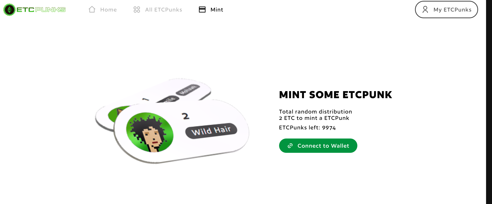
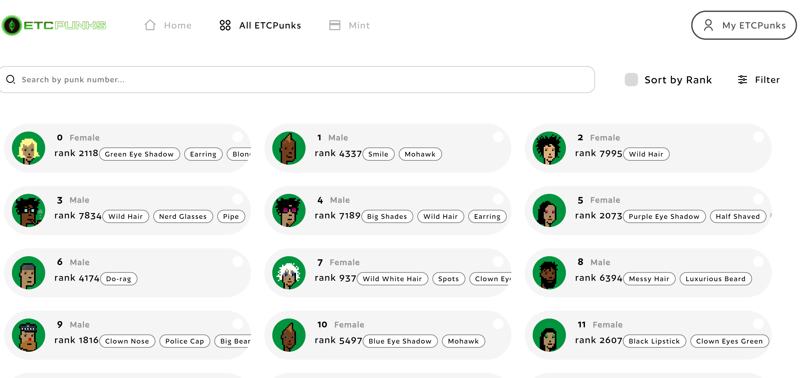

# ETCPunks the Cryptopunks of Ethereum Classic

[https://medium.com/@etcpunks](https://medium.com/@etcpunks) by [ETCPunks](https://etcpunks.com/)

# What are ETCPunks?

What are ETCPunks ?
ETCPunks are inspired collectibles, on the Ethereum Classic mainnet. Only 10,000 made, all with unique features. Collect them, buy one as a gift for someone or trade them on the marketplace!
homage to the cryptopunks.
ETCPunks are not affiliated with larvalabs.

## So why is ETCPunks so special ?

* In the interest of fairness and to give everyone the chance to own one (or more) ETCPunks, the purchase is made on a random basis.
* The identity of the ETCPunks will remain a mystery until your purchase is completed. No first come, first serve, everyone has an equal chance to get the the rare punks such as ape, zombie or aliens.
* Our Marketplace page will be ready once all ETCPunks are minted. You can get as many ThunderPunks as you want but once the 10,000 are sold it will be too late to get one at mint cost.

Visit [https://etcpunks.com/](https://etcpunks.com/) for minting your ETCPunk now

