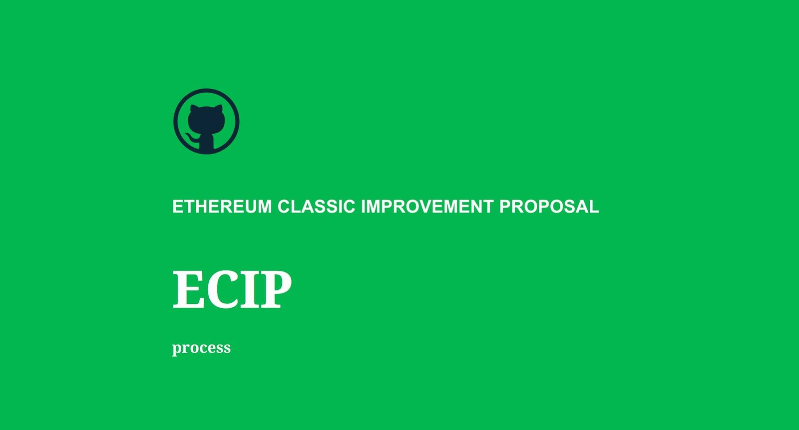

## ETC Core Devs Call 22 - Proposed Rejection of Keccak256 ECIP-1049

* [https://github.com/ethereumclassic/ECIPs/issues/465](https://github.com/ethereumclassic/ECIPs/issues/465)

* When: Monday, February 21st, 2022, 17:00 UTC, 120 minutes max.
* Where: [Ethereum Classic Discord](https://ethereumclassic.org/discord)
* Focus: REJECT Keccak256 Mining Algorithm Change due to a high-probability risk of Contentious Chain Split between GPU Miners on ETCHash and FPGA & ASIC Miners on Keccak256. ECIP-1049 is in violation of Ethereum Classic founding documents and the ECIP process. At this point, the contentious proposal has negative externalities on the network and is a resource drain. Move to reject the proposal after three years of technical discussion. If the proposal is not rejected, begin plans for a chain split.
* Video: https://www.youtube.com/watch?v=lpdZgsAbPXo

## Agenda

ECIP-1000 Clause: "ECIPs should be changed from Draft or Last Call status, to Rejected, upon request by any person, if they have not made progress in three years. Such a ECIP may be changed to Draft status if the champion provides revisions that meaningfully address public criticism of the proposal, or to Last Call if it meets the criteria required as described in the previous paragraph."

The reason for "Rejected" status under this clause is that the champion has not met this requirement during the three years: "the champion provides revisions that meaningfully address public criticism of the proposal". Rather, the champion has ignored much valid criticism and abandoned the proposal.
[https://ecips.ethereumclassic.org/ECIPs/ecip-1000](https://ecips.ethereumclassic.org/ECIPs/ecip-1000)

* Follow Up from: [#382](https://github.com/ethereumclassic/ECIPs/issues/382)
* Formal Proposed Rejection: [#394 comment](https://github.com/ethereumclassic/ECIPs/issues/394#issuecomment-1022909537)
* Documented Github Opposition: [#394 comment](https://github.com/ethereumclassic/ECIPs/issues/394#issuecomment-828160552)

### Please review the issue thread to find the most up to date information.

### Related Discussions:
* 1. [ECIP-1049: Change the ETC Proof of Work Algorithm to Keccak256 #8](https://github.com/ethereumclassic/ECIPs/issues/8)
* 2. [ECIP-1049: Change the ETC Proof of Work Algorithm to Keccak-256 #13](https://github.com/ethereumclassic/ECIPs/issues/13)
* 3. [ETC Core Devs Call(s) 2020 Q3: Hardfork #333](https://github.com/ethereumclassic/ECIPs/issues/333)
* 4. [ECIP-1095: Change ETC PoW to "vanilla" Sha-3 Discussion #342](https://github.com/ethereumclassic/ECIPs/issues/342)
* 5. [ETC Core Devs Call 13 & 14 #362](https://github.com/ethereumclassic/ECIPs/issues/362)
* 6. [ETC Core Devs Call 15 - ECIP-1049 Breakout Session Keccak-256 #382](https://github.com/ethereumclassic/ECIPs/issues/382)
* 7. [SHA3 Precompile ethereum/EIPs#2951](https://github.com/ethereum/EIPs/issues/2951)
* 8. [Core Devs Call 15 Recording](https://vimeo.com/464336957)
* 9. [Change the ETC Proof of Work Algorithm to Keccak-256 #394](https://github.com/ethereumclassic/ECIPs/issues/394)
* 10. [Core Devs Call 19 Recording](https://www.youtube.com/watch?v=WySNxZbDEkQ)
* 11. [Community Call 005 Recording](https://www.youtube.com/watch?v=HaDANZN-ZUU&t=1586s)
* 12. [Community Call 010 Recording](https://www.youtube.com/watch?v=6DRZEaKkpb4)
* 13. [ETC Core Devs Call 22: Proposed Rejection of ECIP-1049 #460](https://github.com/ethereumclassic/ECIPs/issues/460)
* 14. [Rejected Status ecip-1049 #465](https://github.com/ethereumclassic/ECIPs/issues/465)

### It should be noted in this new discussion thread, this ECIP appears to be contentious (as documented in all the previous threads/recordings) and has a high-probability of a chain split between the GPU Miners on ETCHash and the FPGA & ASIC miners on Keccak256.

### Recording of Ethereum Classic Core Devs Call 22 - Proposed Rejection of Keccak256 ECIP-1049

* Video: https://www.youtube.com/watch?v=lpdZgsAbPXo

### Conclusion

Productive Topics from this call:
* A new ECIP Champion was selected in Bob Summerwill. The old champion, Alex Tsankov has stepped down from the proposal as he is too busy and inactive.
* Recommendations to split the ECIP to multiple ECIPs to align with e ECIP-1000; technical work, transition strategy, activation plan.
* The elephant in the room on this one has been "consensus" as the proposal aims to displace the current mining ecosystem. It's unlikely ETChash miners will update nodes to this proposal. Pushing contentious hard forks on the network is a violation of the ECIP process.

New Proposal Champion:
Given the new champion is active, Bob Summerwill is provided time to update the 1049 proposal to be [ECIP-1000](https://ecips.ethereumclassic.org/ECIPs/ecip-1000) compliant. This was recommended in Sept 2020 to the previous champion after CDC 15, but did not happen. The hope is with a new champion we will see compliance with the ECIP process.

Notes from the Proposals New Champion:
Some comments from Bob Summerwill on the undocumented technical work from his staff:
* Support for Astor already integrated in Besu.   There is a pull request for core-Geth (and blocks successfully mined on Astor), but some rearchitecting needed to make that clean enough to integrate.
* The transition is where more client work is needed (ie. having a Testnet which goes through the transition versus being Keccak256 from Genesis).   More work needed on mining side software too.
* So not tons left to do, but probably needs a couple of months of focus to do it right.
* Note - this is the technical work.  Roll out via testnets, all the social layer etc etc is more time again, of course.
* I was asked where June (2022) was feasible (end to end).  I think that is a pretty clear not really possible.

Here is the open PR to move 1049 to Rejected status if the new champion does not bring the proposal up to [ECIP-1000](https://ecips.ethereumclassic.org/ECIPs/ecip-1000) standards:
[Rejected Status ecip-1049](https://github.com/ethereumclassic/ECIPs/pull/465)

Thanks for everyone's participation. Please direct future commentary to the newest ECIP 1049 discussion thread. However, please review the historical threads. There is plenty of technical discussion.

* [Thread 394](https://github.com/ethereumclassic/ECIPs/issues/394)

