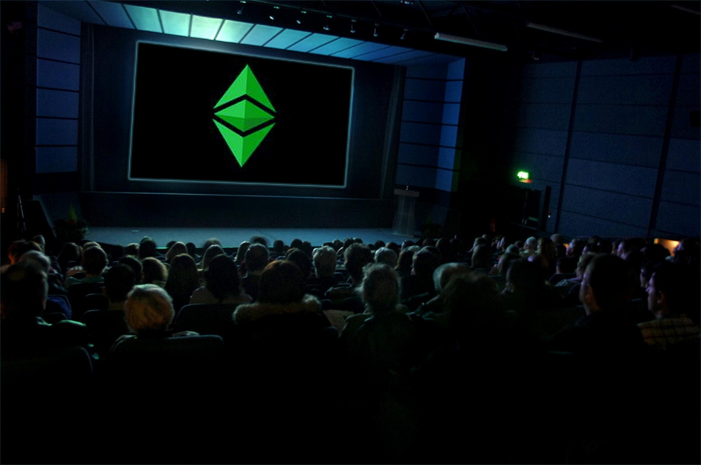

## ETC Core Devs Call 22 - Proposed Rejection of Keccak256 ECIP-1049 Call Results

* [https://github.com/ethereumclassic/ECIPs/issues/465](https://github.com/ethereumclassic/ECIPs/issues/465)
* ETC Core Devs Call 22 Recording: [https://www.youtube.com/watch?v=lpdZgsAbPXo](https://www.youtube.com/watch?v=lpdZgsAbPXo).

### ETC Core Devs Call 22: Conclusion

* A new ECIP-1049 Champion was selected in Bob Summerwill. The old champion, Alexander Tsankov has stepped down from the proposal stating he is too busy to champion this proposal.
* It was agreed by the ECIP Editor r0n1n and the new Champion of ECIP-1049, Bob Summerwill, that the ECIP-1049 proposal needs a material rewrite to meet [ECIP-1000](https://ecips.ethereumclassic.org/ECIPs/ecip-1000) compliance and remain in Draft status.
* The new Champion vocalized intent to bring the ECIP-1049 proposal up to [ECIP-1000](https://ecips.ethereumclassic.org/ECIPs/ecip-1000) standards within the coming months during 2022.
* The ECIP Editor and others on the call felt it was reasonable to afford the new champion time to clean up the ECIP-1049 proposal, as it was vocalized that undocumented technical work has been done by the champion's paid staff.
* The ECIP editor vocalized intent to leave [PR 465](https://github.com/ethereumclassic/ECIPs/issues/465) open to push this proposal to Rejected status should this proposal continue to sit in a state that violates the [ECIP-1000](https://ecips.ethereumclassic.org/ECIPs/ecip-1000). This comes after the CDC 15 meeting where Alexander Tsankov, the old champion of this proposal, vocalized intent to update the proposal after a failed push to Accepted status in 2020 and did not follow through with the [ECIP-1000](https://ecips.ethereumclassic.org/ECIPs/ecip-1000) requirements regarding criticism and dissenting opinions to the ECIP-1049 proposal from the community.
* It was recommended to split the ECIP to multiple ECIPs to align with [ECIP-1000](https://ecips.ethereumclassic.org/ECIPs/ecip-1000) guidelines; technical work, transition strategy, social consensus building, activation plan. These were some examples provided to the champion.
* The elephant in the room on ECIP-1049 has been a documented lack of consensus. The ECIP-1049 proposal aims to displace the current mining ecosystem. This is a violation of the [ECIP-1000](https://ecips.ethereumclassic.org/ECIPs/ecip-1000) in itself.
* Pushing contentious hard forks on the network is a violation of the [ECIP-1000](https://ecips.ethereumclassic.org/ECIPs/ecip-1000) process. It's unlikely the ETChash mining ecosystem will update nodes to this proposal should a hard fork be attempted. Many in the community; mining pools, miners, developers, core development teams, community members have vocalized support for the non-fork ETChash side of a contentious hard fork should the proponents of ECIP-1049 push a contentious hard fork on the Ethereum Classic network.
* The ETChash mining ecosystem was assured continued support from community members should any centralized actor attempt a contentious hard fork on the Ethereum Classic network.
* The opposition to ECIP-1049 has provided the new champion material criticism of ECIP-1049 to address during the champion's material redraft of the proposal.
* The proposal will be reviewed at a later date for [ECIP-1000](https://ecips.ethereumclassic.org/ECIPs/ecip-1000) compliance. Should compliance not be met, this proposal will move to Rejected status. Note: the Champion can always revive a Rejected proposal when [ECIP-1000](https://ecips.ethereumclassic.org/ECIPs/ecip-1000) compliance is met.

Note: This ECIP appears to be contentious, as documented in all the previous threads and recordings. This proposal has a high-probability of a chain split between the Mining Ecosystem on ETCHash (GPUs and ETChash ASICs) and the proposed new mining ecosystem on Keccak256 (FPGA & KEC ASICs).

### New Proposal Champion:

Given the new champion is active, Bob Summerwill is provided time to update the ECIP-1049 proposal to be [ECIP-1000](https://ecips.ethereumclassic.org/ECIPs/ecip-1000) compliant. This was recommended in October, 2020 to the previous champion after Core Developers Call 15, but did not happen. The hope is with a new champion we will see compliance with the ECIP process.

* [ETC Core Devs Call 15 - ECIP-1049 Breakout Session Keccak-256](https://vimeo.com/464336957)

Some comments from Bob Summerwill on the undocumented technical work from his staff:

* Support for Astor already integrated in Besu. There is a pull request for core-Geth (and blocks successfully mined on Astor), but some rearchitecting needed to make that clean enough to integrate.
* The transition is where more client work is needed (ie. having a Testnet which goes through the transition versus being Keccak256 from Genesis). More work needed on mining side software too.
* So not tons left to do, but probably needs a couple of months of focus to do it right. Note - this is the technical work.
* Roll out via testnets, all the social layer etc etc is more time again, of course.
* I was asked where June, 2022 was feasible (end to end).  I think that is a pretty clear *not* really possible.

Here is the open PR to move 1049 to Rejected status if the new champion does NOT bring the ECIP-1049 proposal up to [ECIP-1000](https://ecips.ethereumclassic.org/ECIPs/ecip-1000) standards:

* [Rejected Status ecip-1049](https://github.com/ethereumclassic/ECIPs/pull/465)

Thanks for everyone's participation. Please direct future commentary to the newest ECIP 1049 discussion thread. However, please review the historical threads. There has been plenty of technical discussion on this matter over the years.

### Related Discussions:

Please review the issue thread to find the most up to date information.

* 1. [ECIP-1049: Change the ETC Proof of Work Algorithm to Keccak256 #8](https://github.com/ethereumclassic/ECIPs/issues/8)
* 2. [ECIP-1049: Change the ETC Proof of Work Algorithm to Keccak-256 #13](https://github.com/ethereumclassic/ECIPs/issues/13)
* 3. [ETC Core Devs Call(s) 2020 Q3: Hardfork #333](https://github.com/ethereumclassic/ECIPs/issues/333)
* 4. [ECIP-1095: Change ETC PoW to "vanilla" Sha-3 Discussion #342](https://github.com/ethereumclassic/ECIPs/issues/342)
* 5. [ETC Core Devs Call 13 & 14 #362](https://github.com/ethereumclassic/ECIPs/issues/362)
* 6. [SHA3 Precompile ethereum/EIPs#2951](https://github.com/ethereum/EIPs/issues/2951)
* 7. [ETC Core Devs Call 15 - ECIP-1049 Breakout Session Keccak-256 #382](https://github.com/ethereumclassic/ECIPs/issues/382)
* 8. [Core Devs Call 15 Recording](https://vimeo.com/464336957)
* 9. [2020 Document: Change the ETC Proof of Work Algorithm to Keccak-256 #394](https://github.com/ethereumclassic/ECIPs/issues/394)
* 10. [Admin Clean Up on ecip-1049](https://github.com/ethereumclassic/ECIPs/pull/400)
* 11. [Core Devs Call 19 Recording](https://www.youtube.com/watch?v=WySNxZbDEkQ)
* 12. [Community Call 005 Recording](https://youtu.be/HaDANZN-ZUU?t=1585)
* 13. [Community Call 010 Recording](https://youtu.be/6DRZEaKkpb4?t=3411)
* 14. [Community Call 011 Recording](https://www.youtube.com/watch?v=ad_grFagA5k)
* 15. [Community Call 012 Recording](https://youtu.be/GCBv1VCN2tE?t=3339)
* 16. [Community Call 013 Recording](https://www.youtube.com/watch?v=HQ9IKu3PVkA)
* 17. [ETC Core Devs Call 22: Proposed Rejection of ECIP-1049 #460](https://github.com/ethereumclassic/ECIPs/issues/460)
* 18. [Rejected Status ecip-1049 #465](https://github.com/ethereumclassic/ECIPs/issues/465)

### Recording of Ethereum Classic Core Devs Call 22 - Proposed Rejection of Keccak256 ECIP-1049

* ETC Core Devs Call 22: https://www.youtube.com/watch?v=lpdZgsAbPXo

Note: Issues with the ETC Discord server audio was reported by numerous call participants and observed on the recording. This led to talking over/interruptions during the call. Apologies to those listening after the fact from the organizer of the call and the third-party community member who recorded the call. Future CDC calls will be held on a platform with hand raising and the ability to mute interrupting parties during the call.

* [Thread 394](https://github.com/ethereumclassic/ECIPs/issues/394)

