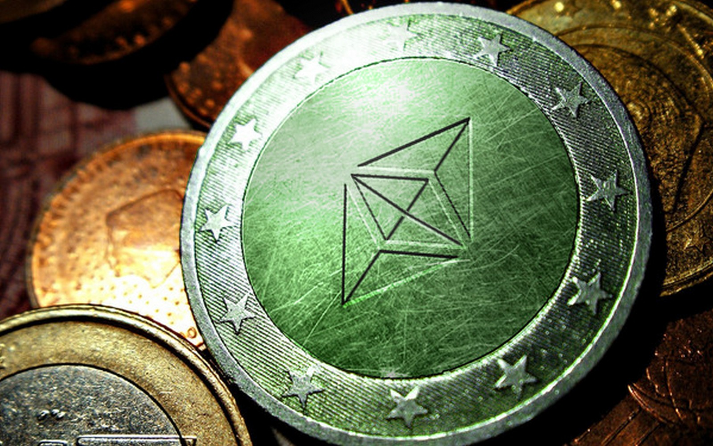
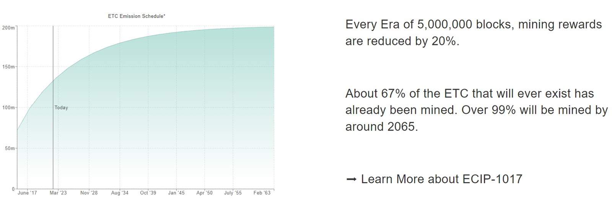

# 5M20 Era 4 Fifthening: ETC Nears Bitcoin inspired Block Reward Reduction

[Ethereum Classic](https://ethereumclassic.org/why-classic) is the original Ethereum network launched in 2015. One of ETC's most desirable properties, is its Bitcoin inspired monetary policy which features a fixed supply and known emission schedule via [ECIP-1017](https://ecips.ethereumclassic.org/ECIPs/ecip1017). The fixed supply of Ethereum Classic is 210,700,000 ETC. The emission schedule is a block reward reduction of 20% every 5,000,000 blocks -- 5M20. A visual countdown and chart of the 5M20 emission schedule can be found at [ETCis.Money](https://etcis.money).

Towards the end of April, 2022 the Ethereum Classic network is expected to cross the 15,000,000 block and enter the fourth era of the 5M20 emission schedule. This will result in a decrease of block rewards from 3.2 ETC to 2.56 ETC per block. This reduces the avaialable sell side liquidity provided to miners for securing the Ethererum Classic network via its ETChash [Proof of Work](https://ethereumclassic.org/why-classic/proof-of-work) consensus mechanism. 

The table below shows the block reduction amounts and the total ETC emitted to miners during each 5M20 Era.

## ETC is Sound Money

The 5M20 emission schedule was inspired by Bitcoin. However the authors of [ECIP-1017](https://ecips.ethereumclassic.org/ECIPs/ecip1017) desired a faster emission schedule to catch up to Bitcoin's low inflation rate. The "Fifthening" event for ETC occurs more frequently than Bitcoin's 4 year "Halvening" event. Also, the 5M20 features a smoother reduction curve with a 20% decrease compared to Bitcoins 50% reduction. The result is a decrease in Ethereum Classic's inflation at a quicker rate than Bitcoin. ETC uniquely provides the digital asset space with sound, programable money on a censorship resistant decentralized network.

So when someone asks you: "What are the unique properties that make Ethereum Classic special in the crowded cryptocurrency space?" The logic is an easy to convey: ETC is programmable [sound money](https://ethereumclassic.org/why-classic/sound-money) built on top of the largest [Proof of Work](https://ethereumclassic.org/why-classic/proof-of-work) smart contract blockchain. Ethereum Classic is censorship resistant and the premiere network to build unstoppable applications. Code is law.

**If Bitcoin is Plan B. Ethereum Classic is Plan C.**
**Stay Classy. Stack ETC.**

The [Ethereum Classic Discord](https://ethereumclassic.org/discord) is an open and active community. Please join the conversation.

## Learn More About ETC

[Why Ethereum Classic](https://ethereumclassic.org/why-classic)

> But some, like yourself, decide to dive a little deeper, and they discover some interesting facts that debunk that initial skepticism. Their journey down the rabbit hole begins when they find out that Ethereum Classic is not a clone of Ethereum™, but a continuation of the original Ethereum launched in 2015, which The Ethereum Foundation forked away from by launching a new protocol one year later in 2016.

* https://ethereumclassic.org
