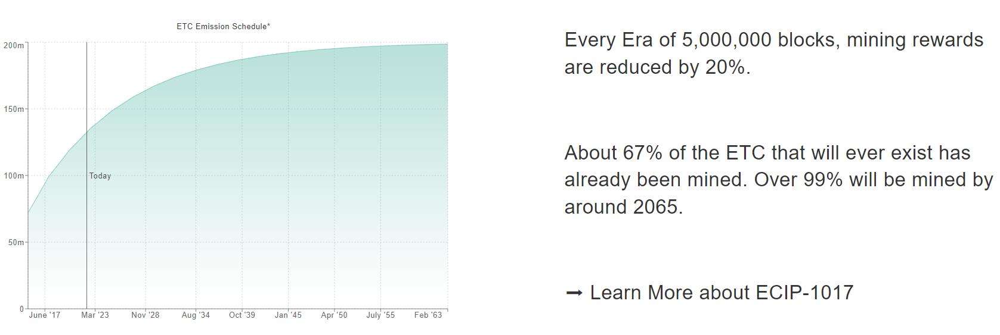

# 5M20 Era 4 Fifthening: ETC Nears Bitcoin inspired Block Reward Reduction

[Ethereum Classic](https://ethereumclassic.org/why-classic) is the original Ethereum network launched in 2015. One of ETC's favorable properties, is its 5M20 monetary policy which features a fixed supply and known emission schedule via [ECIP-1017](https://ecips.ethereumclassic.org/ECIPs/ecip-1017). The fixed supply of Ethereum Classic is 210,700,000 ETC. The emission schedule is a block reward reduction of 20% every 5,000,000 blocks. A visual countdown and chart of the 5M20 emission schedule can be found at [ETCis.Money](https://etcis.money).

Around the end of April, 2022 the Ethereum Classic network is expected to hit the 15,000,000 block and enter the fourth era of the 5M20 emission schedule. This will result in a decrease of block rewards from 3.2 ETC to 2.56 ETC per block. The table below shows the block reduction amounts and the total ETC emitted during each 5M20 Era.

The 5M20 emissions schedule is similar to Bitcoin. However the ~2.3 year "fifthening" event for ETC is quicker than Bitcoin's 4 year "halvening" event. Also, the 5M20 schedule is a bit smoother with 20% reductions compared to Bitcoins 50% reduction.

The [Ethereum Classic Discord](https://ethereumclassic.org/discord) is an open and active community. Please join the conversation and stay classy.

## Learn More About ETC

[Why Ethereum Classic](https://ethereumclassic.org/why-classic)

> But some, like yourself, decide to dive a little deeper, and they discover some interesting facts that debunk that initial skepticism. Their journey down the rabbit hole begins when they find out that Ethereum Classic is not a clone of Ethereum™, but a continuation of the original Ethereum launched in 2015, which The Ethereum Foundation forked away from by launching a new protocol one year later in 2016.

* https://ethereumclassic.org
